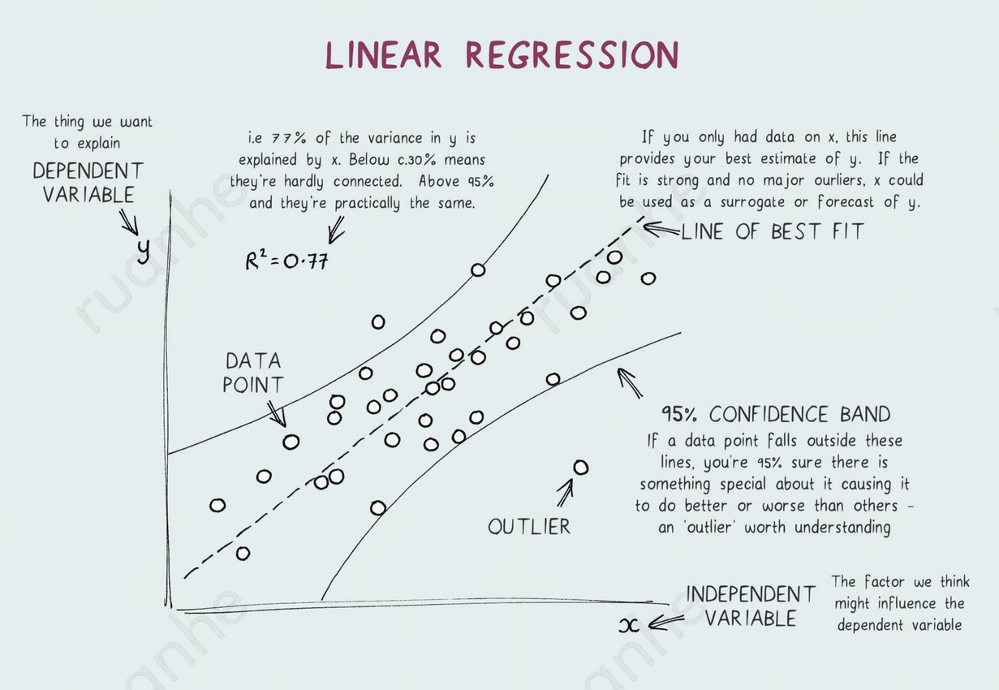
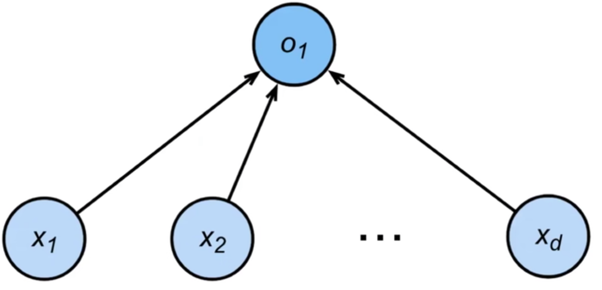
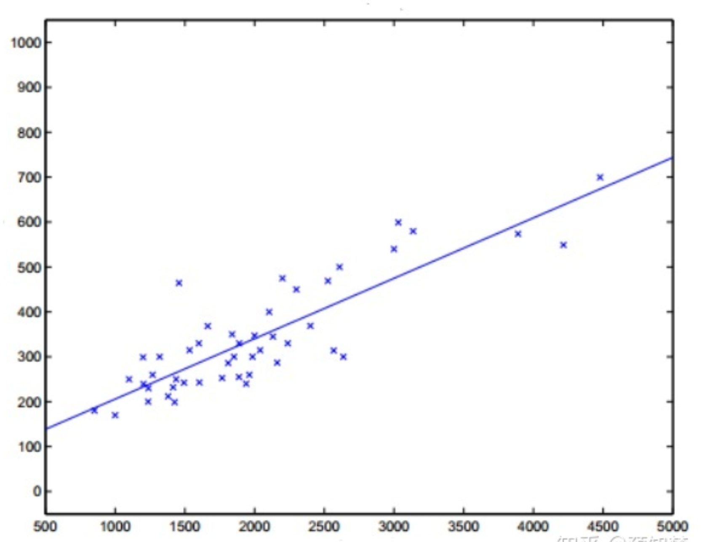

# 线性回归
## 简介

线性回归（linear regression）是一种有监督的学习算法，它通过对数据拟合线性方程，尝试对连续目标变量和一个或多个自变量之间的关系进行建模。为了使线性回归成为一个不错的选择，自变量和目标变量之间必须存在线性关系。

线性回归意味着可以将输入项分别乘以一些常量，再将结果加起来得到输出。线性回归假设特征和结果满足线性关系。其实线性关系的表达能力非常强大，每个特征对结果的影响强弱可以由前面的参数体现，而且每个特征变量可以首先映射到一个函数，然后再参与线性计算，这样就可以表达特征与结果之间的非线性关系。

线性回归本来是是统计学里的概念，现在经常被用在机器学习中。如果 2 个或者多个变量之间存在“线性关系”，那么就可以通过历史数据摸清变量之间的“套路”，建立一个有效的模型，来预测未来的变量结果。线性回归假设输出变量是若干输入变量的线性组合，并根据这一关系求解线性组合中的最优系数。

### vs. 逻辑回归

逻辑回归是在线性回归的基础上加上 sigmoid() 作为激活函数。但因为逻辑回归在训练方法、模型结构、应用场景等方面和神经网络有很多不同的地方，因此没放在神经网络中考虑。

## 学习算法

给定训练数据特征和对应的已知标签，线性回归的目标是找到一组权重向量和偏置。当给定从的同分布中取样的新样本特征时，这组权重向量和偏置能够使得新样本预测标签的误差尽可能小。

### 数据集

X、Y 都是连续的 R

矩阵 $\mathbf{X} \in \mathbb{R}^{n \times d}$ 表示整个数据集的 $n$ 个样本，其中 $x^{(i)}_j$ 表示数据集第 i 个样本的第 j 个特征取值。

训练集 $X=\left[ \begin{matrix} 1 & x_1^{(1)} &\cdots & x_d^{(1)} \\ 1 & x_1^{(2)} &\cdots & x_d^{(2)} \\ \vdots \\ 1 & x_1^{(n)} &\cdots & x_d^{(n)} \end{matrix} \right]$ 是输入的数据矩阵，因为考虑用 $w_0$ 常数项代替 $b$，所以在 X 的第一列加上了一列 1。 

标签集（label set）为 $Y=\left[ \begin{matrix} y^{(1)} \\ y^{(2)} \\ \vdots \\ y^{(m)} \end{matrix} \right]$ 。

### 模型

#### 网络结构

只有 1 层，这层中只有 1 个神经元。

#### 激活函数

无激活函数，所以该网络是线性的。它是唯一一个“线性神经网络”，因为没有使用非线性激活函数。

#### 表达式

线性回归模型定义为：$\hat{y}=w_0 + w_1x_1 + w_2x_2 + ... + w_nx_n$。也可表示为：$\hat{y}=wx+b$，其中 $\hat{y}$ 表示 $y$ 的估计值，$w$ 称为 x 的系数，b 称为偏置项。

如果用矩阵来表示就是 $\hat{y} = Xw$，其中：$w=\left[ \begin{matrix} w_0 \\ w_1 \\ \vdots \\ w_n \end{matrix} \right]$ 是所要求得一系列参数。

线性回归模型的目标就是找到一系列参数 $𝜃$，使得 $\hat{y}=\theta^TX$ 尽可能地贴近 $Y$。也就是如图找到一条直线使得尽可能符合数据的分布，从而有一个新的样本点时，可利用学习得到的这条直线进行预测。

### 度量

#### 损失函数：SE

其损失函数是 Squared Error，也就是单个样本的平方差。回归问题中最常用的损失函数是平方误差函数，当样本 $i$ 的预测值为 $\hat{y}^{(i)}$，其相应的真实标签为 $y^{(i)}$ 时，平方误差可以定义为以下公式：$l^{(i)}(\mathbf{w}, b) = \frac{1}{2} \left(\hat{y}^{(i)} - y^{(i)}\right)^2$

#### 代价函数：MSE

在训练集上确定系数 $𝜃$ 时，预测输出 $\hat{y}$ 和真实输出 $y$ 之间的误差是关注的核心指标。在线性回归中，所有数据集的误差是以 MSE 来定义。当线性回归的模型为二维平面上的直线时，MSE 就是预测输出和真实输出之间的欧几里得距离。

损失函数的表达式为：$L(𝜃)=\frac{1}{m}\displaystyle\sum_{i=1}^{m}(\hat{y}^{(i)}-y^{(i)})^2=\frac{1}{m}(X𝜃-Y)^T(X𝜃-Y)$。

展开后为：$L(𝜃)=\frac{1}{m}(𝜃^TX^TX𝜃-𝜃^TX^Ty-y^TX𝜃+y^Ty)=\frac{1}{m}(𝜃^TX^TX𝜃-2𝜃^TX^Ty+y^Ty)$

$$L(\mathbf{w}, b) =\frac{1}{m}\sum_{i=1}^m l^{(i)}(\mathbf{w}, b) =\frac{1}{m} \sum_{i=1}^m \frac{1}{2}\left(\mathbf{w}^\top \mathbf{x}^{(i)} + b - y^{(i)}\right)^2$$

模型训练就是希望寻找一组参数（$\mathbf{w}^*, b^*$），使最小化所在训练样本的总损失：

$$\mathbf{w}^*, b^* = \operatorname*{argmin}_{\mathbf{w}, b}\  L(\mathbf{w}, b).$$

#### 概率解释

以下解释如何通过函数过渡到“概率分布”，用 MSE 作为线性模型的损失函数。

假设采用线性模型 $f(x)=\theta^TX$，把训练集的标签 $Y$ 代入模型，可获得：$y^{(i)}=\theta^Tx^{(i)}+\epsilon^{(i)}$，其中 $y^{(i)}$ 为真实训练标签值，$\theta^Tx^{(i)}$ 为基于训练数据样本的预测值，而 $\epsilon^{(i)}$ 为误差值。

训练模型和真实样本之间有误差，假设训练集量很大，其误差 $epsilon$ 满足高斯分布 $N(\mu,\delta^2)$ ，且 $\mu=0$，所以高斯分布为 $(0,\delta^2)$，总体可写成：。

根据高斯分布，对于每个样本 x 都可以得到一个获得 y 值的概率 $p(y|x; \theta)$。**似然函数**的本质是描述出现这个情形的概率，最大化它即表示这个情形出现的概率最大，也就是认为出现训练集值的概率最大。又因为样本是独立分布的，对其求最大似然函数：$L(\theta)=\Pi_{i=1}^mP(y^{(i)}|x^{(i)};\theta)=\Pi_{i=1}^m\frac{1}{\sqrt{2\pi}\sigma}exp(-\frac{(y^{(i)}-\theta^Tx^{(i)})^2}{2\sigma^2})$ 。

化简最大似然函数后得：，也就得到了线性回归的 MSE 损失函数公式。

总结：根据“概率分布”的最大似然估计法，假设获取训练集的概率为最大，相应求出了损失函数为 MSE 公式。

### 优化器

#### 解析解：最小二乘法

线性回归是一个很简单的优化问题，与其他大部分模型不同，线性回归的解可以用公式简单地表达出来，这类解叫作解析解（analytical solution）。基于 MSE，通过矩阵运算来直接进行模型求解的过程被称为**最小二乘法**。在单变量线性回归任务中，最小二乘法的作用就是找到一条直线，使所有样本到直线的欧式距离之和最小。其数学表达式为：找出最佳的 $\theta 也就是 w、b$，使损失函数  $\theta=argmin_{\theta}(Y-X\theta)^T(Y-X\theta)$ 最小。

令 $E(\theta)=(Y-X\theta)^T(Y-X\theta)$，对 $\theta$ 求导得到：$\frac{\partial E(\theta)}{\partial \theta}=\frac{2X^T(X\theta-Y)}{m}=0$ ，可得：$\theta=(X^TX)^{-1}X^TY$。

当 $X^TX$ 为满秩矩阵或正定矩阵时，可使用正规方程法直接求得闭式解： $f(x_i)=((X^TX)^{-1}X^TY)^Tx_i$。

像线性回归这样的简单问题存在解析解，但并不是所有的问题都存在解析解。解析解可以进行很好的数学分析，但解析解对问题的限制很严格，导致它无法广泛应用在深度学习里。

#### 梯度下降法

但一般 $X^TX$ 不能满足满秩矩阵或正定矩阵的条件，此时可使用更为通用的梯度下降法。其迭代更新为：$\theta \leftarrow \theta - \eta \frac{\partial E(\theta)}{\partial \theta}$。可得到梯度下降迭代过程，即：$\theta \leftarrow \theta - \frac{2}{m}\alpha X^T(X\theta-Y)$。

度下降法利用沿着梯度下降最快的方向求偏导数，得到损失函数的全局最小值时的参数。梯下降法在有些场景无法求出全局最小值，只能求出局部最小值，但是在线性回归领域可以求出全局最小值。梯度下降法先假设一定点，然后按一定的步长顺着这个点的梯度进行更新，迭代下去，最后能找到最优点。

具体操作方法为，任意选一个起始点 $θ^0$，移到 $θ^1 = θ^0 - η∇L(θ^0)$，再移到 $θ^2 = θ^1 – η∇L(θ^1)$，依次类推，直到获得最小值。

以样本与计算差 $h(x)-y$ 作为梯度：

##### 小批量梯度下降法

BGD 每次迭代都需要必须遍历整个数据集，因此收敛速度较慢，其表达式为：$\theta_{i+1}\leftarrow \theta_i-\eta\sum_n(f_\theta(x^n)-y^n)x_i^n$。

因此，通常会在每次需要计算更新时随机抽取一小批样本（Mini-batch），这种变体叫做小批量随机梯度下降 MBGD。在每次迭代中，首先随机抽样一个小批量 $\mathcal{B}$，它是由固定数量的训练样本组成的。然后，计算这小批量的平均损失关于模型参数的导数（也可以称为梯度）。最后，将梯度乘以一个预先确定的步长 $\eta$，并从当前参数的值中减掉。

其表达式为（$\partial$ 表示偏导数）：$(\mathbf{w},b) \leftarrow (\mathbf{w},b) - \frac{\eta}{|\mathcal{B}|} \sum_{i \in \mathcal{B}} \partial_{(\mathbf{w},b)} l^{(i)}(\mathbf{w},b)$

算法的步骤如下：

- 初始化模型参数的值，如随机初始化；
- 从数据集中随机抽取小批量样本且在负梯度的方向上更新参数，并不断迭代这一步骤。

对于平方损失和仿射变换，可以明确地写成如下形式：

$$\begin{aligned} \mathbf{w} &\leftarrow \mathbf{w} -   \frac{\eta}{|\mathcal{B}|} \sum_{i \in \mathcal{B}} \partial_{\mathbf{w}} l^{(i)}(\mathbf{w}, b) = \mathbf{w} - \frac{\eta}{|\mathcal{B}|} \sum_{i \in \mathcal{B}} \mathbf{x}^{(i)} \left(\mathbf{w}^\top \mathbf{x}^{(i)} + b - y^{(i)}\right),\\ b &\leftarrow b -  \frac{\eta}{|\mathcal{B}|} \sum_{i \in \mathcal{B}} \partial_b l^{(i)}(\mathbf{w}, b)  = b - \frac{\eta}{|\mathcal{B}|} \sum_{i \in \mathcal{B}} \left(\mathbf{w}^\top \mathbf{x}^{(i)} + b - y^{(i)}\right). \end{aligned}$$

- $|\mathcal{B}|$表示每个小批量中的样本数，这也称为批量大小（batch size）
- $\eta$ 表示学习率

在训练了预先确定的若干次 Epoch 后（或者直到满足某些其他停止条件后），记录下模型参数的估计值，表示为 $\hat{\mathbf{w}}, \hat{b}$。

##### 随机梯度下降法

随机梯度下降法 SGD（Stochastic Gradient Descent）通过每个样本来迭代更新一次参数，可能未遍历整个样本就已经找到最优解，大大提高了算法的收敛速度。最小化每个样本的损失函数，虽然每次迭代结果不一定都是全局最优解，却总是沿着这个方向发展，故最终结果总是接近全局最优解。

其表达式为：$\theta_{i+1}\leftarrow \theta_i-\eta(f_\theta(x^n)-y^n)x_i^n$。

## 广义线性模型

广义线性模型（generalized linear model）表示为 $y=g^{-1}(w^Tx+b)$，其中 $g(x)$ 称为联系函数（link function）。

### 对数线性回归

而对数函数是广义线性模型在 $g(x)=ln(x)$ 时的特例。对数线性回归（log-linear regression）是将输出标记的对数作为线性模型逼近的目标，即：$ln(y)=w^Tx+b$。它企图让 $e^{w^Tx+b}$ 逼近 y，实际上已是在求输入空间到输出空间的非线性映射。

## Lab

### 算法实现

- [算法1](10_linear-regression-algorithm1.py)
- [算法2](11_linear-regression-algorithm2.py)

### 算法应用

- [线性回归](20_linear-regression-sk.ipynb)
- [线性回归](22_linear-regression.ipynb)
- [线性回归 Houce](30_houce-linear-regression.ipynb)
- [线性回归 Ridge](40_ridge-regression.ipynb)
- [线性回归 Ridge](41_ridge-regression.ipynb)

## Ref

1. [线性回归原理和实现基本认识](https://blog.csdn.net/lisi1129/article/details/68925799)
2. [线性回归原理及实现(Linear Regression)](https://www.jianshu.com/p/54d1c0c79588)