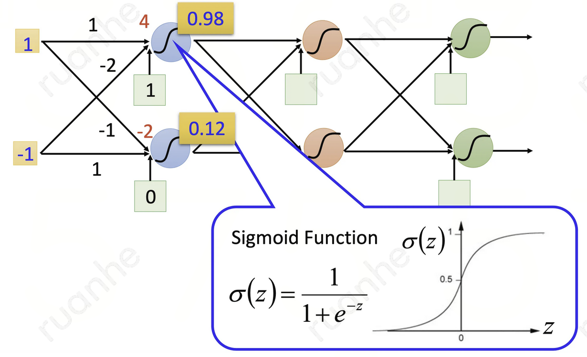

# 多层感知机MLP

## 简介

MLP（Multilayer Perceptron）是全连接+前馈神经网络。它通过在网络中加入一个或多个隐藏层来克服线性模型的限制，使其能处理更普遍的函数关系类型。要做到这一点，最简单的方法是将许多全连接层堆叠在一起。每一层都输出到下一层，直到生成最后的输出。可以把前层看作表示，把最后一层看作线性预测器，这种架构通常称为多层感知机 MLP。      

## 学习算法

### 模型

#### 网络结构

每个层都由多个神经元组成，其中每个神经元都与上一层的所有神经元相连，每个连接都带有一个权重，该权重表示在下一层之前对该输入的重要性。每一层都可以被视为是一个向量，向量的每个元素都可被视为是一个神经元，该神经元接收来源于上一层的单元，并计算它自己的激活值。

- 输入层：接受来自数据集的特征向量作为输入。每个输入被视为一个神经元，并在输入层中进行处理和传递。例如，对于一个28x28的图片，输入层可能有784个神经元（因为28 x 28 = 784）。
- 隐藏层：MLP 在输入层和输出层之间可以有一个或多个隐藏层，用于从输入数据中捕获模式或特征。每个隐藏层中的神经元都是全连接的，即它们都连接到前一层的每一个神经元和后一层的每一个神经元。隐藏层的数量和每层的神经元数量是超参数，可以根据问题和数据进行调整。
  - 隐藏单元：每个隐含层都包含**多个**隐藏单元，其中每个隐藏单元都使用激活函数将其输入变换为输出。每个单元可以理解为一个向量到标量的函数。
- 输出层：MLP 的最后一层是输出层，输出层的神经元数量通常与预测任务的类别数量相匹配，输出层的每个神经元都表示一个类别或任务输出，并通过激活函数将其输入转换为输出。例如，对于一个 10 类分类问题，输出层可能有10个神经元，每个神经元输出一个值表示该类的概率或得分。

上图的 MLP 有 4 个输入、3 个输出，其隐藏层包含 5 个隐藏单元。输入层不涉及任何计算，因此使用此网络产生输出只需要实现隐藏层和输出层的计算。因此，这个多层感知机中的层数为 2。这 2 层都是全连接的，每个输入都会影响隐藏层中的每个神经元，而隐藏层中的每个神经元又会影响输出层中的每个神经元。

#### 激活函数

为了引入非线性并使 MLP 能够逼近任意复杂的函数，隐藏层的每个神经元都会应用一个非线性的激活函数。MLP 可以使用各种激活函数，具体使用哪种取决于问题类型、网络设计者的选择等因素：

1. sigmoid()：sigmoid() 将任意实数映射到 0 和 1 之间，因此**常用于二分类问题的输出层**。但 sigmoid() 在输入的绝对值很大时梯度会接近于 0，容易造成梯度消失问题，因此在实际中在隐藏层的使用已经较少。
2. tanh() ：tanh() 将任意实数映射到 -1 和 1 之间，是 sigmoid() 的一个变体。它在某些问题上的表现优于 sigmoid() ，但同样存在梯度消失的问题。
4. ReLU()：ReLU（Rectified Linear Unit）函数在输入小于 0 时输出 0，在输入大于 0 时输出与输入相同的值。ReLU 函数简单且高效，梯度为 0 或 1，因此在很多深度学习模型中被广泛使用。
5. Leaky ReLU() ：Leaky ReLU 是 ReLU 函数的变体，为了解决 ReLU 在输入小于 0 时梯度为 0 的问题，Leaky ReLU 在输入小于 0 时的输出为一个很小的负梯度。

#### 表达式

MLP 的表达式为：
$$
\begin{aligned}
    \mathbf{H} & = \sigma(\mathbf{X} \mathbf{W}^{(1)} + \mathbf{b}^{(1)}) \\
    \mathbf{O} & = \mathbf{H}\mathbf{W}^{(2)} + \mathbf{b}^{(2)}\\
\end{aligned}
$$
由于 $\mathbf{X}$ 中的每一行对应于小批量中的一个样本，出于记号习惯的考量，非线性激活函数 $\sigma$ 也以按行的方式作用于其输入，即一次计算一个样本。

为了构建更通用的 MLP，可以继续堆叠这样的隐藏层，如：
$$
\begin{aligned}
    \mathbf{H}^{(1)} = \sigma_1(\mathbf{X} \mathbf{W}^{(1)} + \mathbf{b}^{(1)}) \\
    \mathbf{H}^{(2)} = \sigma_2(\mathbf{H}^{(1)} \mathbf{W}^{(2)} + \mathbf{b}^{(2)}) \\
\end{aligned}
$$

一层叠一层，从而产生更有表达能力的模型。

### 优化器

#### 小批量梯度下降法

### 正则化

#### L2 正则化

MLP 常用 L2 正则化，它只针对线性系数矩阵 𝑊，而不针对偏倚系数 𝑏。假设每个样本的损失函数是 SME，则所有 m 个样本的损失函数为：$𝐽(𝑊,𝑏)=\frac{1}{2𝑚}∑_{𝑖=1}{𝑚}|𝑎^𝐿−𝑦|^2_2$。

加上了 L2 正则化后的损失函数是：$𝐽(𝑊,𝑏)=\frac{1}{2𝑚}∑_{𝑖=1}{𝑚}|𝑎^𝐿−𝑦|^2_2+\frac{𝜆}{2𝑚}∑_{l=2}^𝐿|𝑤|^2_2$，其中 𝜆 即正则化超参数，实际使用时需要调参。而 𝑤 为所有权重矩阵 𝑊 的所有列向量。

如果使用上式的损失函数，进行反向传播算法时，则加入 L2 正则化后迭代更新为：$𝑊^𝑙=𝑊^𝑙−𝛼∑_{𝑖=1}^𝑚𝛿^{𝑖,𝑙}(𝑎^{𝑖,𝑙−1})^𝑇−𝛼𝜆𝑊^𝑙$。

注意到上式中的梯度计算中1/𝑚 被忽略了，因为 𝛼 是常数，而除以 𝑚 也是常数，所以等同于用了新常数 𝛼 来代替 𝛼/𝑚。进而简化表达式，但是不影响损失算法。类似的 L2 正则化方法可以用于交叉熵损失函数或其他的损失函数。

