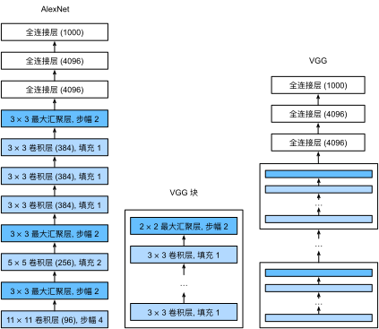

# AlexNet

在 LeNet 提出后，CNN 在计算机视觉和机器学习领域中很有名气，但 CNN 并没有主导这些领域。这是因为虽然 LeNet 在小数据集上取得了很好的效果，但是在更大、更真实的数据集上训练 CNN 的性能和可行性还有待研究。事实上，在上世纪 90 年代初到 2012 年之间的大部分时间里，神经网络往往被其他机器学习方法超越，如 SVM。

2012年，AlexNet 横空出世。它首次证明了机器自己学习到的特征可以超越手工设计的特征，因此它一举打破了计算机视觉研究的现状。AlexNet 使用了 8 层 CNN，并以很大的优势赢得了 2012 年 ImageNet 图像识别挑战赛。

## 网络结构

AlexNet 和 LeNet 的架构非常相似，但在  LeNet 的基础上做了改进，提出了更深的 CNN 网络模型。整个网络的结构：

- 输入层：$227\times 227\times 3$，可以输入 RGB 3 通道的图像。
- 卷积层：由于 ImageNet 中大多数图像的宽和高比 MNIST 图像的多 10 倍以上，因此需要一个更大的卷积窗口来捕获目标。
  - 卷积核：$11\times11$，步幅 4
  - 通道：96
- 池化层：
  - $3\times3$
  - 步幅：2
- 卷积层：
  - 卷积核：$5\times5$
- 池化层：
  - $3\times3$
  - 步幅：2
- 卷积层：
  - 卷积核：$3\times3$
- 卷积层：
  - 卷积核：$3\times3$
- 卷积层：
  - 卷积核：$3\times3$
- 池化层：
  - $3\times3$
  - 步幅：2
- 全连接层：
  - 输出：4096
  - Dropout：p=0.5
- 全连接层：
  - 输出：4096
  - Dropout：p=0.5
- 输出层：
  - 输出：1000

在最后一个卷积层后有两个全连接层，分别有 4096 个输出。这两个巨大的全连接层拥有将近 1GB 的模型参数。

### ReLU 激活函数

此外，AlexNet 将 sigmoid() 激活函数改为更简单的 ReLU() 激活函数。一方面，ReLU() 的计算更简单，它不需要如 sigmoid() 那般复杂的求幂运算。另一方面，当使用不同的参数初始化方法时，ReLU() 使训练模型更加容易。

另外，当 sigmoid() 的输出非常接近于 0 或 1 时，这些区域的梯度几乎为 0，因此反向传播无法持续更新一些模型参数。如果模型参数没有正确初始化，sigmoid() 可能在正区间内得到几乎为 0 的梯度，从而使模型无法得到有效的训练。相反，ReLU() 在正区间的梯度总是 1。

## 数据增强

为了进一步扩充数据，AlexNet 在训练时增加了大量的图像增强数据，如翻转、裁切和变色。这使得模型更健壮，更大的样本量有效地减少了过拟合。

## VGG

为了支撑好更深的 CNN 网络，VGG（Visual Geometry Group） 在 AlexNet 的基础上采用更模块化的结构。同时，它采用了“高宽减半、通道数翻倍”的策略，使网络更深。

### 网络结构

与 AlexNet、LeNet 一样，VGG 网络可以分为两部分：第一部分主要由卷积层和池化层组成的多个卷积快，第二部分由全连接层组成的一个全连接块。VGG 网络连接几个卷积块，其中有超参数变量指定了每个 VGG 块里卷积层个数和输出通道数，全连接块则与 AlexNet 中的相同。

原始 VGG 网络有 5 个卷积块，其中前两个块各有一个卷积层，后三个块各包含两个卷积层。第一个模块有 64 个输出通道，每个后续模块将输出通道数量翻倍，直到该数字达到 512。由于该网络使用 8 个卷积层和 3 个全连接层，因此它通常被称为 VGG-11。

## NiN

LeNet、AlexNet 和 VGG 都有一个共同的设计模式：通过一系列的卷积层与池化层来提取空间结构特征，然后通过全连接层对特征的表征进行处理。AlexNet 和 VGG 对 LeNet 的改进主要在于如何扩大和加深这两个模块。

回想一下，卷积层的输入和输出由四维张量组成，张量的每个轴分别对应样本、通道、高度和宽度。另外，全连接层的输入和输出通常是分别对应于样本和特征的二维张量。NiN 的想法是在每个像素位置（针对每个高度和宽度）应用一个全连接层。如果我们将权重连接到每个空间位置，我们可以将其视为 $1\times1$ 卷积层。从另一个角度看，即将空间维度中的每个像素视为单个样本，将通道维度视为不同特征（feature）。

### 1X1卷积层

$1 \times 1$ 卷积，即 $k_h=k_w=1$，看起来似乎没有多大意义，毕竟卷积的本质是有效提取相邻像素间的相关特征，而 $1 \times 1$ 卷积显然没有此作用。尽管如此， $1 \times 1$ 仍然十分流行，经常包含在复杂深层网络的设计中，它的作用是用来转换输入通道与输出通道数。

下图展示了使用 $1\times 1$ 卷积核与 $3$ 个输入通道和 $2$ 个输出通道的卷积计算。这里输入和输出具有相同的高度和宽度，输出中的每个元素都是从输入图像中同一位置的元素的线性组合。我们可以将 $1\times 1$ 卷积层看作在每个像素位置应用的全连接层，以 $c_i$ 个输入值转换为 $c_o$ 个输出值。因为这仍然是一个卷积层，所以跨像素的权重是一致的。同时，$1\times 1$ 卷积层需要的权重维度为 $c_o\times c_i$，再额外加上一个偏置。

例如，我们有一个特征图，其尺寸为 32×32×25632×32×256，即宽度、高度都是 32，而通道数为 256。现在，我们希望使用 1×1 的卷积来减少通道数，从而降低计算复杂性，但仍然希望保留大部分重要信息。

1. 我们可以应用 64 个 1×1 的卷积核，这将把原始的 256 通道数据压缩成 64 通道，这些卷积核会学习如何从原始的 256 个通道中挑选或组合信息。
2. 输出的特征图尺寸为 32×32×64。请注意，空间维度（宽和高）保持不变，但通道数已经减少了。
3. 在此过程中，我们实际上减少了后续操作的计算量，因为处理 64 个通道的数据比处理 256 个通道的数据要快得多。

### 网络结构

下图说明了 VGG 和 NiN 及它们的块之间主要架构差异。

#### NiN块

NiN 块以一个普通卷积层开始，后面是两个 $1\times1$ 的卷积层。这两个 $1\times1$ 卷积层充当带有 ReLU() 激活函数的逐像素全连接层。第一层的卷积窗口形状通常由用户设置，随后的卷积窗口形状固定为 $1\times1$。

最初的 NiN 网络是在 AlexNet 后不久提出的，显然从中得到了一些启示。NiN 使用窗口形状为 $11\times11$、$5\times5$ 和 $3\times3$ 的卷积层，输出通道数量与 AlexNet 中的相同。每个 NiN 块后有一个最大汇聚层，汇聚窗口形状为 $3\times3$，步幅为 2。

#### 全局平均汇聚层

NiN 和 AlexNet 之间的一个显著区别是 NiN 完全取消了全连接层。相反，NiN 使用一个 NiN 块，其输出通道数等于标签类别的数量。最后放一个全局平均汇聚层（Global Average Pooling Layer），生成一个对数几率（logits）。

NiN 设计的一个优点是，它显著减少了模型所需参数的数量。然而，在实践中，这种设计有时会增加训练模型的时间。

