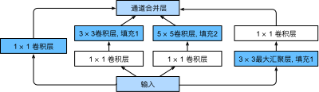
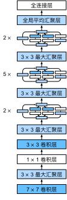

# GoogLeNet

在 2014 年的 ImageNet 图像识别挑战赛中，一个名叫 GoogLeNet 的网络架构大放异彩，GoogLeNet 吸收了 NiN 中串联网络的思想，并在此基础上做了改进。

## 网络架构

### Inception块

在 GoogLeNet 中，基本的卷积块被称为 Inception 块（Inception block）。这很可能得名于电影《盗梦空间》（Inception），因为电影中的一句话“我们需要走得更深”（We need to go deeper）。

如图所示，Inception 块由四条并行路径组成。前三条路径使用窗口大小为 $1\times1$、$3\times3$ 和 $5\times5$ 的卷积层，从不同空间大小中提取信息。中间的两条路径在输入上执行 $1\times1$ 卷积，以减少通道数，从而降低模型的复杂性。第四条路径使用 $3\times3$ 最大汇聚层，然后使用 $1\times1$ 卷积层来改变通道数。

这四条路径都使用合适的填充来使输入与输出的高和宽一致，最后我们将每条线路的输出在通道维度上连结，并构成 Inception 块的输出。在 Inception 块中，通常调整的超参数是每层输出通道数。

### 整体架构

如图所示，GoogLeNet 一共使用 9 个 Inception 块和全局平均汇聚层的堆叠来生成其估计值。Inception 块之间的最大汇聚层可降低维度。第一个模块类似于 AlexNet 和 LeNet，Inception 块的组合从 VGG 继承，全局平均汇聚层避免了在最后使用全连接层。

- 第一个模块使用 64 个通道、$7\times7$ 卷积层。
- 第二个模块使用两个卷积层：第一个卷积层是 64 个通道、$1\times1$ 卷积层；第二个卷积层使用将通道数量增加三倍的$3\times3$卷积层。 这对应于Inception块中的第二条路径。
- 第三个模块串联两个完整的 Inception 块。第一个 Inception 块的输出通道数为 $64+128+32+32=256$，四个路径之间的输出通道数量比为 $64:128:32:32=2:4:1:1$。第二个和第三个路径首先将输入通道的数量分别减少到 $96/192=1/2$ 和 $16/192=1/12$，然后连接第二个卷积层。第二个 Inception 块的输出通道数增加到 $128+192+96+64=480$，四个路径之间的输出通道数量比为 $128:192:96:64 = 4:6:3:2$。第二条和第三条路径首先将输入通道的数量分别减少到 $128/256=1/2$ 和 $32/256=1/8$。
- 第四模块更加复杂，它串联了 5 个Inception 块，其输出通道数分别是 $192+208+48+64=512$、$160+224+64+64=512$、$128+256+64+64=512$、$112+288+64+64=528$ 和 $256+320+128+128=832$。这些路径的通道数分配和第三模块中的类似，首先是含 $3×3$ 卷积层的第二条路径输出最多通道，其次是仅含 $1×1$ 卷积层的第一条路径，之后是含 $5×5$ 卷积层的第三条路径和含 $3×3$ 最大汇聚层的第四条路径。其中第二、第三条路径都会先按比例减小通道数。这些比例在各个 Inception 块中都略有不同。
- 第五模块包含输出通道数为 $256+320+128+128=832$ 和$384+384+128+128=1024$ 的两个 Inception 块。其中每条路径通道数的分配思路和第三、第四模块中的一致，只是在具体数值上有所不同。需要注意的是，第五模块的后面紧跟输出层，该模块同 NiN 一样使用全局平均汇聚层，将每个通道的高和宽变成 1。最后我们将输出变成二维数组，再接上一个输出个数为标签类别数的全连接层。

