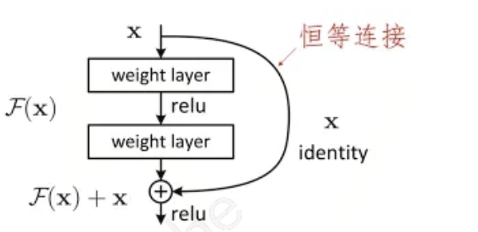

# ResNet

## 批量泛化

在每一层（或特定的层）的激活函数之前或之后，对mini-batch的输出结果进行归一化操作，使其服从均值为0、标准差为1的正态分布。

对于典型的 MLP 或 CNN，当我们训练时，中间层中的变量可能具有更广的变化范围：不论是沿着从输入到输出的层，跨同一层中的单元，或是随着时间的推移，模型参数的随着训练更新变幻莫测。批量规范化的发明者非正式地假设，这些变量分布中的这种偏移可能会阻碍网络的收敛。直观地说，我们可能会猜想，如果一个层的可变值是另一层的100倍，这可能需要对学习率进行补偿调整。

批量规范化应用于单个可选层（也可以应用到所有层），其原理如下：在每次训练迭代中，我们首先规范化输入，即通过减去其均值并除以其标准差，其中两者均基于当前小批量处理。接下来，我们应用比例系数和比例偏移。正是由于这个基于“批量”统计的“标准化”，才有了“批量规范化”的名称。

从形式上来说，用 $\mathbf{x} \in \mathcal{B}$ 表示一个来自小批量 $\mathcal{B}$ 的输入，批量规范化 $\mathrm{BN}$ 根据以下表达式转换 $\mathbf{x}$：$\mathrm{BN}(\mathbf{x}) = \boldsymbol{\gamma} \odot \frac{\mathbf{x} - \hat{\boldsymbol{\mu}}_\mathcal{B}}{\hat{\boldsymbol{\sigma}}_\mathcal{B}} + \boldsymbol{\beta}$，$\hat{\boldsymbol{\mu}}_\mathcal{B}$ 是小批量 $\mathcal{B}$ 的样本均值，$\hat{\boldsymbol{\sigma}}_\mathcal{B}$ 是小批量 $\mathcal{B}$ 的样本标准差。

应用标准化后，生成的小批量的平均值为 0 和单位方差为 1。由于单位方差（与其他一些魔法数）是一个主观的选择，因此我们通常包含拉伸参数（scale）$\boldsymbol{\gamma}$ 和偏移参数（shift）$\boldsymbol{\beta}$，它们的形状与 $\mathbf{x}$ 相同。

请注意，$\boldsymbol{\gamma}$ 和 $\boldsymbol{\beta}$ 是需要与其他模型参数一起学习的参数。

### 批量规范化层

回想一下，批量规范化和其他层之间的一个关键区别是，由于批量规范化在完整的小批量上运行，因此我们不能像以前在引入其他层时那样忽略批量大小。我们在下面讨论这两种情况：全连接层和卷积层，他们的批量规范化实现略有不同。

#### 全连接层

通常，我们将批量规范化层置于全连接层中的仿射变换和激活函数之间。设全连接层的输入为 x，权重参数和偏置参数分别为 $\mathbf{W}$ 和 $\mathbf{b}$，激活函数为 $\phi$，批量规范化的运算符为 $\mathrm{BN}$。那么，使用批量规范化的全连接层的输出的计算详情为：$\mathbf{h} = \phi(\mathrm{BN}(\mathbf{W}\mathbf{x} + \mathbf{b}) )$。

回想一下，均值和方差是在应用变换的"相同"小批量上计算的。

#### 卷积层

同样，对于卷积层，我们可以在卷积层之后和非线性激活函数之前应用批量规范化。当卷积有多个输出通道时，我们需要对这些通道的“每个”输出执行批量规范化，每个通道都有自己的拉伸（scale）和偏移（shift）参数，这两个参数都是标量。

假设我们的小批量包含 $m$ 个样本，并且对于每个通道，卷积的输出具有高度 $p$ 和宽度 $q$。那么对于卷积层，我们在每个输出通道的 $m \cdot p \cdot q$ 个元素上同时执行每个批量规范化。因此，在计算平均值和方差时，我们会收集所有空间位置的值，然后在给定通道内应用相同的均值和方差，以便在每个空间位置对值进行规范化。

#### 预测过程中的批量规范化

正如我们前面提到的，批量规范化在训练模式和预测模式下的行为通常不同。首先，将训练好的模型用于预测时，我们不再需要样本均值中的噪声以及在微批次上估计每个小批次产生的样本方差了。其次，例如，我们可能需要使用我们的模型对逐个样本进行预测。一种常用的方法是通过移动平均估算整个训练数据集的样本均值和方差，并在预测时使用它们得到确定的输出。可见，和 Dropout 一样，批量规范化层在训练模式和预测模式下的计算结果也是不一样的。

批量归一化（Batch Normalization，简称BN）层在训练和推理过程中的主要区别在于计算均值和方差的方法。

在训练过程中：

- 批量归一化层会对每个批次（mini-batch）的数据计算均值和方差。
- 然后使用这些计算出的均值和方差对每个批次的数据进行归一化。
- 同时，批量归一化层会学习可训练的参数（比例因子和偏移因子），以便在归一化后对数据进行缩放和平移。
- 在训练过程中，批量归一化还会维护一个指数加权移动平均值，用于估计整个训练集的均值和方差。这些估计值将在推理过程中使用。

在推理过程中：

- 批量归一化层不再使用每个批次的数据来计算均值和方差，而是使用在训练过程中计算得到的整个训练集的均值和方差估计值。
- 使用这些估计值对输入数据进行归一化，并应用训练过程中学习到的可训练参数（比例因子和偏移因子）进行缩放和平移。

总之，批量归一化层在训练和推理过程中的主要区别在于计算均值和方差的方式。在训练过程中，它使用每个批次的数据进行计算；而在推理过程中，它使用训练过程中得到的整个训练集的均值和方差估计值。

## ResNet

如图所示，对于非嵌套函数（non-nested function）类，较复杂的函数类并不总是向“真”函数 $f^*$ 靠拢（复杂度由 $\mathcal{F}_1$ 向 $\mathcal{F}_6$ 递增）。在图的左边，虽然 $\mathcal{F}_3$ 比 $\mathcal{F}_1$ 更接近 $f^*$，但 $\mathcal{F}_6$ 却离的更远了。相反，对于右侧的嵌套函数（nested function）类 $\mathcal{F}_1 \subseteq \ldots \subseteq \mathcal{F}_6$，我们可以避免上述问题。

因此，只有当较复杂的函数类包含较小的函数类时，我们才能确保提高它们的性能。对于深度神经网络，如果我们能将新添加的层训练成 Identity Function $f(\mathbf{x}) = \mathbf{x}$，新模型和原模型将同样有效。同时，由于新模型可能得出更优的解来拟合训练数据集，因此添加层似乎更容易降低训练误差。

针对这一问题，何恺明等人提出了 ResNet 残差网络。它在 2015 年的 ImageNet 图像识别挑战赛夺魁，并深刻影响了后来的深度神经网络的设计。残差网络的核心思想是：每个附加层都应该更容易地包含原始函数作为其元素之一。于是，残差块（Residual Blocks）便诞生了，这个设计对如何建立深层神经网络产生了深远的影响。凭借它，ResNet 赢得了 2015 年 ImageNe t大规模视觉识别挑战赛。

### 网络结构

#### 残差块

如图所示，假设我们的原始输入为 $x$，而希望学出的理想映射为 $f(\mathbf{x})$。左图虚线框中的部分需要直接拟合出该映射$f(\mathbf{x})$，而右图虚线框中的部分则需要拟合出残差映射$f(\mathbf{x}) - \mathbf{x}$。

残差映射在现实中往往更容易优化。以本节开头提到的 Identify Function 作为我们希望学出的理想映射 $f(\mathbf{x})$，我们只需将右图虚线框内上方的加权运算（如仿射）的权重和偏置参数设成 0，那么 $f(\mathbf{x})$ 即为恒等映射。实际中，当理想映射$f(\mathbf{x})$极接近于恒等映射时，残差映射也易于捕捉恒等映射的细微波动。

在残差块中，输入可通过跨层数据线路更快地向前传播。

ResNet 沿用了 VGG 完整的 $3\times3$ 卷积层设计。残差块里首先有 2 个有相同输出通道数的 $3\times3$ 卷积层。每个卷积层后接一个批量规范化层和 ReLU 激活函数。然后我们通过跨层数据通路，跳过这 2 个卷积运算，将输入直接加在最后的 ReLU 激活函数前。

这样的设计要求 2 个卷积层的输出与输入形状一样，从而使它们可以相加。如果想改变通道数，就需要引入一个额外的 $1\times1$ 卷积层来将输入变换成需要的形状后再做相加运算。

#### 整体结构

- ResNet 的前两层跟之前介绍的 GoogLeNet 中的一样：在输出通道数为 64、步幅为 2 的 $7\times7$ 卷积层后，接步幅为 2 的 $3\times3$ 的最大汇聚层。不同之处在于 ResNet 每个卷积层后增加了批量规范化层。
- GoogLeNet 在后面接了 4 个由 Inception 块组成的模块。ResNet 则使用 4 个由残差块组成的模块，每个模块使用若干个同样输出通道数的残差块。第一个模块的通道数同输入通道数一致。由于之前已经使用了步幅为 2 的最大汇聚层，所以无须减小高和宽。之后的每个模块在第一个残差块里将上一个模块的通道数翻倍，并将高和宽减半。
- 接着在 ResNet 加入所有残差块，这里每个模块使用 2 个残差块。
- 最后，与 GoogLeNet 一样，在 ResNet 中加入全局平均汇聚层，以及全连接层输出。

每个模块有 4个 卷积层（不包括恒等映射的 $1\times1$ 卷积层）。加上第一个 $7\times7$ 卷积层和最后一个全连接层，共有 18 层。因此，这种模型通常被称为 ResNet-18。通过配置不同的通道数和模块里的残差块数可以得到不同的 ResNet模 型，例如更深的含 152 层的 ResNet-152。

虽然 ResNet 的主体架构跟 GoogLeNet 类似，但 ResNet 架构更简单，修改也更方便。这些因素都导致了 ResNet 迅速被广泛使用。

