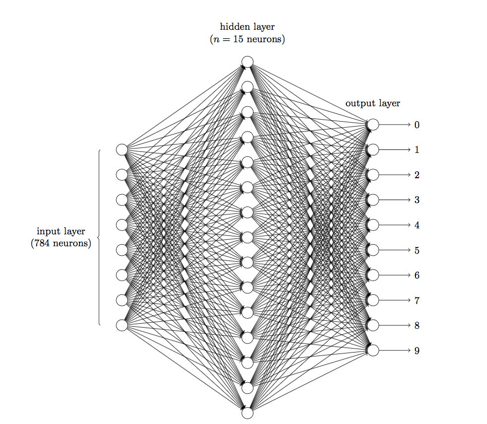
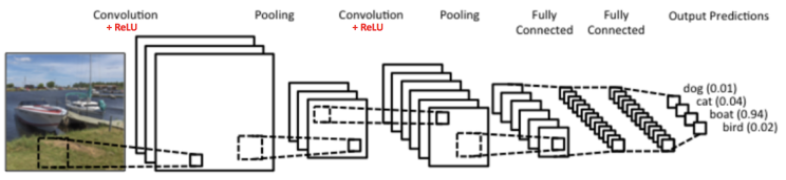

# CNN

## 简介

我们之前讨论的 MLP 十分适合处理表格数据，其中行对应样本、列对应特征。对于表格数据，我们寻找的模式可能涉及特征之间的交互，但是我们不能预先假设任何与特征交互相关的先验结构，此时 MLP 可能是最好的选择。然而对于高维感知数据，这种缺少结构的网络可能会变得不实用。如果用之前的 MLP 处理图像数据时，我们仅仅通过将图像数据展平成一维向量而忽略了每个图像的空间结构信息，再将数据送入一个全连接的 MLP 中。

我们知道，图像是由一个个像素点构成，每个像素点有三个通道，分别代表 RGB 颜色。那么，如果一个图像的尺寸是（28，28，1），即代表这个图像的是一个长宽均为 28，channel 为 1 的图像。如果使用全连接的网络结构，即网络中的神经与相邻层上的每个神经元均连接，那就意味着我们的网络有 28 * 28 =784 个神经元，hidden 层采用了 15 个神经元，那么简单计算一下，我们需要的参数个数（w 和 b）就有：$784\times15\times10+15+10=117625$ 个。这个参数太多了，随便进行一次反向传播计算量都是巨大的，从计算资源和调参的角度都不建议用传统的神经网络。

我们用传统的三层神经网络需要大量的参数，原因在于每个神经元都和相邻层的神经元相连接，但是思考一下，这种连接方式是必须的吗？全连接层的方式对于图像数据来说似乎显得不这么友好，因为图像本身具有“二维空间特征”，通俗点说就是局部特性。譬如我们看一张猫的图片，可能看到猫的眼镜或者嘴巴就知道这是张猫片，而不需要说每个部分都看完了才知道，啊，原来这个是猫啊。所以如果我们可以用某种方式对一张图片的某个典型特征识别，那么这张图片的类别也就知道了，这个时候就产生了卷积的概念。

卷积神经网络 CNN（Convolutional Neural Network）是一类强大的、为处理图像数据而设计的神经网络。CNN 属于前馈神经网络，其特点是每层的神经元节点只响应前一层局部区域范围内的神经元。

### 空间信息/图形3大特征

空间信息：把图像这样不分先后的信息称为空间信息。

1. pattern 要比原图小
2. pattern 可以出现在原图的各个位置
3. 压缩原图（subsampling）不会改变对其的认知

其中 1、2 通过卷积（convolution）解决，而 3 通过池化（pooling）解决。

### 卷积（特征提取）

在数学中，卷积是一个函数越过另一个函数时两个函数重叠多少的积分度量。具体而言，两个函数（如 $f, g: \mathbb{R}^d \to \mathbb{R}$）之间的“卷积”被定义为 $(f * g)(\mathbf{x}) = \int f(\mathbf{z}) g(\mathbf{x}-\mathbf{z}) d\mathbf{z}$。也就是说，卷积是当把一个函数“翻转”并移位 $\mathbf{x}$ 时，测量 $f$ 和 $g$ 之间的重叠。对于二维张量，则为$f$的索引 $(a, b)$ 和 $g$ 的索引 $(i-a, j-b)$ 上的对应加和：$(f * g)(i, j) = \sum_a\sum_b f(a, b) g(i-a, j-b)$。

在具体应用中，往往有多个 filter 卷积核，每个 filter 代表了一种图像模式，如果某个图像块与此 filter 卷积出的值大，则认为此图像块十分接近于此 filter。如果设计了 6 个 filter，可以理解：认为这个图像上有 6 种底层纹理模式，也就是用 6 种基础模式就能描绘出一副图像。

CNN 的卷积层中可以有多个卷积核，每个卷积核操作完成后，都会输出一个 feature map 特征图（也就是卷积后的结果矩阵）。这个特征图是输入图像或上一层特征图的一个变换，它突显了我们希望提取、检测的特定特征在何处存在。以 LeNet 为例，它的第一层卷积核有 6 个，因此可以提取出图像的 6 个特征，从而得到 6 个特征图（feature maps）。

#### 填充（Padding）

对于输入的高度和宽度都为 $3$，卷积核的高度和宽度都为 $2$，生成的输出表征的维数为 $2\times2$。假设输入形状为 $n_h\times n_w$，卷积核形状为 $k_h\times k_w$，那么输出形状将是 $(n_h-k_h+1) \times (n_w-k_w+1)$。因此，卷积的输出形状取决于输入形状和卷积核的形状。

卷积后的矩阵大小与一开始的不一致，那么需要对边缘进行填充以保证尺寸一致。填充（padding）指在输入图像的边界填充元素（通常填充元素是 $0$）。填充可以增加输出的高度和宽度，这常用来使输出与输入具有相同的高和宽。例如，我们将 $3 \times 3$ 输入填充到 $5 \times 5$，那么它的输出就增加为 $4 \times 4$。阴影部分是第一个输出元素以及用于输出计算的输入和核张量元素：$0\times0+0\times1+0\times2+0\times3=0$。

通常，如果我们添加 $p_h$ 行填充（大约一半在顶部，一半在底部）和 $p_w$ 列填充（左侧大约一半，右侧一半），则输出形状将为 $(n_h-k_h+p_h+1)\times(n_w-k_w+p_w+1)$。这意味着输出的高度和宽度将分别增加 $p_h$ 和 $p_w$。在许多情况下，我们需要设置 $p_h=k_h-1$ 和 $p_w=k_w-1$，使输入和输出具有相同的高度和宽度。这样可以在构建网络时更容易地预测每个图层的输出形状。假设 $k_h$ 是奇数，我们将在高度的两侧填充 $p_h/2$ 行。如果 $k_h$ 是偶数，则一种可能性是在输入顶部填充 $\lceil p_h/2\rceil$ 行，在底部填充 $\lfloor p_h/2\rfloor$ 行。同理，我们填充宽度的两侧。CNN 中卷积核的高度和宽度通常为奇数，例如1、3、5 或 7。选择奇数的好处是，保持空间维度的同时，我们可以在顶部和底部填充相同数量的行，在左侧和右侧填充相同数量的列。

#### 步幅（Stride）

在计算卷积时，卷积窗口从输入张量的左上角开始，向下、向右滑动。在前面的例子中，我们默认每次滑动一个元素。但是，有时候为了高效计算或是缩减采样次数，卷积窗口可以跳过中间位置，每次滑动多个元素。我们将每次滑动元素的数量称为步幅（stride）。

下图垂直步幅为 $3$、水平步幅为 $2$ 的二维卷积运算。着色部分是输出元素以及用于输出计算的输入和内核张量元素：$0\times0+0\times1+1\times2+2\times3=8$、$0\times0+6\times1+0\times2+0\times3=6$。可以看到，为了计算输出中第一列的第二个元素和第一行的第二个元素，卷积窗口分别向下滑动三行和向右滑动两列。但是，当卷积窗口继续向右滑动两列时，没有输出，因为输入元素无法填充窗口（除非我们添加另一列填充）。

有时，我们可能希望大幅降低图像的宽度和高度。例如，如果我们发现原始的输入分辨率十分冗余，步幅则可以在这类情况下提供帮助。例如输出的高和宽仅为输入的高和宽的 $1/n$（$n$ 是一个大于 $1$ 的整数）。

通常，当垂直步幅为 $s_h$、水平步幅为 $s_w$ 时，输出形状为 $\lfloor(n_h-k_h+p_h+s_h)/s_h\rfloor \times \lfloor(n_w-k_w+p_w+s_w)/s_w\rfloor$。如果我们设置了 $p_h=k_h-1$ 和 $p_w=k_w-1$，则输出形状将简化为 $\lfloor(n_h+s_h-1)/s_h\rfloor \times \lfloor(n_w+s_w-1)/s_w\rfloor$。更进一步，如果输入的高度和宽度可以被垂直和水平步幅整除，则输出形状将为 $(n_h/s_h) \times (n_w/s_w)$。

### 通道（特征组合）

图像一般包含三种原色（红、绿、蓝），因此图像不是二维张量，而是一个由高度、宽度和颜色组成的三维张量。当我们添加通道时，我们的输入和隐藏的表示都变成了三维张量。例如，每个 RGB 输入图像具有 $3\times h\times w$ 的形状。我们将这个大小为 $3$ 的轴称为通道（channel）维度。

通道的本质就是为输入数据提供“大小相同”的不同“分类处理方式”，每个通道对应一个“子类”。直观上可以想象在靠近输入的底层，一些通道专门识别边缘，而一些通道专门识别纹理。例如，我们处理的是一个简单的灰度图像（没有颜色通道，只有亮度信息），我们希望通过 CNN 检测其中的边缘和角落。

1. 我们可能会有一个 3x3 的卷积核，专门设计用来检测垂直边缘。当这个卷积核滑过图像时，它产生的输出会强调图像中的垂直边缘，这就是一个特征图。
2. 同样地，我们可能还有另一个 3x3 的卷积核，用于检测水平边缘，这会产生另一个特征图。
3. 再比如，我们还可能有另一个卷积核，专门设计用来检测角落，这也会产生对应的特征图。

现在，我们有 3 个不同的特征图，它们分别代表垂直边缘、水平边缘和角落。如果我们将这三个特征图堆叠在一起，就得到了一个输出通道为 3 的输出。这三个通道分别代表了三种不同的特征，它们就是新的特征图。

#### 多输入/单输出通道

当输入包含多个通道时，需要构造一个与输入数据具有相同通道数的卷积核，以便与输入数据进行卷积运算。假设输入的通道数为 $c_i$，那么卷积核的输入通道数也需要为 $c_i$。

如果卷积核的窗口形状是 $k_h\times k_w$，那么当 $c_i=1$ 时，我们可以把卷积核看作形状为 $k_h\times k_w$ 的二维张量。然而，当 $c_i>1$ 时，我们卷积核的每个输入通道将包含形状为 $k_h\times k_w$ 的张量。将这些张量 $c_i$ 连结在一起可以得到形状为 $c_i\times k_h\times k_w$ 的卷积核。由于输入和卷积核都有 $c_i$ 个通道，我们可以对每个通道输入的二维张量和卷积核的二维张量进行互相关运算，再对所有通道求和（将 $c_i$ 的结果相加）得到二维张量。这是多通道输入和多输入通道卷积核之间进行二维互相关运算的结果。简而言之，就是对每个通道执行卷积操作，然后将结果相加，从而合并为一个通道。

在下例中，我们演示了一个具有两个输入通道的二维互相关运算的示例。阴影部分是第一个输出元素以及用于计算这个输出的输入和核张量元素：$(1\times1+2\times2+4\times3+5\times4)+(0\times0+1\times1+3\times2+4\times3)=56$。

#### 多输入/多输出通道

到目前为止，不论有多少输入通道，我们还只有一个输出通道，但每一层有多个输出通道是至关重要的，因为多个输出通道代表着多个不同的“子类特征模式”。而现实可能更为复杂一些，因为每个通道不是独立学习的，而是为了共同使用而优化的。在最流行的神经网络架构中，随着神经网络层数的加深，我们常会增加输出通道的维数，通过减少空间分辨率以获得更大的通道深度。

用 $c_i$ 和 $c_o$ 分别表示输入和输出通道的数目，并让 $k_h$ 和 $k_w$ 为卷积核的高度和宽度。为了获得多个通道的输出，我们可以为每个输出通道创建一个形状为 $c_i\times k_h\times k_w$ 的卷积核张量，这样卷积核的形状是 $c_o\times c_i\times k_h\times k_w$。在互相关运算中，每个输出通道先获取所有输入通道，再以对应该输出通道的卷积核计算出结果。

这样做的核心意义是能够从输入特征图中提取更多的、不同类型的特征，并将这些特征组合起来以更丰富地描述原始数据。每个卷积核都被设计为检测输入数据中的某种特定特征。当我们有多个输出通道时，意味着我们使用了多个不同的卷积核，每个都能检测不同的特征。在深度神经网络中，随着我们进入更深的层，卷积核开始提取更高级、更抽象的特征。这是因为这些层不仅仅在原始输入数据上操作，还在前几层提取的特征图上操作，这样可以组合并组合低级特征以形成高级特征。

例如，我们要设计一个 CNN 模型来识别车辆。在图像的第一个层面，我们可能会检测边缘、颜色和纹理等基本特征。假设原始图像是 RGB 三通道的，我们设计了16个3x3的卷积核来进行特征提取。

1. 初始状态：输入特征图有 3 个通道（RGB）。
2. 使用 16 个 3x3 的卷积核进行卷积操作后，我们得到了一个具有 16 个通道的输出特征图。
3. 在这 16 个通道中，每个通道都代表了从原始图像中提取的一种特定特征。例如，一个通道可能专注于垂直边缘，另一个可能专注于某种特定的颜色，而另一个可能专注于某种纹理。
4. 当网络进一步深入时，后续的层可能会使用更多的卷积核，这些核可能将前面层的输出组合起来，例如将垂直边缘和特定颜色的检测结合起来，以检测车辆的车轮或车窗等更复杂的特征。

因此，通过增加输出通道的数量，我们能够让模型学习和表示更多的、与任务相关的特征。

### 池化（压缩/降维）

即使做完了卷积，图像仍然很大（因为 filter 比较小），所以为了降低数据维度，就进行下采样。所谓的池化，就是对输入张量的各个子矩阵进行压缩。假如是 2x2 的池化，那么就将子矩阵的每 2x2 元素变成一个元素，如果是 3x3 的池化，那么就将子矩阵的每 3x3 个元素变成一个元素，这样输入矩阵的维度就变小了。它具有双重目的：降低卷积层对位置的敏感性，同时降低对空间降采样表示的敏感性。池化实现了数据的压缩和降维，避免过拟合，它可以大大降低数据的维度。

利用池化操作，将复杂问题简化，把大量参数降维成少量参数再做处理。重要的是在大部分场景下，降维并不会影响结果。比如 1000 像素的图片缩小成 200 像素，并不影响肉眼认出来图片中是一只猫还是一只狗，机器也是如此。

要想将输入子矩阵的每 nxn 个元素变成一个元素，那么需要一个池化标准。常见的池化标准有 2 个，MAX 或 Average，即取对应区域的最大值或者平均值作为池化后的元素值。

- 最大汇聚：最大汇聚层会输出该窗口内的最大值。
- 平均汇聚：平均汇聚层会输出该窗口内的平均值。

下面这个例子采用取最大值的池化方法，采用 2x2 的池化、步幅为 2。首先对红色 2x2 区 域进行池化，由于此 2x2 区域的最大值为 6，那么对应的池化输出位置的值为 6。由于步幅为 2，此时移动到绿色的位置去进行池化，输出的最大值为 8。同样的方法，可以得到黄色区域和蓝色区域的输出值。最终，输入 4x4 的矩阵在池化后变成了 2x2 的矩阵，进行了压缩。

### 卷积 vs. MLP

卷积的目的是**特征提取**，它的操作过程是用一个 filter（卷积核）扫完整张图片，这个过程可以理解为使用一个 filter 来过滤图像的各个小区域，从而得到这些小区域的特征值。实际上每个卷积核都是一种滤波器，它们把图像中符合条件的部分筛选出来，也就相当于做了某种特征提取。卷积的 filter 可以看做是一个 window，如下图中一个 5X5 的网络以及一个 3X3 的 filter，其中 filter 的每个格子上有权值。拿着 filter 在网络上去移动，直到所有的小格子都被覆盖到，每次移动，都将 filter “观察”到的内容，与之权值相乘作为结果输出，最后可以得到一个 (5-3+1)X(5-3+1) 的网格矩阵。

MLP 是一个全连接网络，意味着每一个神经元与前一层的所有神经元都相连。因为每一层都是全连接的，所以**参数量非常大**。如果用 MLP 来“实现”卷积操作，考虑一个单个卷积核和一个单通道的输入图像。我们首先把输入图像展平成一个长向量，然后用一个权重矩阵乘以这个向量得到输出。为了模拟卷积，我们考虑 MLP 的一个隐层，其中每个神经元与输入层大小相同，而神经元数对应卷积核在图像上移动的次数。对每个神经元的线性操作模拟一次卷积操作，整个隐藏层模拟了在图上所有移动的卷积操作。针对每个神经元的大部分输入权重应该为 0，只有与卷积核相对应的局部区域的权重才是非零的。例如，考虑上图一个5x5的输入图像和一个3x3的卷积核。输入图像可以展平成一个25维的向量。模拟卷积操作的隐层有 9 个神经元（因为 3x3 卷积核在图上移动的次数为 9 次），每个神经元的大小为 25。

需要注意的是，MLP 虽然可以模拟卷积操作，这种方法的计算效率远低于真正的卷积操作，还会失去 2 大优势。卷积操作的 2 大优势在于其稀疏连接性和参数共享，使其能够高效地处理图像数据并捕捉局部特征：

- 稀疏连接性：稀疏连接性对应于 MLP 的全连接性。这意味着，如果上一层有 m 个神经元，下一层有 n 个神经元，那么连接两层的 MLP 隐层的权重总数就是 $m\times n$。与传统的 MLP 全连接网络不同，卷积只与输入数据的一个小的局部区域连接，这**体现了图像的空间结构信息**。说的直白点，稀疏连接性表示隐藏层的权重矩阵中大部分权重参数为 0。
- 共享参数：共享参数是通过使用卷积核来实现的。卷积核是一个小型的权重矩阵，它在输入数据上滑动以进行卷积操作。当我们说参数共享时，是指这个卷积核在整个输入数据上滑动时使用相同的权重。换句话说，统一隐层不同神经元的权重参数基本相同，只是位置不同而已。这种参数共享策略大大减少了模型的参数数量，并使得模型具有平移不变性，即不论特征在图像的哪个位置，卷积都可以检测到。

以上图为了，隐层权重参数从 $25\times9$ 减到了 9 个。

## 网络结构

CNN 模型般由若干“卷积块”叠加若干“全连接块”组成，中间包含各种的非线性操作、池化操作。CNN 采用多个“卷积层+池化层”的卷积块对输入进行加工，然后再连接到一个“全连接块”（包含多个 MLP）实现与输出目标之间的映射。

例如上图，最左边船的图像就是输入层，通常表示为 3 通道（RGB）。接着是卷积层，卷积层的激活函数使用 ReLU()。在卷积层后面是池化层，池化层没有激活函数。卷积层+池化层组成的“卷积块”可以多次出现（等价于 MLP 中的多个隐藏层），上图中出现 2 次。可以灵活使用使用卷积层+卷积层，或卷积层+卷积层+池化层的组合，这些在构建模型的时候没有限制。但是最常见的 CNN 都是若干“卷积块”（卷积层+池化层）的组合。在若干“卷积块”后面是多个全连接层（FC - Fully Connected Layer）。全连接层其实就是多个 MLP（使用 Sigmoid()、Tanh() 和 ReLU() 作为激活函数），只是最后的输出层采用了 Softmax() 激活函数来做图像识别的分类。

CNN 包括了卷积层、池化层和全连接层，使用反向传播算法进行训练。

- 卷积层：相当于特征提取，起到滤镜的作用，它可以把图像进行分块，对每一块的图像进行变换操作。
- 池化层：相当于对数据进行降维处理，这样输出的维数就会减少很多，从而降低整体的计算量。
- 全连接层：通常是输出层的上一层，它将上一层神经元输出的数据转变成一维向量。

### 卷积层

卷积层对输入和卷积核权重进行互相关运算，并在添加标量偏置之后产生输出。所以，卷积层中的两个被训练的参数是卷积核权重和标量偏置。

#### 学习卷积核

我们先构造一个卷积层，并将其卷积核初始化为随机张量。接下来，在每次迭代中，我们比较`Y`与卷积层输出的 SME，然后计算梯度来更新卷积核，从而通过最终效果 $\hat{Y}$ 学得真正需要的卷积层。      

#### 多通道

每次卷积操作，可以对相同的原图使用多个不同的 filter。每个 filter 卷积计算的结果就是卷积层中的一个通道，因此每个卷积层可以包含多个通道，其数量等于通道的数量。

#### 激活函数

激活函数是卷积操作的最后一步，其作用是在做完卷积操作之后，通常还需要使用激活函数对图像进一步处理。在逻辑回归中使用的 Sigmoid() 函数在深度学习中有广泛的应用，除了 Sigmoid() 外，tanh()、ReLU() 都是常用的激活函数。这些激活函数通常都是非线性的函数，使用它们的目的是把线性数值映射到非线性空间中。卷积操作实际上是两个矩阵之间的乘法，得到的结果也是线性的。只有经过非线性的激活函数运算之后，才能映射到非线性空间中，这样也可以让神经网络的表达能力更强大。

### 池化层

池化层通常在两个卷积层之间，它的作用相当于对特征图做压缩、降维处理，这样就能降低整体计算量。池化层相比卷积层可以更有效的降低数据维度，这么做不但可以大大减少运算量，还可以有效的避免过拟合。

#### 填充/步长

与卷积层一样，池化层层也可以改变输出形状。和以前一样，我们可以通过填充和步幅以获得所需的输出形状。

#### 多通道

在处理多通道输入数据时，池化层在每个输入通道上单独运算，而不是像卷积层一样在通道上对输入进行汇总，这意味着池化层的输出通道数与输入通道数相同。

### 全连接层

在 CNN 中，可以叠加多个卷积层和池化层来提取更抽象的特征。经过几次卷积和池化之后，通常会有一个或多个全连接层。全连接层将前面一层的输出结果与当前层的每个神经元都进行了连接。经过卷积层和池化层降维过的数据连接层才能”跑得动”，不然数据量太大、计算成本高、效率低下。

### 输出层

输出层最终会使用 Softmax() 作为激活函数。在深度学习中，Softmax() 是个很有用的分类器，通过它可以把输入值映射到 0-1 之间，而且所有输出结果相加等于 1。换种方式理解这个概念，假设我们想要识别一个数字，从 0 到 9 都有可能。那么通过 Softmax 层，对应输出 10  种分类结果，每个结果都有一个概率值，这些概率相加为 1，我们就可以知道这个数字是 0 的概率是多少，是 1 的概率是多少……是 9  的概率又是多少，从而也就帮我们完成了数字识别的任务。

## 训练流程

### 前向传播

- 输入层-卷积层：一般输入层对应的都是卷积层。以图像识别为例，先考虑最简单的二维的黑白图片。这样输入层 𝑋 就是一个矩阵，矩阵的值等于图片的各个像素位置的值，这时和卷积层相连的卷积核 𝑊 就也是矩阵。如果样本都是有 RGB 的彩色图片，这样输入层 𝑋 就是 3 个矩阵，分别对应 R、G 和 B 的矩阵，这时和卷积层相连的卷积核 𝑊 也都是 3 个子矩阵组成。前向传播的过程可以表示为：$𝑎^2=𝜎(𝑧^2)=𝜎(𝑎^1∗𝑊^2+𝑏^2)$。其中，上标代表层数、星号代表卷积、而 b 代表偏倚、𝜎 为激活函数，这里是 ReLU()。和 MLP 的前向传播比较一下，其实形式非常的像，只是这里是张量的卷积，而不是矩阵的乘法。
- 隐藏层-卷积层：假设隐藏层的输出是 M 个矩阵对应的三维张量，则输出到卷积层的卷积核也是 M 个子矩阵对应的三维张量。这时表达式和输入层的很像：$𝑎^𝑙=𝜎(𝑧^𝑙)=𝜎(𝑎^{𝑙−1}∗𝑊^𝑙+𝑏^𝑙)$。其中，上标代表层数、星号代表卷积、而 b 代表偏倚、𝜎 为激活函数，这里是 ReLU()。这里的输入是隐藏层来的，而不是输入的原始图片样本形成的矩阵。
- 隐藏层-池化层：池化层的处理逻辑是比较简单的，就是对输入的矩阵进行缩小。比如输入的若干矩阵是 $N\times N$ 维的，而池化大小是 $k\times k$ 的区域，则输出的矩阵都是 $\frac{𝑁}{𝑘}×\frac{𝑁}{𝑘}$ 维。
- 隐藏层-全连接层：由于全连接层就是普通的 MLP 结构，因此可以直接使用 MLP 的前向传播算法逻辑，即：$𝑎^𝑙=𝜎(𝑧^𝑙)=𝜎(𝑊^𝑙𝑎^{𝑙−1}+𝑏^𝑙)$，这里的激活函数一般是 sigmoid()、tanh() 或 ReLU()。
- 输出层-Softmax：经过了若干全连接层之后，最后的一层为 Softmax 输出层。此时输出层和普通的全连接层唯一的区别是，激活函数是 softmax()。

这里需要定义的 CNN 模型的超参数是：1）全连接层的激活函数；2）全连接层各层神经元的个数。

#### 具体步骤

1. 根据输入层的填充大小 P，填充原始图片的边缘，得到输入张量 $𝑎^1$。
2. 初始化所有隐藏层的参数 𝑊、𝑏
3. for 𝑙=2 to 𝐿−1：
   1. 如果第 𝑙 层是卷积层，则输出为 $𝑎^𝑙=𝑅𝑒𝐿𝑈(𝑧^𝑙)=𝑅𝑒𝐿𝑈(𝑎^{𝑙−1}∗𝑊^𝑙+𝑏^𝑙)$
   2. 如果第 𝑙 层是池化层，则输出为 $𝑎^𝑙=𝑝𝑜𝑜𝑙(𝑎^{𝑙−1})$，这里的 pool 指按照池化区域大小 k 和池化标准将输入张量缩小的过程。
   3. 如果第 𝑙 层是全连接层，则输出为 $𝑎^𝑙=𝜎(𝑧^𝑙)=𝜎(𝑊^𝑙𝑎^{𝑙−1}+𝑏^𝑙)$
4. 对于输出层 L：$𝑎^𝐿=𝑠𝑜𝑓𝑡𝑚𝑎𝑥(𝑧^𝐿)=𝑠𝑜𝑓𝑡𝑚𝑎𝑥(𝑊^𝐿𝑎{𝐿−1}+𝑏^𝐿)$

### 反向传播

#### 具体步骤

1. 初始化各隐藏层与输出层的各 𝑊、𝑏 的值为一个随机值。
2. for 迭代=1 to MAX：
   1. for i =1 to m（样本数）：
      1. 将 CNN 输入 $𝑎^1$ 设置为 $𝑥^𝑖$ 对应的张量
      2. for 𝑙=2 to L-1，根据下面 3 种情况进行前向传播算法计算：
         1. 如果当前是全连接层：则有 $𝑎^{𝑖,𝑙}=𝜎(𝑧^{𝑖,𝑙})=𝜎(𝑊^𝑙𝑎^{𝑖,𝑙−1}+𝑏^𝑙)$
         2. 如果当前是卷积层：则有 $𝑎^{𝑖,𝑙}=𝜎(𝑧^𝑖,𝑙)=𝜎(𝑊^𝑙∗𝑎^{𝑖,𝑙−1}+𝑏^𝑙)$
         3. 如果当前是池化层：则有 $𝑎^{𝑖,𝑙}=𝑝𝑜𝑜𝑙(𝑎^{𝑖,𝑙−1})$，这里的 pool 指按照池化区域大小 k 和池化标准将输入张量缩小的过程。
       4. 对于输出层第 L 层：$𝑎^{𝑖,𝐿}=𝑠𝑜𝑓𝑡𝑚𝑎𝑥(𝑧^{𝑖,𝐿})=𝑠𝑜𝑓𝑡𝑚𝑎𝑥(𝑊^𝐿𝑎^{𝑖,𝐿−1}+𝑏^𝐿)$
       4. 通过损失函数计算输出层的 $𝛿^{𝑖,𝐿}$ 
       5. for 𝑙=L-1 to 2, 根据下面 3 种情况进行进行反向传播算法计算：
          1. 如果当前是全连接层：$𝛿^{𝑖,𝑙}=(𝑊^{𝑙+1})^𝑇𝛿^{𝑖,𝑙+1}⊙𝜎′(𝑧^{𝑖,𝑙})$
          2. 如果当前是卷积层：$𝛿^{𝑖,𝑙}=𝛿^{𝑖,𝑙+1}∗𝑟𝑜𝑡180(𝑊^{𝑙+1})⊙𝜎′(𝑧^{𝑖,𝑙})$
          3. 如果当前是池化层：$𝛿^{𝑖,𝑙}=𝑢𝑝𝑠𝑎𝑚𝑝𝑙𝑒(𝛿^{𝑖,𝑙+1})⊙𝜎′(𝑧^{𝑖,𝑙})$
    2. for 𝑙=2 to L，根据下面 2 种情况更新第 𝑙 层的 $𝑊^𝑙、𝑏^𝑙$：
       1. 如果当前是全连接层：$𝑊^𝑙=𝑊^𝑙−𝛼∑_{𝑖=1}^𝑚𝛿{𝑖,𝑙}(𝑎^{𝑖,𝑙−1})^𝑇$，$𝑏^𝑙=𝑏^𝑙−𝛼∑_{𝑖=1}^𝑚𝛿^{𝑖,𝑙}$
       2. 如果当前是卷积层，对于每一个卷积核有：$𝑊^𝑙=𝑊^𝑙−𝛼∑_{𝑖=1}^𝑚𝑎^{𝑖,𝑙−1}∗𝛿^{𝑖,𝑙}，𝑏^𝑙=𝑏^𝑙−𝛼∑_{𝑖=1}^𝑚∑_{𝑢,𝑣}(𝛿^{𝑖,𝑙})_{𝑢,𝑣}$
     3. 如果所有 𝑊、𝑏 的变化值都小于停止迭代阈值 𝜖，则跳出迭代循环到步骤 3。
4. 输出各隐藏层与输出层的线性关系系数矩阵 𝑊 和偏倚向量 𝑏。

## 总结

CNN 中每一层的作用：

- 卷积层提取特征：通过激活函数让结果映射到非线性空间，增强了结果的表达能力，
- 池化层压缩特征图：降低了网络复杂度
- 全连接层：
- Softmax分类：进行计算每个类别的概率。

通常我们可以使用多个卷积层和池化层，最后再连接一个或者多个全连接层，这样也就产生了不同的网络结构，比如 LeNet 和 AlexNet。