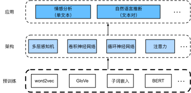
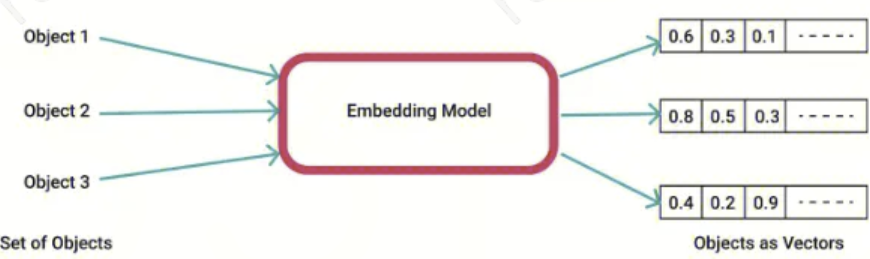
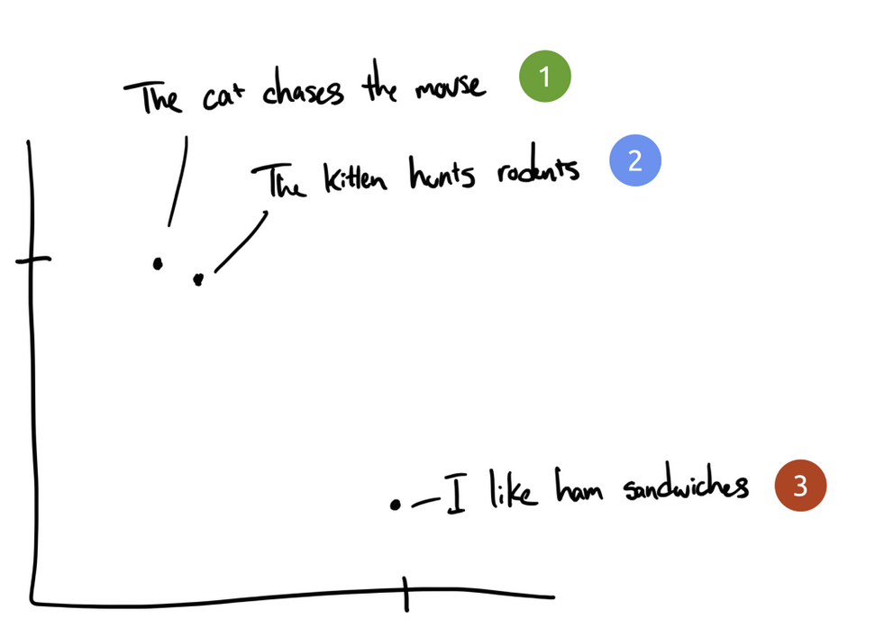
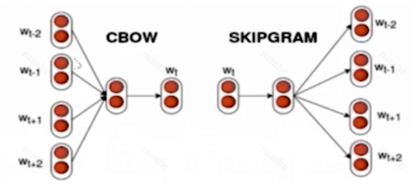
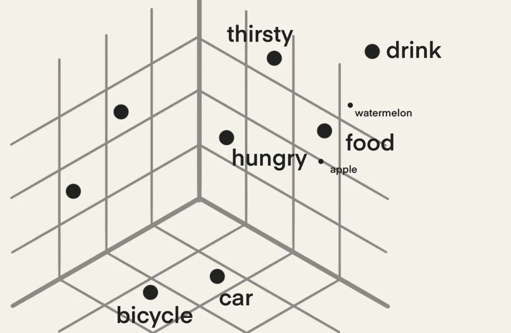
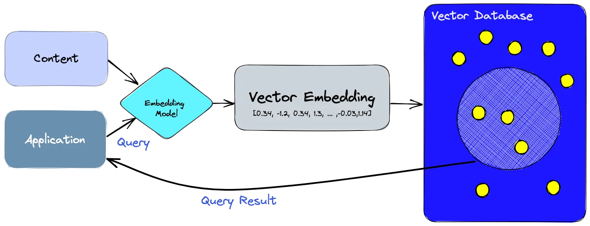
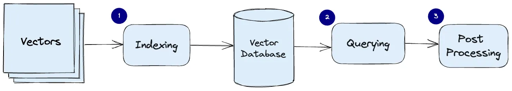

# NLP

## 简介

人与人之间需要交流，出于人类这种基本需要，每天都有大量的书面文本产生，如社交媒体、聊天应用、电子邮件、产品评论、新闻文章、研究论文和书籍中的丰富文本，这使计算机能够理解它们以提供帮助或基于人类语言做出决策变得至关重要。NLP 中文里的翻译是自然语言处理，通俗地讲就是学习一门语言，能懂能说（NLU&NLG）。语言学（Linguistic）源远流长，作为区别于其他生命体的几大超能力之一，人类从很早就开始关注语言和语法，比如专注于古文释义的训诂学，而近代西方更是成立了系统的学科系统，这里不多叙述。

NLP 是指研究使用自然语言的计算机和人类之间的交互。在实践中，使用 NLP 技术来处理和分析文本数据是非常常见的，如语言模型和机器翻译模型。      



NLP 类模型不仅要理解单词的含义，还要结合上下文语义给出有意义的回答。

### 应用场景

#### N-to-1

##### 文本分类

比如我们常见的文本分类，情感计算等都可以归入这一类。它的特点是不管文章有多长，总体给出一个分类类别即可。

这是最典型的 NLP 任务，比如中文分词，词性标注，命名实体识别，语义角色标注等都可以归入这一类问题，它的特点是句子中每个单词要求模型根据上下文都要给出一个分类类别。

-	语义理解
-	感情分析
-	语义角色标注
-	自动打tag

#### N-to-N

##### 文本摘要


##### 对话问答


##### 机器翻译

机器翻译是使用计算机程序将一种自然语言的文本自动翻译为另一种语言的过程。机器翻译的目标是实现人与人之间跨语言的无障碍沟通。语言模型是自然语言处理的关键，而机器翻译是语言模型最成功的基准测试。因为机器翻译正是将输入序列转换成输出序列的序列转换模型（sequence transduction）的核心问题。序列转换模型在各类现代人工智能应用中发挥着至关重要的作用。

机器翻译（machine translation）指的是将序列从一种语言自动翻译成另一种语言。事实上，这个研究领域可以追溯到数字计算机发明后不久的20世纪40年代，特别是在第二次世界大战中使用计算机破解语言编码。
几十年来，在使用神经网络进行端到端学习的兴起之前，统计学方法在这一领域一直占据主导地位。因为统计机器翻译（statistical machine translation）涉及了翻译模型和语言模型等组成部分的统计分析，因此基于神经网络的方法通常被称为神经机器翻译（neural machine translation），用于将两种翻译模型区分开来。本章关注点是神经网络机器翻译方法，强调的是端到端的学习。

与单一语言的语言模型问题存在不同，机器翻译的数据集是由源语言和目标语言的文本序列对组成的。因此，我们需要一种完全不同的方法来预处理机器翻译数据集，而不是复用语言模型的预处理程序。

###### vs. Seq2seq

机器翻译和 seq2seq 虽然经常一同提及，但它们代表的是两个不同的概念。机器学习是应用场景，它用于将文本从一种语言自动翻译为另一种语言。而 seq2seq 是机器学习的一种实现方式，基于 encoder-decoder 架构。机器翻译的实现方法很多，包括基于规则的机器翻译、统计机器翻译和近年来特别受欢迎的神经机器翻译。Seq2seq 是在神经机器翻译领域中的一种实现，它允许模型在没有明确规则的情况下学习如何将输入语言翻译为输出语言。

#### 1-to-N

##### 文本生成

比如机器翻译，文本摘要，写诗造句，看图说话等都属于这一类。它的特点是输入文本内容后，需要自主生成另外一段文字。

### 文本预处理

把文本序列成可以训练的向量表示。

要理解文本，我们可以从学习它的表示开始。在本章中，我们将重点讨论如何预处理文本的这种表示。预处理好的文本表示可以放入各种深度学习架构，应用于不同 NLP 任务。利用来自大型语料库的现有文本序列，自监督学习（self-supervised learning）已被广泛用于文本预处理的表示学习，例如通过使用周围文本的其它部分来预测文本的隐藏部分。通过这种方式，模型可以通过无监督地从海量文本数据中进行表示学习，而不需要昂贵的标签标注。

在深度学习中，处理文本数据需要经过一系列的预处理步骤，以将原始文本数据转化为模型可以接受的数值形式。以下是这个过程中的常见步骤：

#### 序列数据建模

时间数据：把连续的、有先后顺序的数据称为序列数据。

##### 自回归模型

自回归：使用自身过去的数据来预测未来，**也就是输入、输出是同一个序列**。

在深度学习的序列模型中，自回归模型是一种基于其过去值预测序列未来值的模型。从名称上来看，“自”（Auto）意味着输入与输出是同一个序列，而“回归”（Regressive）表示当前的输出是前面时间步的输入的函数。

具体来说，对于时间序列数据 x1,x2,…,xt，自回归模型假设在时间点 $t$ 的值 $x_t$ 是前 p 个时间点的值的函数，即：$x_t=f(x_{t−1},x_{t−2},…,x_{t−p})+ϵ_t$。其中，$f()$ 是一个回归函数，$ϵ_t$ 是噪声或误差项。在深度学习的背景下，这个函数 $f()$ 可以是一个神经网络，例如一个前馈神经网络或一个 RNN。

例如，以下图所示的股票价格（富时100指数）为例，其中用 $x_t$ 表示价格，即在时间步（time step）$t \in \mathbb{Z}^+$ 时，观察到的价格 $x_t$。假设一个交易员想在 $t$ 日的股市中表现良好，于是通过以下途径预测 $x_t$：$x_t \sim P(x_t \mid x_{t-1}, \ldots, x_1)$，自回归模型的大部分应用场景都是围绕着如何有效估计 $P(x_t \mid x_{t-1}, \ldots, x_1)$ 展开的。


自回归模型主要利用了序列数据的自回归性质，即过去的值对未来的值有影响。在深度学习中，自回归模型通常由深度神经网络实现，如 RNN、LSTM 或 Transformer 模型，这些模型能够处理长期依赖关系和复杂的非线性关系。同时，自回归模型也常被用作生成模型。例如，在文本生成中，给定前面的词或字符，模型预测下一个词或字符，然后将这个预测值添加到输入序列中，并继续预测下一个值。

###### 马尔科夫假设

当前数据只跟过去 $\tau$ 个数据相关

在自回归模型的近似法中，我们使用 $x_{t-1}, \ldots, x_{t-\tau}$ 而不是 $x_{t-1}, \ldots, x_1$ 来估计 $x_t$。只要这种近似是精确的，我们就说该序列满足马尔可夫条件（Markov Condition）。特别如果 $\tau = 1$，得到一个 一阶马尔可夫模型（first-order Markov model），$P(x)$ 由下式给出：$P(x_1, \ldots, x_T) = \prod_{t=1}^T P(x_t \mid x_{t-1}) \text{ 当 } P(x_1 \mid x_0) = P(x_1)$。

当假设 $x_t$ 仅是离散值时，这样的模型特别棒。因为在这种情况下，使用动态规划可以沿着马尔可夫链精确地计算结果。例如，我们可以高效地计算 $P(x_{t+1} \mid x_{t-1})$：

$$
\begin{aligned}
P(x_{t+1} \mid x_{t-1})
&= \frac{\sum_{x_t} P(x_{t+1}, x_t, x_{t-1})}{P(x_{t-1})}\\
&= \frac{\sum_{x_t} P(x_{t+1} \mid x_t, x_{t-1}) P(x_t, x_{t-1})}{P(x_{t-1})}\\
&= \sum_{x_t} P(x_{t+1} \mid x_t) P(x_t \mid x_{t-1})
\end{aligned}
$$

利用这一事实，我们只需要考虑过去观察中的一个非常短的时间 $P(x_{t+1} \mid x_t, x_{t-1}) = P(x_{t+1} \mid x_t)$。

###### 隐变量自回归模型

引入潜变量 $h_{t}$ 来概括过去的信息 $h_{t}=f(x_1,...x_{t-1})$

另一种策略是保留一个对过去观测的总结状态 $h_t$（如下图所示），并且同时更新预测值 $\hat{x}_t$ 和总结状态 $h_t$：

- 隐变量更新模型 $h_t = g(h_{t-1}, x_{t-1})$ 
- 预测模型 $\hat{x}_t = P(x_t \mid h_{t})$

由于 $h_t$ 从未被观测到，这类模型也被称为隐变量自回归模型（Latent AutoRegressive Models），RNN 就是基于隐变量自回归模型来设计的。


#### 文本清洗

- 移除文本中的无关内容：如 HTML 标签、URL 链接、特殊符号等。
- 转换大小写：例如将所有文本转换为小写，以减少词汇表的大小和复杂性。
- 移除或替换特定字符或子串：如数字、标点符号等。

#### Token分词化

模型接受文本来训练预测文本，与其他 NLP 系统类似，token 是基本的预处理步骤，它的目的是将文本解析未不可分解单元。分词 token 是将文本分解成词汇单元的过程，如单词、子词或字符。例如，“我爱深度学习”可以被分割为 ["我", "爱", "深度", "学习"]。把这些词汇单元通常是语言中的最小可操作单元，可以是单词、子词（单词的一部分）、字符或其他更小的文本单元。分词是 NLP 中的一个基本预处理步骤，它为文本的后续处理提供了原始材料，并有助于理解和处理文本数据。

##### 词汇表

传统构造词表的方法是先对各个句子进行分词，然后再统计并选出频数最高的前 N 个词组成词表。通常训练集中包含了大量的词汇，以英语为例，总的单词数量在 17 万到 100 万左右。出于计算效率的考虑，通常 N 的选取无法包含训练集中的所有词。因而，这种方法构造的词表存在着如下的问题：

- OOV：模型预测的词汇是开放的，对于未在词表中出现的词 OOV（Out Of Vocabulary），模型将无法处理及生成；
- 低频词汇：词表中的低频词/稀疏词在模型训练过程中无法得到充分训练，进而模型不能充分理解这些词的语义；
- 不同含义：一个单词因为不同的形态会产生不同的词，如由"look"衍生出的"looks", "looking", "looked"，显然这些词具有相近的意思，但是在词表中这些词会被当作不同的词处理，一方面增加了训练冗余，另一方面也造成了大词汇量问题。

#### Subword定义

一种解决思路是使用字符粒度来表示词表，虽然能够解决 OOV 问题。但单词被拆分成字符后，一方面丢失了词的语义信息，另一方面，模型输入会变得很长，这使得模型的训练更加复杂难以收敛。针对上述问题，子词（Subword）模型方法横空出世。它的划分粒度介于词与字符之间，比如可以将“looking”划分为”look”和“ing”两个子词。而划分出来的“look”，“ing”又能够用来构造其它词。如“look”和“ed”子词可组成单词“looked”，因而 Subword 方法能够大大降低词典的大小，同时对相近词能更好地处理。

目前有三种主流的 Subword 算法，它们分别是：BPE（Byte Pair Encoding）、WordPiece 和 Unigram Language Model。

BPE

BPE 最早是一种数据压缩算法，由 Sennrich 等人于 2015 年引入到 NLP 并很快得到推广。该算法简单有效，因而目前它是最流行的方法。GPT-2 和 RoBERTa 使用的 Subword 算法都是 BPE。BPE 获得 Subword 的步骤如下：

- 准备足够大的训练语料，并确定期望的 Subword 词表大小；
- 将单词拆分为成最小单元。比如英文中 26 个字母加上各种符号，这些作为初始词表；
- 在语料上统计单词内相邻单元对的频数，选取频数最高的单元对合并成新的 Subword 单元；
- 重复上一步直到达到最初设定的 Subword 词表大小或下一个最高频数为 1。

WordPiece

Google 的 BERT 模型在分词的时候使用的是 WordPiece 算法。与 BPE 算法类似，WordPiece 算法也是每次从词表中选出两个子词合并成新的子词。与 BPE 的最大区别在于，如何选择两个子词进行合并：BPE 选择频数最高的相邻子词合并，而 WordPiece 选择能够提升语言模型概率最大的相邻子词加入词表。

Unigram Language Model

Unigram Language Model 与 WordPiece 一样，Unigram Language  Mode 同样使用语言模型来挑选子词。不同之处在于，BPE 和 WordPiece 算法的词表大小都是从小到大变化，属于增量法。而 Unigram Language  Model 则是减量法，即先初始化一个大词表，根据评估准则不断丢弃词表，直到满足限定条件。ULM 算法考虑了句子的不同分词可能，因而能够输出带概率的多个子词分段。

###### 创建词汇表

词汇表包含训练数据中所有出现的 token，它可以设置频率阈值，以排除稀有单词。另外，通常会添加特殊的 token，如`<UNK>`代表未知或不在词汇表中的单词，`<PAD>`用于序列填充，`<START>`和`<END>`用于序列的开始和结束。

##### 数值化

数值化是指将 token 转化为整数，这些整数通常是 token 在创建的词汇表中的索引。这将把原始的文本数据转化为一个整数序列，其中每个整数代表词汇表中的一个 token。这个步骤的目的是将非结构化的文本数据转换为结构化的数值数据，使其能够被后续模型处理。例如，考虑句子 "I love learning" 和一个简化的词汇表 {"I": 1, "love": 2, "learning": 3}，数值化后的结果可能是 [1, 2, 3]。

#### 序列填充

由于深度学习模型通常需要固定大小的输入，但文本长度可以有所不同，因此通常需要对短文本进行填充，如使用特殊的`<PAD>` token 进行填充。

## Word Embedding

> 万物皆可 Embedding，向量是 AI 理解世界的通用模式。
>
> An embedding is a mapping from discrete objects, such as words, to vectors of real numbers.     —  Tensorflow 社区

自然语言是用来表达人脑思维的复杂系统，在这个系统中，词是意义的基本单元。顾名思义，词向量是用于表示单词意义的向量，并且还可以被认为是单词的特征向量或表示。

### Embedding

#### vs. 表示学习

表示学习旨在自动发现数据的合适表示或特征，以便更有效地进行后续的学习任务（如分类、预测等）。它的核心目标是转换原始数据到一个更有信息性、更易于处理的形式，通常这意味着将高维数据转换成更低维的表示。表示学习的方法包括 PCA、Auto-Encoders等。

Embedding 是表示学习的一个具体实现，特别是在处理类别数据（如文字）时。Embedding 将大量的类别（如单词、商品、用户等）映射到一个连续的向量空间中，这些向量捕捉了类别之间的关系和语义信息。

它们之间的主要区别在于：

- 范围：表示学习是一个更广泛的概念，涵盖了任何类型的技术或方法，这些技术或方法可以自动从数据中学习表示。而 Embedding 技术专指一种将特定类型的数据（如文本或节点）转换为向量空间中的点的表示学习方法。
- 应用领域：表示学习的应用范围非常广泛，几乎涵盖了所有需要数据预处理和特征提取的机器学习任务。Embedding 技术主要用于处理那些自然形成离散类别的数据，如词汇、用户ID或商品ID，目的是在连续的向量空间中表示这些类别的复杂关系。
- 目的和输出：表示学习的目标是找到任何形式的数据的有效表示，这些表示可以是向量、分布等。Embedding 的目标更专注于为特定类型的类别数据创建密集向量表示，以揭示其中的隐含关系和属性。

总的来说，Embedding 是表示学习的一部分，专注于为类别数据生成密集向量表示。表示学习则是一个更为广泛的概念，涵盖了从数据中自动学习有用表示的所有技术和方法。

#### 目的

- 降维：在许多实际问题中，原始数据的维度往往非常高。例如，在 NLP 中，如果使用One-hot 编码来表示词汇，其维度等于词汇表的大小，可能达到数十万甚至更高。通过Embedding，我们可以将这些高维数据映射到一 个低维空间，大大减少了模型的复杂度。
- 捕捉语义信息：Embedding不仅仅是降维，更重要的是它能够捕捉到数据的语义信息。例如，在词嵌入中，语义上相近的词在向量空间中也会相近。这意味着 Embedding 可以保留并利用原始数据的一些重要信息。
- 适应性：与一些传统的特征提取方法相比，Embedding 是通过数据驱动的方式学习的。这意味着它能够自动适应数据的特性，而无需人工设计特征。
- 泛化能力：在实际问题中，我们经常需要处理一些在训练数据中没有出现过的数据。由于 Embedding 能够捕捉到数据的一些内在规律，因此对于这些未见过的数据，Embedding 仍然能够给出合理的表示。
- 可解释性：尽管 Embedding 是高维的，但我们可以通过一些可视化工具（如 t-SNE）来观察和理解 Embedding 的结构。这对于理解模型的行为，以及发现数据的一些潜在规律是非常有用的。

#### 使用场景

- Word Embedding
- Image Embedding
- Graph Embedding

### Word Embedding

#### 目的

- 语义表示和语义相似度：Word Embedding 可以捕捉到单词之间的语义关系，使得相似含义的单词在向量空间中彼此靠近。这使得我们可以通过计算向量之间的距离或相似度来度量单词的语义相似度。这对于词义消歧、语义搜索、语 义推理等任务非常有用。
- 词语关系和类比推理：WordEmbedding 可以捕捉到单词之间的关系，如同义词、反义词、上下位关系等。通过在向量空间中进行向量运算，例如求解向量之间的差异或类比推理，我们可以发现词语之间的有趣关系。例如，对于词语 之间的类比关系“king - man + woman = queen”，通过 Word Embedding 可以得到类似的结果。
- 上下文理解：Word Embedding 可以帮助理解单词的上下文信息。通过学习单词在其周围上下文中的嵌入表示，我们可以捕捉到单词的语境信息，从而帮助解决语义歧义、词语消歧和指代消解等问题。
- 文本分类和情感分析：Word Embedding 可以提供丰富的词语特征表示，从而改善文本分类和情感分析任务的性能。通过将文本中的词语映射为嵌入向量，并将这些向量作为输入特征，我们可以在分类器或情感分析模型中进行训练和 预测。 
- 机器翻译和生成模型：Word Embedding 对于机器翻译和生成模型也是至关重要的。通过将源语言和目标语言的单词都映射为嵌入向量，可以提高翻译的准确性和生成模型的质量。嵌入向量可以捕捉到单词之间的语义和句法关系，帮助模型更好地理解和生成自然语言。

#### 原理

对于 NLP 文本预处理，在完成了数值化之后，数据会被传递到模型的 Embedding 层进行进一步的转换。数值化提供了一个中间的、模型可以处理的整数表示，而 Embedding 则将这些整数转化为模型可以从中学习的连续向量。Embedding 用于将每个 token 数值化后的整数映射到一个连续的向量空间，原始文本的每个 token 都会被转化为一个固定大小的词向量。这些向量捕获了 token 的语义信息，也就是语义上相近的 token 会有相近的向量。因此，**Embedding 可以捕获 token 之间的语义关系**，并为深度学习模型提供更丰富的表示。在这个向量空间中，相似的词汇具有相似的表示，从而捕获了词汇之间的语义信息。



Embedding 重要的原理在于它可以表示单词或语句的语义，主要是因为这些 Embedding 向量是根据单词在语言上下文中的出现模式进行学习的。如果一个单词在一些上下文中经常与另一个单词一起出现，那么这两个单词的嵌入向量在向量空间中就会有相似的位置，这意味着它们有相似的含义和语义。

例如，我们有几个短语（“The cat chases the mouse”（猫追逐老鼠）、“The kitten hunts rodents”（小猫捕猎啮齿动物）、“I like ham sandwiches”（我喜欢火腿三明治））并在图表上标记它们。短语 1 和 2 将被绘制的位置比较接近，因为它们的含义相似。而短语 3  所在的位置与其他短语的距离较远，因为它与其它短语没有关联。如果我们有第四个短语 “Sally ate Swiss  cheese”（莎莉吃了瑞士奶酪），它可能会位于于短语 3（奶酪可以放在三明治上）和短语 1（老鼠喜欢瑞士奶酪）之间的某个位置。在这个例子中，我们只有两个维度：X 轴和 Y 轴。实际上，我们需要更多维度来有效地捕捉人类语言的复杂性。



可以使用预训练的 Embedding，如 Word2Vec、GloVe、BERT 或 GPT，也可以从零开始训练模型自己的 Embedding。当将每个单词或子词视为单个 token 时，可以在大型语料库上使用 word2vec、GloVe 或子词 Embedding 模型预先训练每个 token 的表示。经过预训练后，每个 token 的表示可以是一个向量。具体参数包括：

- vocab_size：这是词汇表的大小。它表示你的数据集中不同单词或符号的数量，每个单词或符号都会被分配一个唯一的整数索引。
- embed_size：这是 Embedding 向量的维度。它表示你希望将每个单词或符号表示为多少个维度的向量。

例如，我们有一个非常简化的任务，翻译以下几个英文单词到法文：

```rust
apple -> pomme
banana -> banane
cherry -> cerise
```

在此任务中：

- 英文的 `vocab_size` 是 3，因为有 3 个不同的英文单词。
- 法文的 `vocab_size` 也是 3，因为有 3 个不同的法文词汇。

现在，我们决定使用一个 4 维的 Embedding 向量来表示每个单词，这意味着 `embed_size` 是 4。所以，Embedding 层的权重矩阵对于英文将是 3x4 的大小，对于法文也是 3x4 的大小。当“apple”这个词进入模型时，它首先被转换成一个唯一的整数 ID，例如 1。然后，Embedding 层将这个 ID 转换为一个 4 维的向量，例如 `[0.2, -0.5, 0.8, -0.1]`，这个向量是通过 Embedding 矩阵中的“apple”对应的行得到的。

### word2vec

[word2vec](https://code.google.com/archive/p/word2vec/) 是 Mikolov 等人在 2013 年提出的一种用于学习词嵌入的方法，它通过训练浅层神经网络来将词映射到向量空间。Word2Vec 将每个词映射到一个固定长度的向量，这些向量能更好地表达不同词之间的相似性和类比关系，Word2Vec 的目的是使语义上相似的词在向量空间中彼此靠近。

Word2Vec有两种主要的训练方法：CBOW（Continuous Bag of Words）和 Skip-Gram。对于在语义上有意义的表示，它们的训练依赖于条件概率，条件概率可以被看作使用语料库中一些词来预测另一些单词。由于是不带标签的数据，因此跳元模型和连续词袋都是自监督模型。

- CBOW 连续词袋：其核心思想是从一个句子里面把一个词抠掉，用这个词的上文和下文去预测被抠掉的这个词。
- Skip-Gram 跳元模型：与 CBOW 相反，输入某个单词，要求网络预测它的上下文单词。



#### Skip-Gram

跳元模型假设一个词可以用来在文本序列中生成其周围的单词。以文本序列“the”“man”“loves”“his”“son”为例。假设中心词选择“loves”，并将上下文窗口设置为2，如下图所示，给定中心词“loves”，跳元模型考虑生成上下文词“the”“man”“him”“son”的条件概率：$P(\textrm{"the"},\textrm{"man"},\textrm{"his"},\textrm{"son"}\mid\textrm{"loves"})$。

假设上下文词是在给定中心词的情况下独立生成的（即条件独立性），上述条件概率可以重写为：$P(\textrm{"the"}\mid\textrm{"loves"})\cdot P(\textrm{"man"}\mid\textrm{"loves"})\cdot P(\textrm{"his"}\mid\textrm{"loves"})\cdot P(\textrm{"son"}\mid\textrm{"loves"})$。

在跳元模型中，每个词都有两个 $d$ 维向量表示，用于计算条件概率。更具体地说，对于词典中索引为 $i$ 的任何词，分别用 $\mathbf{v}_i\in\mathbb{R}^d$ 和 $\mathbf{u}_i\in\mathbb{R}^d$ 表示其用作中心词和上下文词时的两个向量。给定中心词 $w_c$（词典中的索引 $c$），生成任何上下文词 $w_o$（词典中的索引$o$）的条件概率可以通过对向量点积的 softmax 操作来建模：

$P(w_o \mid w_c) = \frac{\text{exp}(\mathbf{u}_o^\top \mathbf{v}_c)}{ \sum_{i \in \mathcal{V}} \text{exp}(\mathbf{u}_i^\top \mathbf{v}_c)}$。

其中词表索引集 $\mathcal{V} = \{0, 1, \ldots, |\mathcal{V}|-1\}$。给定长度为 $T$ 的文本序列，其中时间步 $t$ 处的词表示为$w^{(t)}$。假设上下文词是在给定任何中心词的情况下独立生成的。对于上下文窗口 $m$，跳元模型的似然函数是在给定任何中心词的情况下生成所有上下文词的概率：

$ \prod_{t=1}^{T} \prod_{-m \leq j \leq m,\ j \neq 0} P(w^{(t+j)} \mid w^{(t)})$

其中可以省略小于$1$或大于$T$的任何时间步。


##### 训练

跳元模型参数是词表中每个词的中心词向量和上下文词向量。在训练中，我们通过最大化似然函数（即极大似然估计）来学习模型参数。这相当于最小化以下损失函数：

$$ - \sum_{t=1}^{T} \sum_{-m \leq j \leq m,\ j \neq 0} \text{log}\, P(w^{(t+j)} \mid w^{(t)}).$$

当使用随机梯度下降来最小化损失时，在每次迭代中可以随机抽样一个较短的子序列来计算该子序列的（随机）梯度，以更新模型参数。为了计算该（随机）梯度，我们需要获得对数条件概率关于中心词向量和上下文词向量的梯度。通常，根据 :eqref:`eq_skip-gram-softmax`，涉及中心词$w_c$和上下文词$w_o$的对数条件概率为：

$$\log P(w_o \mid w_c) =\mathbf{u}_o^\top \mathbf{v}_c - \log\left(\sum_{i \in \mathcal{V}} \text{exp}(\mathbf{u}_i^\top \mathbf{v}_c)\right).$$
:eqlabel:`eq_skip-gram-log`

通过微分，我们可以获得其相对于中心词向量$\mathbf{v}_c$的梯度为

$$\begin{aligned}\frac{\partial \text{log}\, P(w_o \mid w_c)}{\partial \mathbf{v}_c}&= \mathbf{u}_o - \frac{\sum_{j \in \mathcal{V}} \exp(\mathbf{u}_j^\top \mathbf{v}_c)\mathbf{u}_j}{\sum_{i \in \mathcal{V}} \exp(\mathbf{u}_i^\top \mathbf{v}_c)}\\&= \mathbf{u}_o - \sum_{j \in \mathcal{V}} \left(\frac{\text{exp}(\mathbf{u}_j^\top \mathbf{v}_c)}{ \sum_{i \in \mathcal{V}} \text{exp}(\mathbf{u}_i^\top \mathbf{v}_c)}\right) \mathbf{u}_j\\&= \mathbf{u}_o - \sum_{j \in \mathcal{V}} P(w_j \mid w_c) \mathbf{u}_j.\end{aligned}$$

注意，计算需要词典中以$w_c$为中心词的所有词的条件概率。其他词向量的梯度可以以相同的方式获得。对词典中索引为$i$的词进行训练后，得到$\mathbf{v}_i$（作为中心词）和$\mathbf{u}_i$（作为上下文词）两个词向量。在自然语言处理应用中，跳元模型的中心词向量通常用作词表示。

#### CBOW

CBOW 模型类似于跳元模型。与跳元模型的主要区别在于，连续词袋模型假设中心词是基于其在文本序列中的周围上下文词生成的。例如，在文本序列“the”“man”“loves”“his”“son”中，在“loves”为中心词且上下文窗口为2的情况下，连续词袋模型考虑基于上下文词“the”“man”“him”“son”生成中心词“loves”的条件概率，即：$P(\textrm{"loves"}\mid\textrm{"the"},\textrm{"man"},\textrm{"his"},\textrm{"son"})$。


由于连续词袋模型中存在多个上下文词，因此在计算条件概率时对这些上下文词向量进行平均。具体地说，对于字典中索引$i$的任意词，分别用$\mathbf{v}_i\in\mathbb{R}^d$和$\mathbf{u}_i\in\mathbb{R}^d$表示用作*上下文*词和*中心*词的两个向量（符号与跳元模型中相反）。给定上下文词$w_{o_1}, \ldots, w_{o_{2m}}$（在词表中索引是$o_1, \ldots, o_{2m}$）生成任意中心词$w_c$（在词表中索引是$c$）的条件概率可以由以下公式建模:

$$P(w_c \mid w_{o_1}, \ldots, w_{o_{2m}}) = \frac{\text{exp}\left(\frac{1}{2m}\mathbf{u}_c^\top (\mathbf{v}_{o_1} + \ldots, + \mathbf{v}_{o_{2m}}) \right)}{ \sum_{i \in \mathcal{V}} \text{exp}\left(\frac{1}{2m}\mathbf{u}_i^\top (\mathbf{v}_{o_1} + \ldots, + \mathbf{v}_{o_{2m}}) \right)}.$$

为了简洁起见，我们设为$\mathcal{W}_o= \{w_{o_1}, \ldots, w_{o_{2m}}\}$和$\bar{\mathbf{v}}_o = \left(\mathbf{v}_{o_1} + \ldots, + \mathbf{v}_{o_{2m}} \right)/(2m)$。那么 :eqref:`fig_cbow-full`可以简化为：

$$P(w_c \mid \mathcal{W}_o) = \frac{\exp\left(\mathbf{u}_c^\top \bar{\mathbf{v}}_o\right)}{\sum_{i \in \mathcal{V}} \exp\left(\mathbf{u}_i^\top \bar{\mathbf{v}}_o\right)}.$$

给定长度为$T$的文本序列，其中时间步$t$处的词表示为$w^{(t)}$。对于上下文窗口$m$，连续词袋模型的似然函数是在给定其上下文词的情况下生成所有中心词的概率：

$$ \prod_{t=1}^{T}  P(w^{(t)} \mid  w^{(t-m)}, \ldots, w^{(t-1)}, w^{(t+1)}, \ldots, w^{(t+m)}).$$

##### 训练

训练连续词袋模型与训练跳元模型几乎是一样的。连续词袋模型的最大似然估计等价于最小化以下损失函数：

$$  -\sum_{t=1}^T  \text{log}\, P(w^{(t)} \mid  w^{(t-m)}, \ldots, w^{(t-1)}, w^{(t+1)}, \ldots, w^{(t+m)}).$$

请注意，

$$\log\,P(w_c \mid \mathcal{W}_o) = \mathbf{u}_c^\top \bar{\mathbf{v}}_o - \log\,\left(\sum_{i \in \mathcal{V}} \exp\left(\mathbf{u}_i^\top \bar{\mathbf{v}}_o\right)\right).$$

通过微分，我们可以获得其关于任意上下文词向量$\mathbf{v}_{o_i}$（$i = 1, \ldots, 2m$）的梯度，如下：

$$\frac{\partial \log\, P(w_c \mid \mathcal{W}_o)}{\partial \mathbf{v}_{o_i}} = \frac{1}{2m} \left(\mathbf{u}_c - \sum_{j \in \mathcal{V}} \frac{\exp(\mathbf{u}_j^\top \bar{\mathbf{v}}_o)\mathbf{u}_j}{ \sum_{i \in \mathcal{V}} \text{exp}(\mathbf{u}_i^\top \bar{\mathbf{v}}_o)} \right) = \frac{1}{2m}\left(\mathbf{u}_c - \sum_{j \in \mathcal{V}} P(w_j \mid \mathcal{W}_o) \mathbf{u}_j \right).$$
:eqlabel:`eq_cbow-gradient`

其他词向量的梯度可以以相同的方式获得。与跳元模型不同，连续词袋模型通常使用上下文词向量作为词表示。


### GloVe

GloVe 是 Pennington 等人在 2014 年提出的。与 Word2Vec 不同，GloVe 是基于统计信息的，它通过对词-词共现矩阵进行因子分解来获得词嵌入。GloVe 的核心思想是利用全局统计信息，即整个数据集的词共现统计信息，而不仅仅是局部的滑动窗口内的信息。之后，这个共现矩阵会被分解，从而产生词向量。

上下文窗口内的词共现可以携带丰富的语义信息。例如，在一个大型语料库中，“固体”比“气体”更有可能与“冰”共现，但“气体”一词与“蒸汽”的共现频率可能比与“冰”的共现频率更高。此外，可以预先计算此类共现的全局语料库统计数据：这可以提高训练效率。为了利用整个语料库中的统计信息进行词嵌入，让我们首先回顾跳元模型，但是使用全局语料库统计（如共现计数）来解释它。

#### 带全局语料统计的跳元模型

用$q_{ij}$表示词$w_j$的条件概率$P(w_j\mid w_i)$，在跳元模型中给定词$w_i$，我们有：

$$q_{ij}=\frac{\exp(\mathbf{u}_j^\top \mathbf{v}_i)}{ \sum_{k \in \mathcal{V}} \text{exp}(\mathbf{u}_k^\top \mathbf{v}_i)},$$

其中，对于任意索引$i$，向量$\mathbf{v}_i$和$\mathbf{u}_i$分别表示词$w_i$作为中心词和上下文词，且$\mathcal{V} = \{0, 1, \ldots, |\mathcal{V}|-1\}$是词表的索引集。

考虑词$w_i$可能在语料库中出现多次。在整个语料库中，所有以$w_i$为中心词的上下文词形成一个词索引的*多重集*$\mathcal{C}_i$，该索引允许同一元素的多个实例。对于任何元素，其实例数称为其*重数*。举例说明，假设词$w_i$在语料库中出现两次，并且在两个上下文窗口中以$w_i$为其中心词的上下文词索引是$k, j, m, k$和$k, l, k, j$。因此，多重集$\mathcal{C}_i = \{j, j, k, k, k, k, l, m\}$，其中元素$j, k, l, m$的重数分别为2、4、1、1。

现在，让我们将多重集$\mathcal{C}_i$中的元素$j$的重数表示为$x_{ij}$。这是词$w_j$（作为上下文词）和词$w_i$（作为中心词）在整个语料库的同一上下文窗口中的全局共现计数。使用这样的全局语料库统计，跳元模型的损失函数等价于：

$$-\sum_{i\in\mathcal{V}}\sum_{j\in\mathcal{V}} x_{ij} \log\,q_{ij}.$$

我们用$x_i$表示上下文窗口中的所有上下文词的数量，其中$w_i$作为它们的中心词出现，这相当于$|\mathcal{C}_i|$。设$p_{ij}$为用于生成上下文词$w_j$的条件概率$x_{ij}/x_i$。给定中心词$w_i$， :eqref:`eq_skipgram-x_ij`可以重写为：

$$-\sum_{i\in\mathcal{V}} x_i \sum_{j\in\mathcal{V}} p_{ij} \log\,q_{ij}.$$


在上式中，$-\sum_{j\in\mathcal{V}} p_{ij} \log\,q_{ij}$计算全局语料统计的条件分布$p_{ij}$和模型预测的条件分布$q_{ij}$的交叉熵。如上所述，这一损失也按$x_i$加权。在 skip-gram 中最小化损失函数将使预测的条件分布接近全局语料库统计中的条件分布。

虽然交叉熵损失函数通常用于测量概率分布之间的距离，但在这里可能不是一个好的选择。一方面，正如我们之前提到的，规范化$q_{ij}$的代价在于整个词表的求和，这在计算上可能非常昂贵。另一方面，来自大型语料库的大量罕见事件往往被交叉熵损失建模，从而赋予过多的权重。

#### GloVe模型

有鉴于此，GloVe 模型基于平方损失对跳元模型做了三个修改：

1. 使用变量$p'_{ij}=x_{ij}$和$q'_{ij}=\exp(\mathbf{u}_j^\top \mathbf{v}_i)$ 而非概率分布，并取两者的对数。所以平方损失项是$\left(\log\,p'_{ij} - \log\,q'_{ij}\right)^2 = \left(\mathbf{u}_j^\top \mathbf{v}_i - \log\,x_{ij}\right)^2$。
2. 为每个词$w_i$添加两个标量模型参数：中心词偏置$b_i$和上下文词偏置$c_i$。
3. 用权重函数$h(x_{ij})$替换每个损失项的权重，其中$h(x)$在$[0, 1]$的间隔内递增。

整合代码，训练GloVe是为了尽量降低以下损失函数：

$$\sum_{i\in\mathcal{V}} \sum_{j\in\mathcal{V}} h(x_{ij}) \left(\mathbf{u}_j^\top \mathbf{v}_i + b_i + c_j - \log\,x_{ij}\right)^2.$$

对于权重函数，建议的选择是：当$x < c$（例如，$c = 100$）时，$h(x) = (x/c) ^\alpha$（例如$\alpha = 0.75$）；否则$h(x) = 1$。在这种情况下，由于$h(0)=0$，为了提高计算效率，可以省略任意$x_{ij}=0$的平方损失项。例如，当使用小批量随机梯度下降进行训练时，在每次迭代中，我们随机抽样一小批量*非零*的$x_{ij}$来计算梯度并更新模型参数。注意，这些非零的$x_{ij}$是预先计算的全局语料库统计数据；因此，该模型GloVe被称为*全局向量*。

应该强调的是，当词$w_i$出现在词$w_j$的上下文窗口时，词$w_j$也出现在词$w_i$的上下文窗口。因此，$x_{ij}=x_{ji}$。与拟合非对称条件概率$p_{ij}$的word2vec不同，GloVe拟合对称概率$\log \, x_{ij}$。因此，在GloVe模型中，任意词的中心词向量和上下文词向量在数学上是等价的。但在实际应用中，由于初始值不同，同一个词经过训练后，在这两个向量中可能得到不同的值：GloVe将它们相加作为输出向量。

#### 从条件概率比值理解GloVe模型

我们也可以从另一个角度来理解GloVe模型。设$p_{ij} \stackrel{\mathrm{def}}{=} P(w_j \mid w_i)$为生成上下文词$w_j$的条件概率，给定$w_i$作为语料库中的中心词。 根据大量语料库的统计数据，列出了给定单词“ice”和“steam”的共现概率及其比值。

:大型语料库中的词-词共现概率及其比值（根据 :cite:`Pennington.Socher.Manning.2014`中的表1改编）

| $w_k$=                       | solid    | gas      | water  | fashion  |
| :--------------------------- | :------- | :------- | :----- | :------- |
| $p_1=P(w_k\mid \text{ice})$  | 0.00019  | 0.000066 | 0.003  | 0.000017 |
| $p_2=P(w_k\mid\text{steam})$ | 0.000022 | 0.00078  | 0.0022 | 0.000018 |
| $p_1/p_2$                    | 8.9      | 0.085    | 1.36   | 0.96     |
| :label:`tab_glove`           |          |          |        |          |

从 :numref:`tab_glove`中，我们可以观察到以下几点：

* 对于与“ice”相关但与“steam”无关的单词$w_k$，例如$w_k=\text{solid}$，我们预计会有更大的共现概率比值，例如8.9。
* 对于与“steam”相关但与“ice”无关的单词$w_k$，例如$w_k=\text{gas}$，我们预计较小的共现概率比值，例如0.085。
* 对于同时与“ice”和“steam”相关的单词$w_k$，例如$w_k=\text{water}$，我们预计其共现概率的比值接近1，例如1.36.
* 对于与“ice”和“steam”都不相关的单词$w_k$，例如$w_k=\text{fashion}$，我们预计共现概率的比值接近1，例如0.96.

由此可见，共现概率的比值能够直观地表达词与词之间的关系。因此，我们可以设计三个词向量的函数来拟合这个比值。对于共现概率${p_{ij}}/{p_{ik}}$的比值，其中$w_i$是中心词，$w_j$和$w_k$是上下文词，我们希望使用某个函数$f$来拟合该比值：

$$f(\mathbf{u}_j, \mathbf{u}_k, {\mathbf{v}}_i) \approx \frac{p_{ij}}{p_{ik}}.$$

在$f$的许多可能的设计中，我们只在以下几点中选择了一个合理的选择。因为共现概率的比值是标量，所以我们要求$f$是标量函数，例如$f(\mathbf{u}_j, \mathbf{u}_k, {\mathbf{v}}_i) = f\left((\mathbf{u}_j - \mathbf{u}_k)^\top {\mathbf{v}}_i\right)$。在 :eqref:`eq_glove-f`中交换词索引$j$和$k$，它必须保持$f(x)f(-x)=1$，所以一种可能性是$f(x)=\exp(x)$，即：

$$f(\mathbf{u}_j, \mathbf{u}_k, {\mathbf{v}}_i) = \frac{\exp\left(\mathbf{u}_j^\top {\mathbf{v}}_i\right)}{\exp\left(\mathbf{u}_k^\top {\mathbf{v}}_i\right)} \approx \frac{p_{ij}}{p_{ik}}.$$

现在让我们选择$\exp\left(\mathbf{u}_j^\top {\mathbf{v}}_i\right) \approx \alpha p_{ij}$，其中$\alpha$是常数。从$p_{ij}=x_{ij}/x_i$开始，取两边的对数得到$\mathbf{u}_j^\top {\mathbf{v}}_i \approx \log\,\alpha + \log\,x_{ij} - \log\,x_i$。我们可以使用附加的偏置项来拟合$- \log\, \alpha + \log\, x_i$，如中心词偏置$b_i$和上下文词偏置$c_j$：

$$\mathbf{u}_j^\top \mathbf{v}_i + b_i + c_j \approx \log\, x_{ij}.$$

通过对 :eqref:`eq_glove-square`的加权平方误差的度量，得到了 :eqref:`eq_glove-loss`的GloVe损失函数。

### 子词嵌入

子词嵌入是 Word2Vec 的扩展，其思想是将词分解为更小的部分，如字符或字符 n-gram，然后学习这些部分的嵌入。例如，词“chatting”可以被分解为 ["cha", "hat", "att", "tti", "tin", "ing"]。子词嵌入的优势在于，它考虑了词内部的结构，可以更好地处理稀有词和 OOV (Out of Vocabulary) 词，因为即使整个词没有出现在训练数据中，它的部分可能会出现。

在英语中，“helps”“helped”和“helping”等单词都是同一个词“help”的变形形式。“dog”和“dogs”之间的关系与“cat”和“cats”之间的关系相同，“boy”和“boyfriend”之间的关系与“girl”和“girlfriend”之间的关系相同。在法语和西班牙语等其他语言中，许多动词有40多种变形形式，而在芬兰语中，名词最多可能有15种变形。在语言学中，形态学研究单词形成和词汇关系。但是，word2vec和GloVe都没有对词的内部结构进行探讨。

#### fastText模型

回想一下词在word2vec中是如何表示的。在跳元模型和连续词袋模型中，同一词的不同变形形式直接由不同的向量表示，不需要共享参数。为了使用形态信息，fastText 模型提出了一种*子词嵌入*方法，其中子词是一个字符 $n$-gram。fastText可以被认为是子词级跳元模型，而非学习词级向量表示，其中每个*中心词*由其子词级向量之和表示。

让我们来说明如何以单词“where”为例获得fastText中每个中心词的子词。首先，在词的开头和末尾添加特殊字符“&lt;”和“&gt;”，以将前缀和后缀与其他子词区分开来。然后，从词中提取字符$n$-gram。例如，值$n=3$时，我们将获得长度为3的所有子词：“&lt;wh”“whe”“her”“ere”“re&gt;”和特殊子词“&lt;where&gt;”。

在fastText中，对于任意词$w$，用$\mathcal{G}_w$表示其长度在3和6之间的所有子词与其特殊子词的并集。词表是所有词的子词的集合。假设$\mathbf{z}_g$是词典中的子词$g$的向量，则跳元模型中作为中心词的词$w$的向量$\mathbf{v}_w$是其子词向量的和：$\mathbf{v}_w = \sum_{g\in\mathcal{G}_w} \mathbf{z}_g$。

fastText的其余部分与跳元模型相同。与跳元模型相比，fastText的词量更大，模型参数也更多。此外，为了计算一个词的表示，它的所有子词向量都必须求和，这导致了更高的计算复杂度。然而，由于具有相似结构的词之间共享来自子词的参数，罕见词甚至词表外的词在fastText中可能获得更好的向量表示。

#### 字节对编码（Byte Pair Encoding）

在fastText中，所有提取的子词都必须是指定的长度，例如$3$到$6$，因此词表大小不能预定义。为了在固定大小的词表中允许可变长度的子词，我们可以应用一种称为*字节对编码*（Byte Pair Encoding，BPE）的压缩算法来提取子词 。

字节对编码执行训练数据集的统计分析，以发现单词内的公共符号，诸如任意长度的连续字符。从长度为1的符号开始，字节对编码迭代地合并最频繁的连续符号对以产生新的更长的符号。请注意，为提高效率，不考虑跨越单词边界的对。最后，我们可以使用像子词这样的符号来切分单词。字节对编码及其变体已经用于诸如 GPT-2 和 RoBERTa 等自然语言处理预训练模型中的输入表示。

### 向量数据库

> 如果说 LLM 是容易失忆的大脑，向量数据库就是海马体：一方面，LLM 能浏览专用数据与知识，解决 Hallucination 的问题、使回答更精准；另一方面，LLM 能回忆自己过往的经验与历史，更了解用户的需求，通过反思实现更好的个性化 AI Native : LLM + 交互 + 记忆（专有数据 + 个性化） +  多模态  --- Form Pinecone

为解决 LLM 无记忆、数据隐私等问题，向量数据库会成为未来 LLM 必然用到的组件，正如关系型数据库在 web 中的应用一样。为什么说 LLM “没有记忆”，需要向量数据库呢？熟悉 LLM 的算法同学都了解，原生 LLM 有着强大信息处理能力，但仅限于有限的上下文“黄金窗口”。而有了向量数据库，LLM  可以检索到并组织起相关的“记忆碎片”，从而将关联到的海量内容放入这个黄金窗口，因此也被人们誉为 LLM 的“海马体”。此外，Embedding 作为一种数据脱敏的媒介，也可以降低中间数据传输的敏感性，对于数据隐私有一定的保护能力。

向量数据库是一种存储和管理非结构化数据（如文本、图像或音频）的数据库，它使用 Embedding 向量（高维向量）来快速查找和检索相似的对象。传统的 SQL 数据库擅长处理具有固定模式的结构化数据，各条目通常存储在行和列构成的表内。与之相反，Embedding 属于高维向量，表示连续数字空间中的非结构化数据，例如文本、图像和音频。Embedding 可以包含数百甚至几千个维度，因此不适合被存储在专门针对小型、固定维度数据集进行优化的传统 SQL 数据库内。因为这些 Embedding 是一长串数字，所以我们称它们为高维的。现在假设这些 Embedding 只有三维，以便更好地进行可视化，如下所示。可以看到，类似的词如 “饥饿”、“口渴”、“食物” 和 “饮料” 都聚集在相似的角落，而其他词如 “自行车” 和 “汽车” 虽然彼此接近，但位于向量空间的不同角落。

向量数据的典型结构是一个一维数组，这些数值表示对象或数据点在多维空间中的位置、特征或属性。向量数据的长度取决于所表示的特征维度。向量数据的结构非常简单，但针对不同的场景，衍生出了多种计算方法。比如最常见的有向量相似度计算：衡量两个向量之间的相似程度。常用的相似度度量方法包括余弦相似度、欧几里得距离、曼哈顿距离等。



#### 使用场景



向量数据库的使用场景拆解一下可以分为几个步骤：

- 使用 Embedding 模型为我们想要索引的内容创建 Embedding 向量。
- 将 Embedding 向量插入到向量数据库，并引用创建 Embedding 的原始内容。
- 当应用发出查询请求时，使用相同的 Embedding 模型为查询创建 Embedding 向量，并使用这些 Embedding 向量查询数据库中的相似向量。

例如，假设你在运营一个在线音乐平台，你希望通过 AI 算法为每个用户推荐最符合他们音乐品味的歌曲。为了实现这个功能，你首先需要将每一首歌曲和用户的音乐品味都转化为一个向量，这个向量可能包含歌曲的各种特性，比如节奏、音调、歌曲类型等。对于用户，它可能包含他们以往听过的歌曲类型、评价的歌曲等信息。这些向量被称为 Embedding，它们将复杂的歌曲信息或用户信息压缩在一个多维的向量中，这个向量在数学上能够表达歌曲或用户间的关系。然后，你可以将这些歌曲的 Embedding 插入到向量数据库中。当一个用户登陆平台，我们就可以根据他的音乐品味向量在向量数据库中查询，找到最接近该向量的歌曲向量，然后推荐这些歌曲给用户。在这个例子中，向量化歌曲和用户的过程通常会涉及到 Embedding 模型，这个模型能够将具有丰富语义信息的实体（如歌曲或用户）转化为向量。 例如，你可以使用某种 Embedding 模型，为每一首歌曲生成一个 Embedding 向量。这个 Embedding 能够捕获歌曲的各种特性（如曲风、节奏、歌词情感等）。同样，你也可以用类似的方法生成用户的 Embedding，可能基于他们的听歌历史、评价、喜欢的歌曲类型等。

#### 原理

向量数据库在设计上特别适合处理高维向量，例如 Embedding，因此可以为大量非结构化数据的存储、查询和分析提供更具可扩展性的效率优势的解决方案。

##### 工作流程

在传统数据库中，我们通常查找数据库中与查询完全匹配的行值。而在向量数据库中，我们采用相似性度量来查找与查询最相似的向量。向量数据库结合运用了各种算法来实现近似最近邻（ANN）搜索，包括哈希、量化或基于图的搜索等，以优化搜索过程。这些算法被整合成一种流程，以实现快速准确地查找查询向量的邻居。下面是向量数据库的常见工作流程：



- 建立索引：向量数据库能够快速检索与查询相似的对象，是因为它们已经预先计算了这些相似度。此步骤将向量映射到一种数据结构中，以便加速搜索。向量数据库利用 PQ、LSH 或 HNSW 等算法为向量建立索引，其中的基本概念称为近似最近邻（ANN）搜索，它使用不同的算法进行索引和相似度计算。
- 查询：向量数据库将索引的查询向量与数据集中的索引向量进行比较，找到最近的邻居（应用该索引使用的相似性度量）。
- 后处理：在某些情况下，向量数据库从数据集中检索最终的最近邻居，并进行后处理以返回最终结果。此步骤可能包括使用不同的相似性度量重新对最近邻居进行排序。

##### 相似度度量

为了从索引向量中找到与查询最接近的邻居，向量数据库应用相似度度量。常见的相似度度量包括余弦相似度、点积、欧几里德距离、曼哈顿距离和汉明距离。

#### 优势

向量数据库的嵌入处理优势源自以下几个特性：

- 高效存储：向量数据库强调对高维向量的高效存储，能够在最小存储空间下处理大量数据。这一点对于包含数百或几千个维度的嵌入而言非常重要。
- 高性能相似性搜索：向量数据库使用专门的算法和数据结构对嵌入进行高性能的相似性搜索。用户可以借此快速找到与给定查询最接近的嵌入，因此非常适合对图像或文本的相似性搜索任务。
- 可扩展性：向量数据库具备良好的可扩展性，能够轻松处理大规模数据集。这一点对嵌入非常重要，自然也能良好支持广泛依赖嵌入的大语言模型和其他 AI 应用。
- 灵活性：向量数据库能够处理各种数据类型，包括文本、图像、音频和视频，因此广泛适合各类 AI 应用。

### Lab

#### OpenAI Embedding

- [OpenAI Embedding](18_openai-embedding.ipynb)：调用 OpenAI Embeddinbg 模型生成 word embedding。


