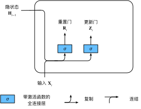

# GRU

我们讨论了如何在 RNN 中计算梯度，以及矩阵连续乘积可以导致梯度消失或梯度爆炸的问题。下面我们简单思考一下这种梯度异常在实践中的意义，我们可能会遇到这样的情况：

- 早期观测值对预测所有未来观测值具有非常重要的意义。考虑一个极端情况，其中第一个观测值包含一个校验和，目标是在序列的末尾辨别校验和是否正确。在这种情况下，第一个词元的影响至关重要。我们希望有某些机制能够在一个记忆元里存储重要的早期信息。如果没有这样的机制，我们将不得不给这个观测值指定一个非常大的梯度，因为它会影响所有后续的观测值。
- 一些词元没有相关的观测值。例如，在对网页内容进行情感分析时，可能有一些辅助HTML代码与网页传达的情绪无关。我们希望有一些机制来跳过隐状态表示中的此类词元。
- 我们可能会遇到这样的情况：序列的各个部分之间存在逻辑中断。例如，书的章节之间可能会有过渡存在，或者证券的熊市和牛市之间可能会有过渡存在。在这种情况下，最好有一种方法来重置我们的内部状态表示。

在学术界已经提出了许多方法来解决这类问题。门控循环单元（GRU Gated Recurrent Unit）是一个稍微简化的变体。GRU 与普通的循环神经网络之间的关键区别在于：前者支持隐状态的门控。这意味着模型有专门的机制来确定应该何时更新隐状态，以及应该何时重置隐状态。这些机制是可学习的，并且能够解决了上面列出的问题。

例如，如果第一个词元非常重要，模型将学会在第一次观测之后不更新隐状态。同样，模型也可以学会跳过不相关的临时观测。最后，模型还将学会在需要的时候重置隐状态。下面我们将详细讨论各类门控。

RNN 可以更好地处理序列数据，我们在文本数据上实现了基于 RNN 的语言模型，但是对于当今各种各样的序列学习问题，这些技术可能并不够用。例如，RNN 在实践中一个常见问题是数值不稳定性。尽管我们已经应用了梯度裁剪等技巧来缓解这个问题，但是仍需要通过设计更复杂的序列模型来进一步处理它。具体来说，我们将引入两个广泛使用的网络，即门控循环单元（GRU Gated Recurrent Units）和长短期记忆网络（LSTM Long Short-Term Memory）。然后，我们将描述具有多个隐藏层的深层架构，并讨论基于前向和后向循环计算的双向设计，现代循环网络经常采用这种扩展。

事实上，语言建模只揭示了序列学习能力的冰山一角。在各种序列学习问题中，如自动语音识别、文本到语音转换和机器翻译，输入和输出都是任意长度的序列。为了阐述如何拟合这种类型的数据，我们将以机器翻译为例介绍基于循环神经网络的“Encoder－Decoder”架构和束搜索，并用它们来生成序列。      

## 重置门&更新门

我们首先介绍重置门（reset gate）和更新门（update gate）。我们把它们设计成$(0, 1)$区间中的向量，
这样我们就可以进行凸组合。重置门允许我们控制“可能还想记住”的过去状态的数量，而更新门将允许我们控制新状态中有多少个是旧状态的副本。

我们从构造这些门控开始。 下图描述了门控循环单元中的重置门和更新门的输入，输入是由当前时间步的输入和前一时间步的隐状态给出。两个门的输出是由使用 sigmoid 激活函数的两个全连接层给出。

我们来看一下门控循环单元的数学表达。对于给定的时间步$t$，假设输入是一个小批量 $\mathbf{X}_t \in \mathbb{R}^{n \times d}$（样本个数$n$，输入个数$d$），上一个时间步的隐状态是 $\mathbf{H}_{t-1} \in \mathbb{R}^{n \times h}$（隐藏单元个数$h$）。那么，重置门$\mathbf{R}_t \in \mathbb{R}^{n \times h}$和更新门$\mathbf{Z}_t \in \mathbb{R}^{n \times h}$的计算如下所示：

$$
\begin{aligned}
\mathbf{R}_t = \sigma(\mathbf{X}_t \mathbf{W}_{xr} + \mathbf{H}_{t-1} \mathbf{W}_{hr} + \mathbf{b}_r),\\
\mathbf{Z}_t = \sigma(\mathbf{X}_t \mathbf{W}_{xz} + \mathbf{H}_{t-1} \mathbf{W}_{hz} + \mathbf{b}_z),
\end{aligned}
$$

其中 $\mathbf{W}_{xr}, \mathbf{W}_{xz} \in \mathbb{R}^{d \times h}$ 和 $\mathbf{W}_{hr}, \mathbf{W}_{hz} \in \mathbb{R}^{h \times h}$是权重参数，$\mathbf{b}_r, \mathbf{b}_z \in \mathbb{R}^{1 \times h}$是偏置参数。
请注意，在求和过程中会触发广播机制。最后，我们使用sigmoid函数将输入值转换到区间$(0, 1)$。

## 候选隐状态

接下来，让我们将重置门 $\mathbf{R}_t$ 与 RNN 中的常规隐状态更新机制集成，得到在时间步$t$的候选隐状态（candidate hidden state）$\tilde{\mathbf{H}}_t \in \mathbb{R}^{n \times h}$。

$$\tilde{\mathbf{H}}_t = \tanh(\mathbf{X}_t \mathbf{W}_{xh} + \left(\mathbf{R}_t \odot \mathbf{H}_{t-1}\right) \mathbf{W}_{hh} + \mathbf{b}_h),$$

其中$\mathbf{W}_{xh} \in \mathbb{R}^{d \times h}$ 和 $\mathbf{W}_{hh} \in \mathbb{R}^{h \times h}$是权重参数，$\mathbf{b}_h \in \mathbb{R}^{1 \times h}$是偏置项，符号 $\odot$ 是Hadamard积（按元素乘积）运算符。在这里，我们使用tanh非线性激活函数来确保候选隐状态中的值保持在区间$(-1, 1)$中。

与传统的 RNN 相比，$\mathbf{R}_t$ 和 $\mathbf{H}_{t-1}$ 的元素相乘可以减少以往状态的影响。每当重置门$\mathbf{R}_t$中的项接近$1$时，我们恢复一个普通的 RNN。对于重置门 $\mathbf{R}_t$ 中所有接近$0$的项，候选隐状态是以$\mathbf{X}_t$作为输入的 MLP 的结果。
因此，任何预先存在的隐状态都会被重置为默认值。

## 隐状态

上述的计算结果只是候选隐状态，我们仍然需要结合更新门$\mathbf{Z}_t$的效果。这一步确定新的隐状态$\mathbf{H}_t \in \mathbb{R}^{n \times h}$
在多大程度上来自旧的状态$\mathbf{H}_{t-1}$和新的候选状态$\tilde{\mathbf{H}}_t$。更新门$\mathbf{Z}_t$仅需要在$\mathbf{H}_{t-1}$和$\tilde{\mathbf{H}}_t$之间进行按元素的凸组合就可以实现这个目标。这就得出了门控循环单元的最终更新公式：

$$\mathbf{H}_t = \mathbf{Z}_t \odot \mathbf{H}_{t-1}  + (1 - \mathbf{Z}_t) \odot \tilde{\mathbf{H}}_t.$$

每当更新门$\mathbf{Z}_t$接近$1$时，模型就倾向只保留旧状态。此时，来自$\mathbf{X}_t$的信息基本上被忽略，从而有效地跳过了依赖链条中的时间步$t$。相反，当$\mathbf{Z}_t$接近$0$时，新的隐状态$\mathbf{H}_t$就会接近候选隐状态$\tilde{\mathbf{H}}_t$。

这些设计可以帮助我们处理循环神经网络中的梯度消失问题，并更好地捕获时间步距离很长的序列的依赖关系。例如，如果整个子序列的所有时间步的更新门都接近于$1$，则无论序列的长度如何，在序列起始时间步的旧隐状态都将很容易保留并传递到序列结束。

总之，门控循环单元具有以下两个显著特征：

* 重置门有助于捕获序列中的短期依赖关系；
* 更新门有助于捕获序列中的长期依赖关系。