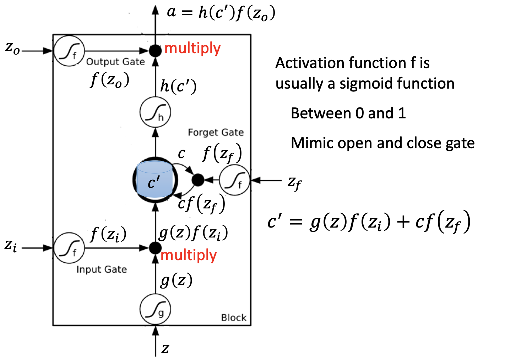
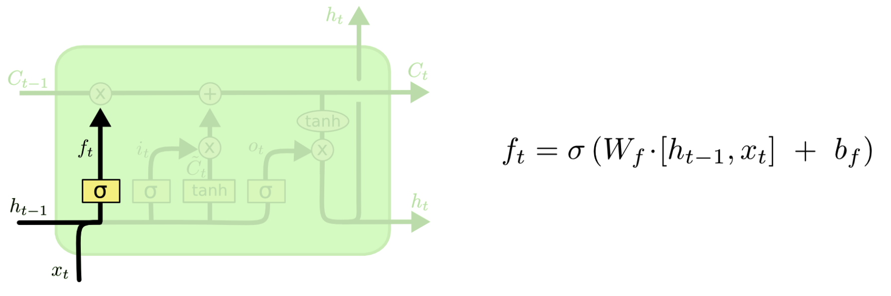

# LSTM

RNN 是一种死板的逻辑，越晚的输入影响越大，越早的输入影响越小，且无法改变这个逻辑。LSTM（Long Short Term Mermory network）做的最大的改变就是打破了这个死板的逻辑，而改用了一套灵活了逻辑——只保留重要的信息，可以很好地解决长时依赖问题。简单说就是：抓重点！

长期以来，隐变量模型存在着长期信息保存和短期输入缺失的问题。解决这一问题的最早方法之一是长短期存储器（LSTM long short-term memory）。它有许多与 GRU 一样的属性，有趣的是，LSTM 的设计比 GRU 稍微复杂一些，却比 GRU 早诞生了近20年。

## 网络结构

为了预测下一个单词，需要返回几个时间步骤来了解前面的单词。有可能在两个相关信息之间有足够的差距。随着差距的扩大，RNN 很难学习和连接信息，但这反而是LSTM的强大功能。LSTM 能够更快地学习长期依赖关系，它可以学习跨1000步的时间间隔。这是通过一种高效的基于梯度的算法实现的。

- input：
- input gate：
- forget gate：
- output gate：

在深层 LSTM 中，只是把原先 NN 中的 neuron 用 LSTM 替换。

可以说，LSTM 的设计灵感来自于计算机的逻辑门，它引入了记忆元（memory cell）。有些文献认为记忆元是隐状态的一种特殊类型，它们与隐状态具有相同的形状，其设计目的是用于记录附加的信息。为了控制记忆元，我们需要许多门。其中一个门用来从单元中输出条目，我们将其称为输出门（output gate）。另外一个门用来决定何时将数据读入单元，我们将其称为输入门（input gate）。我们还需要一种机制来重置单元的内容，由遗忘门（forget gate）来管理，这种设计的动机与 GRU 相同，能够通过专用机制决定什么时候记忆或忽略隐状态中的输入。
让我们看看这在实践中是如何运作的。

### 输入门/忘记门/输出门

就如在 GRU 中一样，当前时间步的输入和前一个时间步的隐状态作为数据送入 LSTM 的门中。它们由三个具有sigmoid激活函数的全连接层处理，以计算输入门、遗忘门和输出门的值，因此，这三个门的值都在$(0, 1)$的范围内。

我们来细化一下 LSTM 的数学表达。假设有$h$个隐藏单元，批量大小为$n$，输入数为$d$。因此，输入为$\mathbf{X}_t \in \mathbb{R}^{n \times d}$，前一时间步的隐状态为$\mathbf{H}_{t-1} \in \mathbb{R}^{n \times h}$。相应地，时间步$t$的门被定义如下：

- 输入门是$\mathbf{I}_t \in \mathbb{R}^{n \times h}$，
- 遗忘门是$\mathbf{F}_t \in \mathbb{R}^{n \times h}$，
- 输出门是$\mathbf{O}_t \in \mathbb{R}^{n \times h}$。

它们的计算方法如下：
$$
\begin{aligned}
\mathbf{I}_t &= \sigma(\mathbf{X}_t \mathbf{W}_{xi} + \mathbf{H}_{t-1} \mathbf{W}_{hi} + \mathbf{b}_i),\\
\mathbf{F}_t &= \sigma(\mathbf{X}_t \mathbf{W}_{xf} + \mathbf{H}_{t-1} \mathbf{W}_{hf} + \mathbf{b}_f),\\
\mathbf{O}_t &= \sigma(\mathbf{X}_t \mathbf{W}_{xo} + \mathbf{H}_{t-1} \mathbf{W}_{ho} + \mathbf{b}_o),
\end{aligned}
$$

其中$\mathbf{W}_{xi}, \mathbf{W}_{xf}, \mathbf{W}_{xo} \in \mathbb{R}^{d \times h}$，和$\mathbf{W}_{hi}, \mathbf{W}_{hf}, \mathbf{W}_{ho} \in \mathbb{R}^{h \times h}$是权重参数，$\mathbf{b}_i, \mathbf{b}_f, \mathbf{b}_o \in \mathbb{R}^{1 \times h}$是偏置参数。

### 候选记忆元

由于还没有指定各种门的操作，所以先介绍*候选记忆元*（candidate memory cell）
$\tilde{\mathbf{C}}_t \in \mathbb{R}^{n \times h}$。它的计算与上面描述的三个门的计算类似，但是使用$\tanh$函数作为激活函数，函数的值范围为$(-1, 1)$。下面导出在时间步$t$处的方程：

$$\tilde{\mathbf{C}}_t = \text{tanh}(\mathbf{X}_t \mathbf{W}_{xc} + \mathbf{H}_{t-1} \mathbf{W}_{hc} + \mathbf{b}_c),$$

其中$\mathbf{W}_{xc} \in \mathbb{R}^{d \times h}$和$\mathbf{W}_{hc} \in \mathbb{R}^{h \times h}$是权重参数，$\mathbf{b}_c \in \mathbb{R}^{1 \times h}$是偏置参数。

### 记忆元

在 GRU 中，有一种机制来控制输入和遗忘（或跳过）。类似地，在 LSTM 中，也有两个门用于这样的目的：输入门$\mathbf{I}_t$控制采用多少来自$\tilde{\mathbf{C}}_t$的新数据，而遗忘门$\mathbf{F}_t$控制保留多少过去的记忆元$\mathbf{C}_{t-1} \in \mathbb{R}^{n \times h}$的内容。使用按元素乘法，得出：

$$\mathbf{C}_t = \mathbf{F}_t \odot \mathbf{C}_{t-1} + \mathbf{I}_t \odot \tilde{\mathbf{C}}_t.$$

如果遗忘门始终为$1$且输入门始终为$0$，则过去的记忆元$\mathbf{C}_{t-1}$将随时间被保存并传递到当前时间步。引入这种设计是为了缓解梯度消失问题，并更好地捕获序列中的长距离依赖关系。

### 隐状态

最后，我们需要定义如何计算隐状态$\mathbf{H}_t \in \mathbb{R}^{n \times h}$，这就是输出门发挥作用的地方。在 LSTM 中，它仅仅是记忆元的$\tanh$的门控版本。这就确保了$\mathbf{H}_t$的值始终在区间$(-1, 1)$内：

$$\mathbf{H}_t = \mathbf{O}_t \odot \tanh(\mathbf{C}_t).$$

只要输出门接近$1$，我们就能够有效地将所有记忆信息传递给预测部分，而对于输出门接近$0$，我们只保留记忆元内的所有信息，而不需要更新隐状态。

## 算法

- 方框内上方的那条水平线，被称为cell state（单元状态），它就像一个传送带，可以控制信息传递给下一时刻。
- LSTM第一步是用来决定什么信息可以通过cell state。这个决定由“forget gate”层通过sigmoid来控制，它会根据上一时刻的输出通过或部分通过。
- 第二步是产生我们需要更新的新信息。这一步包含两部分，第一个是一个“input gate”层通过sigmoid来决定哪些值用来更新，第二个是一个tanh层用来生成新的候选值相加，得到了候选值，一二步结合起来就是丢掉不需要的信息，
- 最后一步是决定模型的输出，首先是通过sigmoid层来得到一个初始输出，然后使用tanh将值缩放到-1到1间，再与sigmoid得到的输出逐对相乘，从而得到模型的输出。

