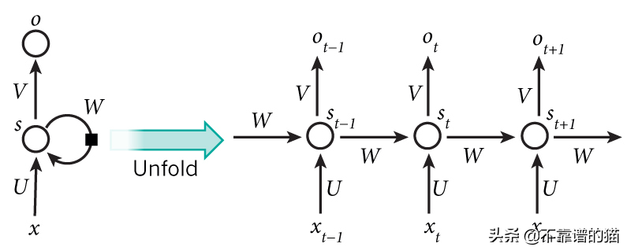
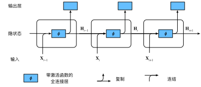
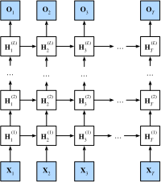

# RNN

## 简介

CNN 处理的数据都默认来自于某种分布，并且所有样本都是 IID 独立同分布的。另外，CNN 和普通的算法大部分都是输入和输出的一一对应，也就是一个输入得到一个输出，不同的输入之间是没有依赖关系的。然而，大多数的数据并非如此，例如文章中的单词是按顺序写的，如果顺序被随机地重排，就很难理解文章原始的意思。同样，视频中的图像帧、对话中的音频信号以及网站上的浏览行为都是有顺序的。因此，针对此类数据而设计特定模型，可能效果会更好。

在需要处理“序列数据 – 一串相互依赖的数据流”的场景时，就需要使用 RNN 循环神经网络（Recurrent Neural Network）了。RNN 之所以能够有效的处理序列数据，主要是基于他的比较特殊的运行原理，它跟传统神经网络最大的区别在于**每次都会将前一次的输出结果带到下一次的隐藏层中一起训练**。总之，如果说 CNN 可以有效地处理空间信息，那么本章的 RNN 则可以更好地处理序列信息。RNN 可以应用在语音识别、自然语言处理等与上下文相关的场景，它可以自动找到那些人类找不到或根本没有意识到的前后信息之间的相关性。

### RNN vs. CNN

RNN 与 CNN 的主要区别在于：

- CNN：
  - 前馈结构：CNN 是一个前馈神经网络，由三部分组成：输入层、隐藏层（可能有多个）和输出层。数据从输入层流向输出层，没有反馈或循环。
  - 固定长度输入/输出：由于其结构，CNN 主要用于处理固定大小的输入（如图片、文本或数值数据）以及输出。
  - 有多个隐藏层：每个隐藏层实现一部分“抽象”操作，从而实现多个操作。
- RNN：
  - 循环结构：RNN 的核心思想是维护一个内部状态变量，该状态在序列的每个时间步上都会更新。这是通过网络中的循环连接来实现的，该连接将某个时间步的输出或内部状态馈送回网络的输入，从而在下一个时间步考虑前一个时间步的信息。
  - 不固定长度输入/输出：这种结构使得 RNN 可以处理不同长度的序列数据。
  - 单隐藏层：可以认为“多个操作”共享一个隐藏层的参数，只是通过独立的“隐状态变量”来区分不同操作。

### 隐状态变量

#### 无隐状态MLP

让我们先来看一下无隐藏状态的单隐藏层 MLP。假设隐藏层的激活函数为 $\phi$，给定一个小批量样本 $\mathbf{X} \in \mathbb{R}^{n \times d}$，其中批量大小为 $n$（可并行计算 $n$ 个输出值），输入维度为 $d$，则隐藏层的输出 $\mathbf{H} \in \mathbb{R}^{n \times h}$ 为 $\mathbf{H} = \phi(\mathbf{X} \mathbf{W}_{xh} + \mathbf{b}_h)$，其中隐藏单元的数目为 $h$，隐藏层权重参数为 $\mathbf{W}_{xh} \in \mathbb{R}^{d \times h}$，偏置参数为 $\mathbf{b}_h \in \mathbb{R}^{1 \times h}$。

接下来，将隐藏层 $\mathbf{H}$ 作为输入传递给输出层，输出层 $\mathbf{O} = \mathbf{H} \mathbf{W}_{hq} + \mathbf{b}_q$，其中 $\mathbf{O} \in \mathbb{R}^{n \times q}$ 是输出变量，$\mathbf{W}_{hq} \in \mathbb{R}^{h \times q}$ 是权重参数，$\mathbf{b}_q \in \mathbb{R}^{1 \times q}$ 是输出层的偏置参数。如果是分类问题，我们还可以用 $\text{softmax}(\mathbf{O})$ 作为输出层的激活函数来计算输出类别的概率分布。

#### 有隐状态RNN

RNN 通过引入隐状态变量 $h$ 来总结和存储过去的信息（也就是之前提到的隐变量）。当计算时间步 $t$ 的输出 $o_t$ 时，RNN 使用先前的隐状态变量 $h_{t-1}$ 和当前的输入 $x_t$ 一起更新得到当前的隐状态变量 $h_t$，然后基于 $h_t$ 计算当前的输出 $o_t$。RNN 的另一种解释是使得网络具有“记忆”，因为网络考虑了先前的总结信息 $h_{t-1}$。



有了隐状态后，情况就完全不同了。假设我们在时间步 $t$ 有输入 $\mathbf{X}_t \in \mathbb{R}^{d}$。换言之，对于 $n$ 个序列样本的小批量，$\mathbf{X}_t$ 对应来自该序列的时间步 $t$ 处的一个样本。

在 NLP 中，我们介绍了语言模型，其中包括了 n-gram 元语法模型，其中单词 $x_t$ 在时间步 $t$ 的条件概率仅取决于前面 $n-1$ 个单词。对于时间步 $t-(n-1)$ 之前的单词，如果我们想将其可能产生的影响合并到 $x_t$ 上，需要增加 $n$ 的大小。然而 $n$ 的增大也会使模型参数的数量也会随之呈指数增长，因为词表 $\mathcal{V}$ 需要存储 $|\mathcal{V}|^n$ 个数字。因此，与其将 $P(x_t \mid x_{t-1}, \ldots, x_{t-n+1})$ 模型化，不如使用隐变量模型 $P(x_t \mid x_{t-1}, \ldots, x_1) \approx P(x_t \mid h_{t-1})$，其中 $h_{t-1}$ 是隐状态（hidden state），也被称为隐状态变量（hidden variable），它总结、存储了到时间步 $t-1$ 的序列信息。通常，我们可以基于当前输入 $x_{t}$ 和先前隐状态 $h_{t-1}$ 来计算时间步 $t$ 处的任何时间的隐状态 $h_t = f(x_{t}, h_{t-1})$。接下来，用 $\mathbf{H}_t  \in \mathbb{R}^{n \times h}$ 表示时间步 $t$ 的隐状态变量。隐状态来自前一个隐状态的信息，因此充当 RNN 的记忆。任何时间步的输出都取决于当前输入以及以前的隐状态（他们共同组成的当前时间步的隐状态）。

与其他对每个隐藏层使用不同参数的深层神经网络不同，RNN 在**每个时间步共享相同的权重参数**，RNN 通过隐状态来区分不同时间步的操作。

#### vs. MLP隐藏层

这里的隐状态 与 MLP 中的隐藏层是两个截然不同的概念。MLP 的隐藏层是在从输入到输出的路径上的隐藏的层，而隐状态则是在给定步骤所做的任何事情的输入，并且这些状态只能通过先前时间步的数据来计算。

## 学习算法

### 模型

#### 网络结构

RNN 允许网络中出现环形结构，它带有一个指向自身的环，用来表示它可以传递当前时刻处理的信息给下一时刻使用，每一时刻的神经网络会传递信息给下一时刻。从而让一些神经元的输出反馈回来作为输入信号。这样的结构使 RNN 在 t 时刻的输出状态不仅与 t 时刻的输入有关，还与 t-1 时刻的隐状态有关，从而能处理与时间有关的动态变化。

##### 隐藏层

在 RNN 中，**$H_t$ 即是时间步 $t$ 隐藏层的输出，同时也作为隐变量存储时间步 $t$ 的隐状态**。因此，$H_t$ 需要通过前一个时间步的隐变量 $\mathbf{H}_{t-1}$ 计算而来。为此，我们引入了一个新的权重参数 $\mathbf{W}_{hh} \in \mathbb{R}^{h \times h}$ 来描述如何在当前时间步中使用前一个时间步的隐变量来进行计算。当前时间步隐变量（隐藏层输出）由当前时间步的输入与前一个时间步的隐变量一起计算得出：

$$\mathbf{H}_t = \phi(\mathbf{X}_t \mathbf{W}_{xh}  + \mathbf{b}_h + \mathbf{H}_{t-1} \mathbf{W}_{hh})$$

-  $\mathbf{W}_{xh} \in \mathbb{R}^{d \times h}$、 $\mathbf{b}_h \in \mathbb{R}^{1 \times h}$：隐藏层的权重。与传统的神经网络一样，RNN 也有其权重参数。但与传统网络不同的是，RNN 在所有时间步上共享相同的权重。这是因为我们假设序列中的每个时间步都遵循相同的数据生成过程。
- $\mathbf{W}_{hh} \in \mathbb{R}^{h \times h}$：与之前相比，新的公式多添加了一项 $\mathbf{H}_{t-1} \mathbf{W}_{hh}$，这变量捕获并保留了序列直到其当前时间步的历史信息，就如当前时间步下状态或记忆，因此这样的隐变量被称为隐状态（hidden state）。隐状态的值取决于当前时间步的输入和前一时间步的隐状态。

由于在当前时间步中，隐状态使用的定义与前一个时间步中使用的定义相同，因此隐藏状态的计算是循环的（Recurrent），于是基于循环计算的隐状态神经网络被命名为循环神经网络 RNN，RNN 中执行计算的层称为循环层（Recurrent Layer）。


###### 多隐藏层

在 RNN 中，使用多层循环层可以帮助模型学习更复杂的表示和捕捉更高层次的抽象特征。多层循环层的作用主要有以下几点：

- 增强表示能力：多层 RNN 可以增加模型的表示能力，使其能够学习更复杂的函数。多层 RNN 可以通过堆叠多个 RNN 层来增加模型的容量，从而提高模型的性能。每一层 RNN 都可以捕捉不同层次的特征，从低级到高级，这使得模型能够更好地理解和处理序列数据。
- 更深的抽象：多层 RNN 可以提取更高层次的抽象特征。在处理序列数据时，这种抽象特征对于捕捉长距离依赖关系和复杂模式非常重要。多层 RNN 可以通过逐层处理输入序列，逐步生成更高层次的表示，从而提高模型的泛化能力。

实际例子：假设我们要处理一个机器翻译任务，将英文句子翻译成中文句子。我们可以使用一个基于多层 RNN 的 seq2seq 模型来完成这个任务。我们可以使用一个多层的 RNN encoder 来处理输入的英文句子。第一层 RNN 可能主要关注词汇级别的特征，如词性、词义等。第二层 RNN 可能关注短语级别的特征，如语法结构、成分关系等。更高层的 RNN 可能关注句子级别的特征，如句子结构、语义关系等。通过这种方式，多层 RNN 可以逐层提取输入句子的不同层次的特征。同样，我们可以使用一个多层的 RNN decoder 来生成输出的中文句子。在每个解码步骤，decoder 可以利用多层 RNN 学习到的高层次特征来生成更准确的中文词汇。

###### 隐藏状态传递（隐状态）

在多层 RNN 中，相邻循环层之间传递的参数是上一层 RNN 的隐状态。隐状态包含了上一层 RNN 在处理序列时学到的信息。这个隐状态可以被看作是上一层 RNN 对输入序列的编码或表示，它将被用作下一层 RNN 的输入。

以一个两层 RNN 为例，假设我们有一个输入序列 $X=[x_1, x_2, ...,  x_n]$。在第一层 RNN 中，我们将输入序列逐个元素地输入到 RNN 中，得到第一层的隐藏状态序列 $H_1=[h_{11}, h_{12}, ..., h_{1n}]$，$h_{1i}$ 表示第一个 RNN 的隐藏层在处理输入元素 $x_i$ 时的隐状态。

接下来，我们将第一层的隐状态序列 $H_1$ 作为输入传递给第二层 RNN。第二层 RNN 会根据 H1 生成它自己的隐藏状态序列 $H2=[h_{21}, h_{22}, ..., h_{2n}]$​。在这个过程中，第二层 RNN 可以捕捉到更高层次的抽象特征，从而提取输入序列的更复杂表示。

假设我们有一个输入序列 $X=[x_1, x_2, x_3]$。我们的 RNN 有两层，分别是 RNN1 和 RNN2。我们将使用如下符号表示 RNN 单元的权重和激活函数：

- W1 和 U1 分别表示第一层 RNN1 的输入权重和循环权重。
- W2 和 U2 分别表示第二层 RNN2 的输入权重和循环权重。
- b1 和 b2 分别表示第一层 RNN1 和第二层 RNN2 的偏置项。
- tanh() 是激活函数。

具体的步骤为：

- 首先，我们将输入序列逐个元素地输入到第一层 RNN1 中。对于每个输入元素 xi，RNN1 会计算一个隐藏状态 $h_{1i}$：
  - $h_{11} = tanh(W_1*x_1+b_1)$，
  - $h_{12}=tanh(W_1*x_2+U_1*h_{11}+b_1)$，
  - $h_{13}=tanh(W_1*x_3+U_1*h_{12}+b_1)$。

这样，我们得到第一层的隐藏状态序列 $H_1=[h_{11}, h_{12}, h_{13}]$。

- 接下来，我们将第一层的隐藏状态序列 $H_1$ 作为输入传递给第二层 RNN2。对于每个隐藏状态 $h_{1i}$，RNN2 会计算一个对应的隐藏状态 $h_{2i}$：
  - $h_{21} = tanh(W_2 * h_{11}+b2)$
  - $h_{22} = tanh(W_2 * h_{12} + U_2 * h_{21} + b_2)$
  - $h_{23} = tanh(W_2 * h_{13} + U_2 * h_{22} + b_2)$

这样，我们得到第二层的隐藏状态序列 $H_2 = [h_{21}, h_{22}, h_{23}]$。

在这个过程中，第二层 RNN2 会接收到第一层 RNN1 生成的隐状态，并根据这些隐状态计算自己的隐状态。这使得第二层 RNN2 能够捕捉到输入序列的更高层次的抽象特征，从而提取更复杂的表示。

重新生成

5693 tokens

在这个过程中，第二层RNN2会接收到第一层RNN1生成的隐藏状态，然后根据这些隐藏状态计算自己的隐藏状态。这使得第二层RNN2能够捕捉到输入序列的更高层次的抽象特征，从而提取更复杂的表示。

总之，多层 RNN 中相邻循环层之间传递的参数是上一层的隐藏状态。这个隐藏状态包含了上一层 RNN 在处理序列时学到的信息，它将被用作下一层 RNN 的输入。通过这种方式，多层 RNN 可以逐层提取输入序列的不同层次的特征。

###### 梯度消失/爆炸

通过使用多层 RNN，seq2seq 模型可以更好地理解输入句子的结构和语义信息，并生成更准确的翻译结果。在实践中，通常会使用 2 到 4 层的循环层，这种设置在保持计算成本相对较低的同时，可以提供足够的表示能力来处理许多序列任务。然而，并没有固定的规则来确定多层 RNN 的最佳层数。然而，需要注意的是，增加 RNN 层数也会增加模型的复杂性和计算成本。此外，训练深层 RNN 可能会遇到梯度消失或梯度爆炸的问题。为了解决这些问题，可以使用更复杂的 RNN 结构，如 GRU 或 LSTM，以及使用合适的正则化技术和优化策略。

##### 输出层

$$\mathbf{O}_t=softmax(\mathbf{W}_{hq}\mathbf{H}_t+\mathbf{b}_q)$$

- $\mathbf{W}_{hq} \in \mathbb{R}^{h \times q}$ 和偏置 $\mathbf{b}_q \in \mathbb{R}^{1 \times q}$：输出层的权重。值得一提的是，即使在不同的时间步，RNN 也总是使用这些模型参数。

### 度量

#### 困惑度（Perplexity）

一个好的语言模型能够用高度准确的词元来预测我们接下来会看到什么。考虑一下由不同的语言模型给出的对“It is raining ...”（“...下雨了”）的续写：

```css
1. "It is raining outside"（外面下雨了）；
2. "It is raining banana tree"（香蕉树下雨了）；
3. "It is raining piouw;kcj pwepoiut"（piouw;kcj pwepoiut下雨了）。
```

就质量而言，例 $1$ 显然是最合乎情理、在逻辑上最连贯的。虽然这个模型可能没有很准确地反映出后续词的语义，比如，“It is raining in San Francisco”（旧金山下雨了）和“It is raining in winter”（冬天下雨了）
可能才是更完美的合理扩展，但该模型已经能够捕捉到跟在后面的是哪类单词。例$2$则要糟糕得多，因为其产生了一个无意义的续写。尽管如此，至少该模型已经学会了如何拼写单词，以及单词之间的某种程度的相关性。最后，例$3$表明了训练不足的模型是无法正确地拟合数据的。

我们可以通过计算序列的似然概率来度量模型的质量。然而这是一个难以理解、难以比较的数字，毕竟，较短的序列比较长的序列更有可能出现，因此评估模型产生托尔斯泰的巨著《战争与和平》的可能性不可避免地会比产生圣埃克苏佩里的中篇小说《小王子》可能性要小得多，而缺少的可能性值相当于平均数。而这里信息论可以派上用场了，我们在引入 softmax 回归时定义了熵、惊异和交叉熵等关于的信息论知识。如果想要压缩文本，我们可以根据当前词元集预测的下一个词元，而一个更好的语言模型应该能让我们更准确地预测下一个词元，因此，它应该允许我们在压缩序列时花费更少的比特。

所以我们可以通过一个序列中所有的 $n$ 个词元的交叉熵损失的平均值来衡量：$\frac{1}{n} \sum_{t=1}^n -\log P(x_t \mid x_{t-1}, \ldots, x_1)$。其中 $P$ 由语言模型给出，$x_t$ 是在时间步 $t$ 从该序列中观察到的实际词元，这使得不同长度的文档的性能具有了可比性。由于历史原因，自然语言处理的科学家更喜欢使用一个叫做困惑度（perplexity）的量，它是以上的指数：$\exp\left(-\frac{1}{n} \sum_{t=1}^n \log P(x_t \mid x_{t-1}, \ldots, x_1)\right)$。困惑度的最好的理解是“下一个词元的实际选择数的调和平均数”。我们看看一些案例：

* 在最好的情况下，模型总是完美地估计标签词元的概率为1。在这种情况下，模型的困惑度为1。
* 在最坏的情况下，模型总是预测标签词元的概率为0。在这种情况下，困惑度是正无穷大。
* 在基线上，该模型的预测是词表的所有可用词元上的均匀分布。在这种情况下，困惑度等于词表中唯一词元的数量。

事实上，如果我们在没有任何压缩的情况下存储序列，这将是我们能做的最好的编码方式。因此，这种方式提供了一个重要的上限，而任何实际模型都必须超越这个上限。

### 优化器

#### 梯度剪裁

解决梯度爆炸的问题


## 训练流程

### 前向传播

RNN 中的前向传播相对简单，它的计算逻辑为，在任意时间步 $t$，隐状态的计算可以被视为：

1. 拼接当前时间步 $t$ 的输入 $\mathbf{X}_t$ 和前一时间步 $t-1$ 的隐状态 $\mathbf{H}_{t-1}$；
1. 将拼接的结果送入带有激活函数 $\phi$ 的全连接层，全连接层的输出是当前时间步 $t$ 的隐状态 $\mathbf{H}_t$。
1. $\mathbf{H}_t$ 将送入全连接输出层，用于计算当前时间步 $t$ 的输出 $\mathbf{O}_t$。

当前时间步 $t$ 的隐状态 $\mathbf{H}_t$ 将参与计算下一时间步 $t+1$ 的隐状态 $\mathbf{H}_{t+1}$，开启新一轮迭代。



语言模型的目标是根据过去的和当前的词元预测下一个词元，因此我们将原始序列移位一个词元作为标签。Bengio 等人首先提出使用神经网络进行语言建模。设小批量大小为 1，批量中的文本序列为“machine”。为了简化后续部分的训练，我们考虑使用字符级语言模型（character-level language model），将文本词元化为字符而不是单词。下图演示了如何通过基于字符级语言建模的 RNN，使用当前的和先前的字符预测下一个字符。在训练过程中，我们对每个时间步的输出层的输出进行 softmax 操作，然后利用交叉熵损失计算模型输出和标签之间的误差。由于隐藏层中隐状态的循环计算，第 $3$ 个时间步的输出 $\mathbf{O}_3$ 由文本序列 “m”、“a” 和 “c” 确定。由于训练数据中这个文本序列的下一个字符是“h”，因此第 $3$ 个时间步的损失将取决于下一个字符的概率分布，而下一个字符是基于特征序列 “m”、“a”、“c” 和这个时间步的标签 “h” 生成的。


#### Teacher Forcing

在 RNN 的训练过程中，通常使用训练样本中的正确值作为下一个时间步的输入，而不是使用上一个时间步预测的错误输出。这种方法称为"教师强制"（teacher forcing）。教师强制可以帮助模型更快地收敛，因为它在每个时间步都向模型提供了正确的上下文信息。

#### mini-batch

在实践中，我们使用的批量大小为 $n>1$，每个词元都由一个 $d$ 维向量表示。因此，在时间步 $t$ 输入 $\mathbf X_t$ 将是一个 $n\times d$ 矩阵。

具体来说，假设我们正在小批量处理一个文本，我们会将 N（mini-batch 的大小）个句子一并加载到模型中。而每个句子又是由多个 token 组成。在处理每个 mini-batch 时，模型会按时间步骤迭代处理每个句子中的 token。例如，如果我们的 mini-batch 大小为 32，那么模型会同时处理 32 个句子中的第一个 token，然后是第二个 token，以此类推。需要注意的是，为了能够处理长度不同的句子，通常会使用某种形式的填充（padding）策略，以确保每个 mini-batch 中的所有句子都具有相同的长度。

但当处理的句子之间存在前后依赖关系时，mini-batch 处理方式会面临一定的挑战。理论上，RNN 需要先完整处理前一句句子，然后再使用前一句句子的最后隐藏状态作为下一句句子的初始隐藏状态。但在实际的 mini-batch 训练中，为了并行化和计算效率，常常需要对这种前后关系进行一些调整或权衡。

#### 示例

举个例子，假设我们有以下 4 句话，我们希望在 RNN 中进行小批量处理：

```css
1. I love AI.
2. She is studying machine learning.
3. He is a scientist.
4. Deep learning models are fascinating.
```

##### 数据准备

首先，我们将这些句子转换为 token 并且进行数值化（即转换成索引形式）。基于上述文本，假设我们的词汇表如下：

```css
{
    'I': 1,
    'love': 2,
    'AI': 3,
    'She': 4,
    'is': 5,
    'studying': 6,
    'machine': 7,
    'learning': 8,
    'He': 9,
    'a': 10,
    'scientist': 11,
    'Deep': 12,
    'models': 13,
    'are': 14,
    'fascinating': 15
}
```

##### 填充

由于每个句子的长度都不相同，我们需要进行填充，以确保每个序列都具有相同的长度。通常使用一个特殊的 token（例如 0）进行填充。

```css
I love AI -> [1, 2, 3]
She is studying machine learning -> [4, 5, 6, 7, 8]
He is a scientist -> [9, 5, 10, 11]
Deep learning models are fascinating -> [12, 8, 13, 14, 15]
```

为了处理这四个句子，我们需要填充他们，使每个序列的长度都为 5（最长的句子长度）。

```csharp
[1, 2, 3, 0, 0]
[4, 5, 6, 7, 8]
[9, 5, 10, 11, 0]
[12, 8, 13, 14, 15]
```

##### RNN训练

在 RNN 的每一个时间步，它会同时处理所有句子在该时间步的 token。首先，RNN 会处理所有句子的第一个 token，然后是第二个，以此类推。在每个时间步，RNN 都会为每个句子生成一个隐状态。这样，RNN 可以有效地处理 mini-batch 中的多个句子，并充分利用并行计算的优势。

### 反向传播

RNN 通过 BPTT 时间反向传播（backpropagation through time）实现反向传播。在 BPTT 中，RNN 首先按照时间顺序正向传播，计算整个序列的损失。然后，它沿着时间步骤反向传播，计算梯度并更新权重。这种方法 允许 RNN 在整个序列上捕捉长期依赖关系，并在训练过程中考虑整个上下文。它要求我们将 RNN 的计算图一次展开一个时间步，以获得模型变量和参数之间的依赖关系。然后，基于链式法则，应用反向传播来计算和存储梯度。由于序列可能相当长，因此依赖关系也可能相当长。

例如，某个 1000 个字符的序列，其第一个词元可能会对最后位置的词元产生重大影响。这在计算上是不可行的（它需要的时间和内存都太多了），并且还需要超过 1000 个矩阵的乘积才能得到非常难以捉摸的梯度，这个过程充满了计算与统计的不确定性。

然而，这也可能导致梯度消失或梯度爆炸的问题，这是训练 RNN 时的常见挑战。为了解决这些问题，可以使用诸如 GRU 或 LSTM 的更复杂的 RNN 结构。

## GRU

- [GRU](20_gru.md)

## LSTM

- [LSTM](30_lstm.md)

## Deep RNN

到目前为止，我们只讨论了具有一个单向隐藏层的循环神经网络。其中，隐变量和观测值与具体的函数形式的交互方式是相当随意的。只要交互类型建模具有足够的灵活性，这就不是一个大问题。然而，对一个单层来说，这可能具有相当的挑战性。之前在线性模型中，我们通过添加更多的层来解决这个问题。而在 RNN 中，我们首先需要确定如何添加更多的层，以及在哪里添加额外的非线性，因此这个问题有点棘手。

事实上，我们可以将多层 RNN 堆叠在一起，通过对几个简单层的组合，产生了一个灵活的机制。特别是，数据可能与不同层的堆叠有关。例如，我们可能希望保持有关金融市场状况（熊市或牛市）的宏观数据可用，而微观数据只记录较短期的时间动态。

下图描述了一个具有$L$个隐藏层的深度循环神经网络，每个隐状态都连续地传递到当前层的下一个时间步和下一层的当前时间步。



### 函数依赖关系

我们可以将深度架构中的函数依赖关系形式化，这个架构描述了$L$个隐藏层构成。后续的讨论主要集中在经典的RNN上，但是这些讨论也适应于其他序列模型。

假设在时间步$t$有一个小批量的输入数据 $\mathbf{X}_t \in \mathbb{R}^{n \times d}$（样本数：$n$，每个样本中的输入数：$d$）。同时，将$l^\mathrm{th}$隐藏层（$l=1,\ldots,L$）的隐状态设为$\mathbf{H}_t^{(l)}  \in \mathbb{R}^{n \times h}$ （隐藏单元数：$h$），输出层变量设为$\mathbf{O}_t \in \mathbb{R}^{n \times q}$（输出数：$q$）。设置$\mathbf{H}_t^{(0)} = \mathbf{X}_t$，第$l$个隐藏层的隐状态使用激活函数$\phi_l$，则：

$$\mathbf{H}_t^{(l)} = \phi_l(\mathbf{H}_t^{(l-1)} \mathbf{W}_{xh}^{(l)} + \mathbf{H}_{t-1}^{(l)} \mathbf{W}_{hh}^{(l)}  + \mathbf{b}_h^{(l)})$$。其中，权重$\mathbf{W}_{xh}^{(l)} \in \mathbb{R}^{h \times h}$，$\mathbf{W}_{hh}^{(l)} \in \mathbb{R}^{h \times h}$和偏置$\mathbf{b}_h^{(l)} \in \mathbb{R}^{1 \times h}$ 都是第$l$个隐藏层的模型参数。

最后，输出层的计算仅基于第$l$个隐藏层最终的隐状态：

$$\mathbf{O}_t = \mathbf{H}_t^{(L)} \mathbf{W}_{hq} + \mathbf{b}_q$$。其中，权重$\mathbf{W}_{hq} \in \mathbb{R}^{h \times q}$和偏置$\mathbf{b}_q \in \mathbb{R}^{1 \times q}$都是输出层的模型参数。

与 MLP 一样，隐藏层数目$L$和隐藏单元数目$h$都是超参数。也就是说，它们可以由我们调整的。另外，用 GRU 或 LSTM 的隐状态来代替公式中的隐状态进行计算，可以很容易地得到深度 GRU 或 LSTM。


## Tmp

### 分类

- Elman 网络：将隐层的参数传递给下一个迭代周期
- Jordan 网络：将输出值传递给下一个迭代周期


