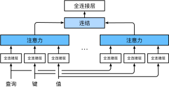

# Transformer

seq2seq 模型会有一个问题，意义单元能存储的信息有限，如果输入的句子太长，翻译精度就会下降。Transformer 是 Google 于 2017 年提出的一种采用 Attention 机制的深度学习模型，可以按输入数据各部分重要性的不同分配不同的权重。2017 年，Google 的一篇题为“[Attention is all you need](https://proceedings.neurips.cc/paper/2017/file/3f5ee243547dee91fbd053c1c4a845aa-Paper.pdf)”的 Paper 横空出世，自此完全使用 Attention 机制的 Transformer 模型开始主导 NLP 领域。不久后，利用 Transformer 模型结构的预训练语言模型 BERT 和 GPT 大放异彩。除了 NLP 领域，Transformer 结构也被应用到了计算机视觉领域，由此诞生了一系列吊打 CNN 的模型，如 ViT、BEiT 和 MAE。可以说，Transformer 结构继 CNN、RNN（以及其一系列变体 LSTM、GRU、ResNet、DenseNet 等）之后，在 Inductive Bias 方向上打开了一个新世界的大门。

## encoder-decoder架构

Transformer 作为 encoder-decoder 架构的实现，与基于 Attention 实现的 seq2seq 的学习相比，Transformer 的目的是理解输入序列的语义、生成输出语句。因此，Transformer 的 encoder 和 decoder 是基于 Self-attention 的模块叠加而成的（seq2seq 则是用 RNN 模块叠加），源（输入）序列和目标（输出）序列的 Embedding 表示将加上位置编码（positional encoding），再分别输入到 encoder 和 decoder 中。其基本原理就是输入一个序列，先通过 encoder 处理，再传入 decoder 中进行处理然后输出最后的结果。encoder 注重于理解，而 decoder 则注重于生成。


在论文中，encoder 器由 6 个编码 self-attention block 组成，同样 decoder 是 6 个解码 self-attention block 组成。与所有的生成模型相同的是，encoder 的输出会作为 decoder 的输入。


## Self-attention & Multi-head

### Self-attention

Attention 在使用时的核心是选择何为 Query、Key 和 Value。在大部分情况下，Query、Key 和 Value 不需要来自同一个序列，传统的 Attention 机制通常在一个输入序列和一个不同的序列之间计算 Attention 权重。

self-attention 机制是一种用于捕捉序列内部依赖关系的机制，它允许模型在处理每个输入位置时动态地将注意力集中在序列中其他位置的不同部分上，从而更好地理解上下文信息。Self-attention 的原理是通过将 Query、Key 和 Value 都设置为同一序列的词元来确定每个词元与其他词元之间的关联性。因为 Query、Key 和 Value 都来自于同一个输入序列，所以可以对该序列进行 mask、预测等操作，从而用于理解文本序列的结构及语义。也就是说，Self-attetnion 是 Attention 机制的一种特殊形式，它的 Q/K/V 为同一序列，也就是通过 mask 同一个文本序列的一部分来训练语言模型对该文本序列的理解。因此，Self-attetnion 可以捕获输入序列内部的各种依赖关系，而不仅仅是相邻元素之间的关系。

具体而言，会为序列的每个词元计算一个 Query 向量、一个 Key 向量和一个 Value 向量。为了产生 Query、 Key 和 Value，Transformer 首先会将每个输入词元转化为一个固定长度的 Embedding 向量。然后，这个 Embedding 向量会分别被传递给 3 个不同的全连接层（权值矩阵 $W_Q$，$W_K$，$W_V$），这 3 个全连接层就负责生成 Query、Key 和 Value。但是由于他们经过了不同的全连接层处理，因此他们是不同的向量。这样设计的好处是，Query、Key 和 Value 可以承载不同的信息。然后，把每个词元的 Query 向量和所有其他词元的 Vavlue 向量计算点积来计算 Attention 分数，再将这些分数经过 softmax 归一化以获取权重，最后将权重乘以 Value 向量来计算加权和，从而得到一个结合了各个输入词语义信息的上下文向量，也就是该词元在序列中的“注意力”。具体计算过程可以分成 7 步：

1. 将输入词元转化成 Embedding 向量。
2. 根据 Embedding 向量得到 $q$，$k$，$v$ 三个向量。
3. 为每个向量计算一个 Attention score：$score=q \times k$。
4. 为了梯度的稳定，Transformer 使用了 score 归一化，即除以 $square(d_k)$ 。
5. 对 score 施以 softmax 激活函数。
6. softmax 点乘 $v$，得到加权的每个输入向量的评分 $v$。
7. 相加之后得到最终的输出结果 $z=\sum{v}$。


整体公式可以总结为：

给定一个由 token 组成的输入序列 $\mathbf{x}_1, \ldots, \mathbf{x}_n$，其中任意 $\mathbf{x}_i \in \mathbb{R}^d$（$1 \leq i \leq n$），该序列的自注意力输出为一个长度相同的序列 $\mathbf{y}_1, \ldots, \mathbf{y}_n$，其中：$\mathbf{y}_i = f(\mathbf{x}_i, (\mathbf{x}_1, \mathbf{x}_1), \ldots, (\mathbf{x}_n, \mathbf{x}_n)) \in \mathbb{R}^d$。


#### 作用

Self-attention 的主要作用有以下几点：

- 捕捉长距离依赖：Self-attention 可以帮助模型捕捉序列中的长距离依赖关系，因为它允许模型直接关注序列中任意距离的元素。这对于处理诸如语言建模、文本翻译或文本摘要等任务中的长序列非常有用。
- 结构化表示：Self-attention 可以帮助模型学习序列中的结构化表示。例如，在 NLP 任务中，Self-attention 可以帮助模型学习词汇、短语和句子之间的层次结构，这使得模型能够更好地理解和表示序列数据。
- 可解释性：Self-attention 可以提供关于模型是如何关注输入序列的不同部分的可视化和解释。这有助于分析模型的行为，了解模型如何处理序列数据。
- 并行计算：同时，Self-attention 允许模型在计算注意力权重时并行处理整个序列，因为每个元素之间的关系可以同时计算。这使得 Self-attention 非常适合在现代硬件（如 GPU）上进行大规模训练。

#### 位置编码

在处理 token 序列时，RNN 是逐个地处理 token 的，而自 Attention 则因为并行计算而放弃了顺序操作。为了使用序列的顺序信息，通过在输入表示中添加位置编码（positional encoding）来注入绝对的或相对的位置信息。位置编码可以通过学习得到也可以直接固定得到，一般采用基于正弦函数和余弦函数的固定位置编码。

假设输入表示 $\mathbf{X} \in \mathbb{R}^{n \times d}$ 包含一个序列中 $n$ 个词元的 $d$ 维嵌入表示。位置编码使用相同形状的位置嵌入矩阵 $\mathbf{P} \in \mathbb{R}^{n \times d}$ 输出 $\mathbf{X} + \mathbf{P}$，矩阵第 $i$ 行、第 $2j$ 列和 $2j+1$ 列上的元素为：

$$\begin{aligned} p_{i, 2j} &= \sin\left(\frac{i}{10000^{2j/d}}\right), \\p_{i, 2j+1} &= \cos\left(\frac{i}{10000^{2j/d}}\right).\end{aligned}$$

除了捕获绝对位置信息之外，上述的位置编码还允许模型学习得到输入序列中相对位置信息。这是因为对于任何确定的位置偏移 $\delta$，位置 $i + \delta$ 处的位置编码可以线性投影位置 $i$ 处的位置编码来表示。这种投影的数学解释是，令$\omega_j = 1/10000^{2j/d}$，对于任何确定的位置偏移 $\delta$，任何一对 $(p_{i, 2j}, p_{i, 2j+1})$ 都可以线性投影到 $(p_{i+\delta, 2j}, p_{i+\delta, 2j+1})$：

$$\begin{aligned}
&\begin{bmatrix} \cos(\delta \omega_j) & \sin(\delta \omega_j) \\  -\sin(\delta \omega_j) & \cos(\delta \omega_j) \\ \end{bmatrix}
\begin{bmatrix} p_{i, 2j} \\  p_{i, 2j+1} \\ \end{bmatrix}\\
=&\begin{bmatrix} \cos(\delta \omega_j) \sin(i \omega_j) + \sin(\delta \omega_j) \cos(i \omega_j) \\  -\sin(\delta \omega_j) \sin(i \omega_j) + \cos(\delta \omega_j) \cos(i \omega_j) \\ \end{bmatrix}\\
=&\begin{bmatrix} \sin\left((i+\delta) \omega_j\right) \\  \cos\left((i+\delta) \omega_j\right) \\ \end{bmatrix}\\
=& 
\begin{bmatrix} p_{i+\delta, 2j} \\  p_{i+\delta, 2j+1} \\ \end{bmatrix},
\end{aligned}$$

$2\times 2$ 投影矩阵不依赖于任何位置的索引 $i$。

#### 推理步骤

以下是 Self-attention 的基本步骤：

##### 计算Query/Key/Value矩阵

对于输入序列中的每一个元素（比如一个句子中的每一个 token），我们都会计算出一个 Query、一个 Key 和一个 Value（Embedding 表示）。这三个向量通常是通过将输入元素的 Embedding 表示分别与 3 个权重矩阵进行矩阵乘法运算得到的。

假设我们有一个词“cat”，其 Embedding 表示为一个三维向量：
$x_{\text{cat}} = \begin{bmatrix} 0.5 \\ 0.3 \\ -0.2 \end{bmatrix}$

现在，我们有以下权重矩阵:

$$
W_Q = \begin{bmatrix} 1 & 0 & 2 \\ 0 & 1 & -1 \\ 1 & -1 & 1 \end{bmatrix} \\ 
W_K = \begin{bmatrix} 0 & 1 & -1 \\ -1 & 1 & 1 \\ 1 & 0 & 0 \end{bmatrix} \\
W_V = \begin{bmatrix} 1 & 1 & 0 \\ 0 & -1 & 1 \\ -1 & 0 & 2 \end{bmatrix}
$$

使用上面的公式，我们可以为“cat”计算 Query、Key 和 Value 向量:

$$
Q_{\text{cat}} = x_{\text{cat}} W_Q = \begin{bmatrix} 0.5 \\ 0.3 \\ -0.2 \end{bmatrix} \times \begin{bmatrix} 1 & 0 & 2 \\ 0 & 1 & -1 \\ 1 & -1 & 1 \end{bmatrix} = \begin{bmatrix} 0.9 \\ 0.1 \\ 0.4 \end{bmatrix} \\
K_{\text{cat}} = x_{\text{cat}} W_K \\
V_{\text{cat}} = x_{\text{cat}} W_V
$$

这样，我们就得到了“cat”的 Query、Key 和 Value 向量。在真实的模型中，这些权重矩阵和向量会有更高的维度，但基本的计算步骤是相同的。

##### 计算Attention分数

对于输入序列中的每一对 token，我们都会计算一个 Attention 分数。Attention 分数的计算方法是将该 token 的 Query 和另一 token 的 Key 进行点积运算。

##### 计算Attention分数分布

通过 softmax() 函数将每个 Qury 与所有的 Key 的 Attention 得分转换为概率值。这样，每一个 token 都会有一个与其他所有 token 相关的 Attention 分数分布。

##### 计算上下文向量

然后，我们会用上一步计算出的 Attention 分数分布对每个 token 的 Value 进行加权求和，得到每个 token 的上下文向量。这个上下文向量是输入序列中所有 Key 的 Value 的加权平均，权重就是 Attention 分数分布。

##### 输出序列

最后，所有 token 的上下文向量就构成了输出序列。这个输出序列与输入序列有相同的长度，但每个 token 的表示现在都包含了输入序列中所有 token 的信息。

假设我们有一个简短的句子：“I love cats”。我们希望模型在处理“love”这个词时，更多地关注“cats”。

1. 计算Query、Key、Value矩阵：

   - 对“I”：Q1，K1，V1
   - 对“love”：Q2，K2，V2
   - 对“cats”：Q3，K3，V3

2. 计算 Attention 分数：本例中只对“love”计算

   - 分数1（“love”对“I”）：Q2·K1
   - 分数2（“love”对“love”）：Q2·K2
   - 分数3（“love”对“cats”）：Q2·K3

   假设分数3最大，这意味着“love”更多地关注“cats”。

3. 计算 Attention 分数分布： 将分数转化为 Softmax() 概率形式，假设得到的是：0.1（I），0.3（love），0.6（cats）。

4. 计算上下文向量：加权求和得到 = 0.1*V1 + 0.3*V2 + 0.6*V3。

5. 输出序列：把所有 token 的上下文向量 concat 在一起，得到输出序列。

这样，输出2就是“love”在自注意力机制下的表示，它主要关注了“cats”。

#### 训练步骤

为了计算 Query、Key 和 Value，我们需要从输入序列中提取这些向量。提取的方法是使用权重矩阵与输入数据相乘。对于 Query、Key 和 Value，我们有单独的权重矩阵 $W_Q、W_K 和 W_V$。在使用时，对于一个输入向量 $x$（通常是 Embedding 表示），我们可以通过以下方式计算它的 Query、Key 和 Value 向量：$Q=xW_Q、K=xW_K$、$V=xW_V$。在深度学习模型，特别是 Attention 机制中，$W_Q$、$W_K$ 和 $W_V$ 这三个权重矩阵并不是事先给定的，而是需要通过模型训练来学习和优化的参数。以下是它们的获得方式：

- 随机初始化：在开始训练之前，这些权重矩阵通常会被随机初始化，这样它们就有了一个初始值。这些初始值可以很小，通常是从某种分布（如正态分布或均匀分布）中抽取的小数值。
- 反向传播与优化：在模型的训练过程中，当数据通过模型并产生输出时，这个输出会与实际的标签进行比较，产生一个损失值。然后，通过反向传播算法，损失会传播回网络，根据损失来更新这些权重矩阵的值。这一步通常使用一种优化算法，如梯度下降或其变体（例如 Adam、RMSprop 等）来执行。
- 迭代学习：随着模型在大量数据上的迭代训练，权重矩阵的值会逐渐调整，使模型的输出更接近于真实的目标或标签。在多次迭代过程中，这些矩阵会收敛到一组能够提供较好性能的值。

模型的参数（包括这些权重矩阵）是通过数据驱动的方式学到的，而不是基于先验知识或规则制定的。

### Multi-Head

在实践中，当给定相同的 Query、Key 和 Value 的集合时，我们希望模型可以基于相同的 Attention 机制学习到不同的行为，然后将不同的行为作为组合起来，捕获序列内各种范围的依赖关系（如短距离依赖和长距离依赖关系）。因此，允许 Attention 机制组合使用 Query 、Key 和 Value 的不同子空间表示（representation subspaces）。为此，与其只使用单独一个注意力汇聚，我们可以用独立学习得到的 $h$ 组不同的线性投影（linear projections）来变换 Query、Key 和 Value。然后，这 $h$ 组变换后的 Query、Key 和 Value 将并行地送到注意力汇聚中。最后，将这 $h$ 个注意力汇聚的输出拼接在一起，并且通过另一个可以学习的线性投影进行变换，以产生最终输出。这种设计被称为多头注意力 MHA（Multi-Head Attention），对于 $h$​ 个注意力汇聚输出，每一个注意力汇聚都被称作一个头（head），以下是多头注意力机制的主要步骤：

- 输入表示转换：通过线性变换将输入的特征映射到 Query、Key 和 Value 空间。这通常是通过三个不同的线性变换（权重矩阵）来完成的。
- 多头注意力计算：对于每个注意力头，计算 Query 和 Key 之间的相似度，然后将这些相似度与 Value 相乘，得到每个头的注意力输出。
- 多头输出合并：将所有注意力头的输出连接起来，通过另一个线性变换来融合多头注意力的结果。
- 最终输出：对合并后的输出进行最终的线性变换和激活函数处理，以得到最终的多头注意力输出。



#### 数学描述

在实现多头注意力之前，让我们用数学语言将这个模型形式化地描述出来。给定 Query $\mathbf{q} \in \mathbb{R}^{d_q}$、Key $\mathbf{k} \in \mathbb{R}^{d_k}$ 和 Value $\mathbf{v} \in \mathbb{R}^{d_v}$，每个注意力头 $\mathbf{h}_i$（$i = 1, \ldots, h$）的计算方法为：$\mathbf{h}_i = f(\mathbf W_i^{(q)}\mathbf q, \mathbf W_i^{(k)}\mathbf k,\mathbf W_i^{(v)}\mathbf v) \in \mathbb R^{p_v}$。

其中，可学习的参数包括 $\mathbf W_i^{(q)}\in\mathbb R^{p_q\times d_q}$、$\mathbf W_i^{(k)}\in\mathbb R^{p_k\times d_k}$ 和 $\mathbf W_i^{(v)}\in\mathbb R^{p_v\times d_v}$，以及代表注意力汇聚的函数 $f()$。$f()$ 可以是加性注意力或缩放点积注意力。

多头注意力的输出需要经过另一个线性转换，它对应着 $h$ 个头连结后的结果，因此其可学习参数是 $\mathbf W_o\in\mathbb R^{p_o\times h p_v}$：

$$\mathbf W_o \begin{bmatrix}\mathbf h_1\\\vdots\\\mathbf h_h\end{bmatrix} \in \mathbb{R}^{p_o}$$

基于这种设计，每个头都可能会关注输入的不同部分，可以表示比简单加权平均值更复杂的函数。

#### 并行计算

在具体实现过程中通常选择缩放点积注意力作为每一个注意力头。为了避免计算代价和参数代价的大幅增长，我们一般设定 $p_q = p_k = p_v = p_o / h$。

如果将 Query、Key 和 Value 的线性变换的输出数量设置为 $p_q h = p_k h = p_v h = p_o$，则可以并行计算 $h$ 个头。

## 网络结构

与 seq2seq 不同，Transformer 不但通过 Attention 实现上下文变量，同时还在 encoder 和 decoder 中使用 self-attention 模块代替 RNN。Transformer 由若干个 encoder 和 decoder 组成，其内部里还具备了 Self-attention 和 Multi-headed 机制。Self-attention 负责挑选出重要的、有用的信息，Multi-headed 则负责对这些信息进行并发处理。


### encoder

Transformer 的 encoder 由一个输入层与多个相同的 block 叠加而成。每个 block 都有两个子层：MHA（Multi-Head Self-Attention）和 FF（Positionwise Feed-Forward network）。具体来说，在计算 encoder 的 Self-attention 时，Query、Key 和 Value 都来自前一个 encoder block 的输出。受 ResNet 的启发，每个子层都采用了残差连接（Residual Connection）。在 Transformer 中，对于序列中任何位置的任何输入，都要求满足，以便残差连接满足。在残差连接的加法计算之后，紧接着应用层规范化（Layer Normalization）。因此，输入序列对应的每个位置 Transformer encoder 都将输出一个维表示向量。  


例如，一个输入序列可以被分解成 x1、x2、x3、x4 这 4 个 token，每个 token 都代表是一个向量。通过 encoder 的处理，生成新的 4 个向量，分别是 h1、h2、h3、h4。这就是 encoder 的作用，即产生与输入数量相等的新的对应向量。


#### 输入层

在 Transformer 中，输入文本首先会被转换成固定维度的向量表示，这一步被称为 Embedding。另外，由于 Transformer 本身并没有考虑序列的顺序，因此引入了 Positional Encoding 来帮助模型理解序列中不同位置的词的关系。这两个步骤都完成后，这两个向量（嵌入向量和位置向量）会被相加。然后，结果会被传入模型的下一层。

##### Input Embedding

Embedding 就是是把文本数据转换成固定维度向量的过程。在 Transformer 中，Embedding 步骤通常是使用预训练的词向量（如 Word2Vec 或 GloVe）。例如，如果我们的词汇表大小为 V，并且我们想要得到的嵌入维度为 D，那么嵌入矩阵的大小就是 $V \times D$，每个词都会在这个矩阵中有一个对应的向量。

###### Token化&词汇表

词汇表是一个包含了所有可能出现的单词的列表。在处理文本的模型中，我们需要一个词汇表来定义我们的**输入空间**。也就是说，如果一个单词不在我们的词汇表中，那么我们的模型就无法处理它。举个例子，假设我们有一个词汇表：`["I", "love", "dogs", "cats"]`，那么我们的模型只能处理这 4 个单词。

###### Embedding向量/维度

Embedding 维度是我们将单词转换为内部 Embedding 向量时的向量维度。当我们用 Embedding 向量来表示一个单词时，这个 Embbeding 向量的大小就是嵌入维度。举个例子，如果我们的嵌入维度是 3，那么单词 "dogs" 可能被表示为一个三维向量，比如 `[0.1, 0.2, 0.3]`。

词汇表和嵌入维度是两个相关但不同的概念。词汇表是定义我们的输入空间，决定了我们模型可以处理哪些单词；而嵌入维度是定义模型的内部处理空间，决定了我们的模型将单词表示为多大的向量。

###### 具体流程

假设有一个英文句子 "I love dogs"，我们首先需要做的是分词，将这个句子拆分为 "I", "love", "dogs" 三个单词。然后，我们需要有一个词汇表，包含了可以处理的所有单词。假设词汇表如下：

```
0: I
1: love
2: dogs
3: cats
4: you
```

接下来，我们需要定义嵌入维度，这是嵌入向量的长度。例如，如果我们选择嵌入维度为 5，那么每个单词都会被表示为一个长度为 5 的向量。这些向量通常会随机初始化，然后在训练过程中通过反向传播进行更新。例如，初始化后的嵌入矩阵可能如下：

```
I: [0.1, 0.2, 0.3, 0.4, 0.5]
love: [0.2, 0.3, 0.4, 0.5, 0.6]
dogs: [0.3, 0.4, 0.5, 0.6, 0.7]
cats: [0.4, 0.5, 0.6, 0.7, 0.8]
you: [0.5, 0.6, 0.7, 0.8, 0.9]
```

于是，我们的句子 "I love dogs" 就被映射为三个向量：

```
I: [0.1, 0.2, 0.3, 0.4, 0.5]
love: [0.2, 0.3, 0.4, 0.5, 0.6]
dogs: [0.3, 0.4, 0.5, 0.6, 0.7]
```

这样，我们就将原始的文本数据转换成了可以输入到神经网络中的数值数据。在训练过程中，这些嵌入向量会不断更新，以便更好地捕获单词之间的语义关系。

##### Positional Encoding

截止目前为止，我们介绍的 Transformer 模型并没有捕捉顺序序列的能力，也就是说无论句子的结构怎么打乱，Transformer 都会得到类似的结果。换句话说，Transformer 只是一个功能更强大的词袋模型而已。为了解决这个问题，论文中在编码词向量时引入了位置编码（Position Encoding）的特征。具体地说，位置编码会在词向量中加入了单词的位置信息，用来向序列数据添加位置信息，进而让模型学到“顺序”。Positional Encoding 的目的是给出序列中每个词添加位置信息（一个位置向量），这个位置向量是通过一种特定的函数生成的，这个函数可以生成和嵌入向量维度相同，但是随位置变化的向量。其实际的做法是用正弦、余弦函数生成沿时间轴变化的波形，然后把这种波形叠加到 Transformer 的输入中。


#### block

encoder 内由多个 block 组成，每个 block 都是输入一排向量，然后输出一排向量。每个 block 包含 MHA 和 FF（每层最后都会做个 Add&Norm）：

- MHA：用于捕捉输入序列中不同位置之间的依赖关系，用 MHA 考虑整个文本序列中前后信息的关联。
- FF：用于在模型学习到不同特征后，对这些特征进行线性和非线性变换，以便更好地进行下一层建模。
- Add&Norm：对参数进行的归一化等操作。


##### MHA

MHA 的目的是计算输入序列中每个词元的 Query、Key 和 Value，然后用 Query 和 Key 计算注意力得分，用注意力得分对 Value 进行加权求和得到每个词元的上下文向量。

###### SDPA

SDPA（Scaled Dot-Product Attention）与标准的 Self-attention 非常相似，但在计算注意力得分时有一个小的改变：它在计算 Query 和 Key 的点积之后，会除以一个缩放因子（通常是 Key 的维度的平方根）。假设我们的 Query 和 Key 都是 d 维的向量，那么这个缩放因子就是 d 的平方根。这么做的原因是当 d 的值很大时，Query 和 Key 的点积可能会有非常大的值，这可能会导致 softmax 函数在求概率时出现梯度消失的问题。通过除以这个缩放因子，我们可以避免这个问题。除了这个差别之外，"缩放的点积注意力"和标准的 Self-attention 机制是一样的。

SDPA（图左）为每个 token 都和其他所有 token 计算 Attention 分数，它通常会涉及到以下步骤：

- MatMul（矩阵乘法）： 在 SDPA 中，需要对输入序列进行矩阵乘法来计算 Attention 分数，以便更好地进行比较和求和操作。因此，需要使用一个权重矩阵 W 来将输入序列 X 映射到一个新的 Z（每个元素的 Attention 分数），即 Z = XW，这个过程可以用矩阵乘法来实现。
- Scale（缩放）： 为了避免 Self-attention 中的计算过程过于复杂，需要对 Z 进行缩放，这可以通过将 Z 除以其维度的平方根来实现。即 Z' = Z / sqrt(d)，其中 d 为 Z 的维度。
- Mask（掩码）： 在一些 NLP 任务中，可能需要考虑到一些输入序列中的位置是无效的，例如填充的位置。在这种情况下，需要使用掩码矩阵来指示哪些位置是无效的。将掩码矩阵中无效位置处的权重设置为一个很小的数，这样进行 Softmax 操作时，这些位置就会被忽略。
- Softmax： 在完成缩放和掩码操作后，需要将每个位置的权重归一化，以便计算每个位置的输出。这可以通过应用 Softmax 函数来实现，将 Z' 中每个位置的值作为输入，输出每个位置的权重，使得所有权重的和为 1。

###### Multi-Head

在实践中，Transformer 通常会使用 Multi-Head。Multi-Head 使用多组不同的权重矩阵对输入进行线性变换，然后对每一组变换后的结果都进行 SDPA 运算。这样可以让模型在多个不同的表示空间中都捕获输入的信息，来增强模型对于输入序列的建模能力。最后再把所有的结果拼接起来，这些表示通过一个线性变换被合并起来，生成最终的输出。


Multi-Head Attention相当于 $h$ 个不同的self-attention的集成（ensemble），在这里我们以 $h=8$ 举例说明。


###### 权重

MHA 的最核心逻辑是使针对每个输入词元的 Embedding 向量，计算它的 Query、Key、Value 的表示（虽然在大部分情况下，Query、Key 会是相同的空间，但这里给出的是通用的方案）。通过权重矩阵 $W_Q$、$W_K$ 和 $W_V$ 实际上是计算将原始输入转换为 Q、K 和 V 的表示。这些权重矩阵是模型在训练过程中学到的，可以帮助模型更好地挑选和加权输入。$W_Q$、$W_K$ 和 $W_V$ 是整个 MHA 学习的核心，其作用是将句子中的每个词转化成 Q、K、V 的表示形式。

考虑句子："She reads books"：

- 计算 Query：每个词（"She"、"reads"、"books"）都会 $W_Q$ 矩阵相乘，生成一个 Query。
- 计算 Key：同样，每个词也会与 $W_K$ 矩阵相乘，生成对应的 Key。
- 计算 Value：每个词还会与 $W_V$ 矩阵相乘，生成 Value。

当我们想要计算"reads"这个词的注意力输出时：

- "reads"的 Query 向量会与所有的 Key 向量（包括其自身的和其他词的）进行点乘，得到一个得分，这个得分会经过 softmax() 得到权重。
- 然后，这些权重会与 Value 向量相乘并求和，得到"reads"的注意力输出。

这只是一个简化的例子，而在实际应用中，Self-attention 会同时处理句子中的所有词，并且每个词都会作为 Query 进行此类计算，所以每个词都有一个对应的注意力输出，而其整体输出就是对输入语句的一次抽象表示。

##### FF

FF 先对输入进行线性变换，并通过激活函数对线性变换后的结果进行非线性变换，得到最终的输出。具体而言，可以将输入向量 X 通过矩阵乘法映射到一个新的表示 Z，即 Z = XW + b，其中 W 和 b 是可学习的参数。然后将 Z 输入到一个激活函数中，如 ReLU，进行非线性变换，得到最终的输出 Y。FF 层的作用是在特征空间中对输入进行重新表示，以便更好地进行下一层的建模。

##### Add&Norm

Self-attention 采用了残差网络，目的当然是解决深度学习中的退化问题。Add&Norm 在一个小批量的样本内基于批量规范化对数据进行重新中心化和重新缩放的调整。层规范化和批量规范化的目标相同，但层规范化是基于特征维度进行规范化。尽管批量规范化在计算机视觉中被广泛应用，但在 NLP 任务中（输入通常是变长序列）批量规范化通常不如层规范化的效果好。


对于每个 block：

- MHA 后的 Add&Norm：MHA 处理后的输出与输入序列相加（A+B） 作为 Residual，然后再做 Normalization 得到 C。
- FF 后的 Add&Norm：将 C 传入 FF 层完成 FF 操作后，得到 D。D+C 相加作为 Residual，再做一次 Normalization 得到 E，作为整个 block 的输出。


##### block堆叠

encoder 的每个 block 对输入数据进行一系列的转换操作，增强其上下文信息。通过堆叠多个这样的 block，模型能够捕获输入序列中更复杂、更深入的上下文关系。经过 N 个这样的 block（如 N=6）后，我们得到 encoder 的最终输出/上下文变量。上下文变量是一个与输入同样长度的序列，但是每个位置的表示都被丰富了，包含了整个输入序列的上下文信息。

例如，我们要处理句子：“The cat sat on the mat.” 我们首先将这个句子转化为一个词向量序列，每个词向量是句子中每个词的初始表示。当这个词向量序列被输入到第一个 block 时，Self-attetenion 机制开始工作。例如，对于词“cat”，Self-attention 可能会发现“sat”和“mat”与它有较强的关系，因此“cat”的新表示可能会倾向于加强与“sat”和“mat”的关联性。当这个序列经过多个 block 后，每个词的表示会变得更加丰富。例如，词“cat”的最终表示可能不仅仅包含与“sat”和“mat”的关系，还可能包括与其他词、如“The”和“on”的关系。因此，encoder 的最终输出是一个新的词向量序列，每个向量都融合了整个句子的上下文信息。

#### 上下文信息

encoder 的目的是为了生成输入序列中每个词的上下文表示。这些上下文表示是整个输入句子的一个综合体现，不仅包含了该词本身的信息，还包含了它与其他单词间的关系或上下文信息。

例如，输入句子是 "The cat is cute"，这个句子经过 encoder 的处理后，每个单词都会有一个对应的向量表示，这就是 `e1`, `e2`, `e3`, 和 `e4`，**他们即是 Key、也是 Value**。

- `e1` 是 "The" 这个单词的上下文表示，它不仅包含 "The" 这个单词本身的语义，还融合了与 "cat", "is", "cute" 这些单词相关的上下文信息。
- `e2` 是 "cat" 的上下文表示，同样地，它不只是表示 "cat"，还包含了与 "The", "is", "cute" 等其他单词的上下文关系。
- `e3` 和 `e4` 也是同理，分别代表 "is" 和 "cute" 的上下文表示。

这种上下文表示的生成是通过 Self-attention 机制实现的。在 Self-attention 过程中，每个单词都会与句子中的其他单词进行交互，计算注意力权重，然后利用这些权重生成上下文丰富的表示。

例如，对于 "cat" 这个词，它可能会更关注 "cute" 这个词（因为猫是可爱的），所以在计算 `e2` 时，"cute" 的表示可能会有较大的权重。这样，`e2` 不仅代表了 "cat"，还隐含了 "cat" 是 "cute" 这样的信息。简而言之，`e1`, `e2`, `e3`, 和 `e4` 是经过 Self-attention 得到的每个词的上下文向量表示，融合了整个句子的信息。

### decoder

Transformer decoder 也是由多个相同的 block 叠加而成的，并且每个 block 使用了残差连接和层规范化。除了 encoder 中描述的两个子层之外，decoder 还在这两个子层之间插入了第三个子层，称为 encoder-decoder attention 层。在 encoder-decoder Attention 中，Query 来自前一个 decoder 的输出，而 Key 和 Value 来自 encoder 输出的上下文信息。而在 decoder Self-attention 中，Query、Key 和 Value 都来自上一个 decoder 层的输出。但是，decoder 中的每个位置只能考虑该位置之前的所有位置，这种 Masked Attention 保留了自回归（auto-regressive）属性，确保预测仅依赖于已生成的输出词元。

总的来说，Transformer 的 decoder 对输入序列和 encoder 输出的上下文信息向量进行建模，然后使用Add&Norm 层归一化来提高模型性能，最后通过逐步生成词的方式完成目标序列的生成。


#### 输入层

与 encoder 的输入层完全相同。

#### block

decoder 的输入由目标语言的 Embedding 向量和 encoder 输出的上下文信息向量经过线性变换后相加得到。Transformer 的 decoder 也由多个 block 组成的，每个 block 比 encoder 多了一个 MMHA。

##### MMHA

MMHA（Masked Multi-Head Attention）结构与 MHA 相同，只不过 Mask 矩阵中要屏蔽当前位置之前的词与当前位置之后的词的联系，使得文本下文信息不提前泄露，例如生成式任务（如机器翻译）是从前到后逐步生成的。输入序列后面的 token 需要被遮蔽，以防止模型看到目标序列中后面的标记，这里使用 MMHA 来实现。该层的作用是使得当前位置只能看到之前的位置，从而确保生成目标序列时是自左向右逐个生成。

##### MHA

MHA 使用 encoder 输出的上下文信息作为其 Key 和 Value，而 Query 来自 decoder 自身的前一个层的输出。这样设计是为了让 decoder 在生成每个词元时都能考虑到整个输入序列的信息。

例如，我们正在进行机器翻译任务，将英文翻译为中文，英文输入句子是 "The cat is cute"，目前 decoder 已经生成了 "这只猫"，我们现在要生成下一个中文单词。

- encoder 的工作：encoder 处理输入句子 "The cat is cute"，每个词通过 MHA 和 FF 得到一个上下文相关的表示，假设 encoder 的输出为 `E = [e1, e2, e3, e4]`。
- decoder 的工作：decoder 已经生成 "这只猫"，每个词也通过 MHA 和 FF 得到一个中间表示。假设当前 token "猫" 的表示为 `d3`。
  - MHA：`d3` 作为 Query，`E` 中的每个元素都作为 Key 和 Value。通过计算 Query 和每个 Key 的注意力得分，然后用这些得分去加权求和 Value，得到一个新的上下文表示 `c3`，它包含了对整个输入英文句子的注意力信息。具体计算过程，例如，注意力得分 `score(d3, e1)`、`score(d3, e2)`、...，通过 softmax 变成权重，然后加权求和 Values 得到 `c3`。这个 `c3` 与 decoder 自身的输出进行某种操作（例如拼接或加和），然后通过后续的层（例如前馈神经网络）来得到下一个单词的表示，用来预测下一个单词。

通过 MHA 机制，decoder 在生成每一个新词元时都会考虑整个输入序列的信息，确保翻译的准确性和流畅性。

##### FF

在完成对输入序列和 encoder 输出的建模后，decoder 中的每个 block 还包含一个 FF，用于对特征进行线性变换和非线性变换，以便更好地进行下一层的建模。

##### Add&Norm

Add&Norm 帮助信息流更加顺畅地通过网络，避免信息丢失。层归一化则是一种正则化技术，可以使得模型对输入更加鲁棒，并加速训练收敛。

#### 输出层

最后一个 block 的输出被输入到一个线性变换和 Softmax 函数中，对比分布中分数最高的那个对应 token，然后这个分数最高的 token 就是要输出的那个 token，以生成目标序列中的下一个词。对于每个时间步，模型会输出一个概率分布，表示在当前时间步，每个目标语言单词出现的概率。decoder 通过逐步生成词，完成对目标序列的生成。


输出第一个 token 以后，下一个 token 的输出要先辨识第一个 token 已经输出，然后同时辨识到 begin，然后重复上面的步骤输出第二个 token，后面的 token 输出以此类推。


## 推理步骤

### encoder

- 输入层：

  - Embedding：将原始输入文本（例如英文句子）转换为对应的 Embedding，这通常通过查找预先训练好的 Embedding 矩阵来实现。
  - 位置编码：由于 Transformer 不具有固有的顺序感知能力，所以需要添加位置编码来给予模型词序的信息。

- Block：重复以下两个步骤 N 次（N 为 block 数）。
  - MHA：对每个位置的词元应用 MHA 机制，使每个词元能够聚焦于输入句子中的其他部分。
  - FF：每个词元的表示会进一步通过 FF 进行降维处理。
- 输出：最后一个 block 生成的与每个输入词元对应的向量会被作为 encoder 的输出，成为上下文信息，是原始输入词元的上下文表示，它将被送入 decoder。


### decoder

- 输入：
  - 开始符号（例如`<start>`或`<sos>`）被送入 decoder 作为第一个词元。
  - 位置编码：同 encoder，decoder 也需要位置编码。
- Block：重复以下三个步骤 N 次（N 为 block 数）。
  - MMHA：在 decoder 中，MMHA 机制使得每个位置的输出可以考虑到先前输出的词元，MMHA 的实际工作就是将句子中之前的词元统一压缩成 Query。
  - MHA：这是 decoder 中特有的一个 Attention 机制，使得 decoder 可以聚焦于 encoder 的输出，这里才是真正通过 Query 调用 encoder 输出的上下文信息（Key-Value 字典）的地方。
  - FF：与 encoder 类似，decoder 的每个词元的表示也会进一步通过 FF 进行处理。
- 输出：
  - 线性转换和 softmax：decoder 的输出会经过一个线性层和 softmax 激活函数，生成目标语言词汇表上的概率分布。
  - 输出选择: 根据概率分布选择最有可能的词元作为当前位置的输出，并将其送回 decoder 作为下一个输入。
- 终止: 如果输出了结束符号（例如`<end>`或`<eos>`）或达到了最大输出长度，则解码停止。

### 示例

 假设我们使用一个英-法的 Transformer 模型来翻译句子 "I love Paris" 到 "J'aime Paris"。

- encoder：
  - 输入: `I`, `love`, `Paris`。
  - 通过 N 层编码器后，我们获得这三个词的上下文表示字典。
- decoder：
  - 开始符号 `<sos>` 被送入 decoder。
  - 在第一个时间步，可能产生输出 `J'`.
  - 在第二个时间步，`<sos>` 和 `J'` 被送回 decoder，可能产生输出 `aime`.
  - 在第三个时间步，`<sos>`, `J'` 和 `aime` 被送回 decoder，可能产生输出 `Paris`.
- 在第四个时间步，如果产生了 `<eos>` 或达到最大长度，则停止。


这就完成了"I love Paris"到"J'aime Paris"的翻译过程。

## 训练步骤

Transformer 的训练流程主要由以下步骤构成：

### encoder

- 准备训练语料：首先，你需要准备训练数据，例如机器翻译的源语言句子和目标语言句子。
- 输入：
  - token化：这些句子首先被 tokenized，并转化为数字 ID。
  - Embedding：在 Transformer 的 encoder 和 decoder 中，输入的数字 ID 首先被转化为 Embedding 向量，这一步通常使用 Embedding matrix 来完成。
  - 位置编码：由于 Transformer 不保留序列的时间信息，因此需要加入位置编码来为每个词汇提供位置信息。
  - 每个词的 Embedding 与位置编码相加，作为 encoder 的输入。
  
- Block：输入通过一系列 block，每个 block 包含一个 MHA 和一个 FF。

### decoder

- 输入：和 encoder 类似，目标语言句子（去除最后一个词）首先被转化为 Embedding 向量，并加上位置编码，这些向量作为 decoder 的输入。
- Block：
  - MHA：decoder 还有一个额外的 MHA，用于对 encoder 的输出进行注意力计算。
- Linear + Softmax 层：decoder 的输出通过一个线性层，然后是一个 softmax 层，预测每个位置的下一个词。

### 反向传播

- 损失计算：使用预测的分布和实际的目标句子计算交叉熵损失。
- 反向传播：使用损失进行反向传播，更新模型的参数。

重复：重复上述步骤，直到满足终止条件（例如达到最大的训练epochs或损失低于某个阈值）。

### 示例

假设我们正在训练一个英-法的机器翻译系统。我们有以下英文句子“Hello world”和对应的法文句子“Salut le monde”。

1. 句子首先被tokenized，例如，“Hello”变为ID 1，“world”变为ID 2，等等。
2. 这些ID被转化为vectors：例如，1可能被转化为[0.1, 0.3]，2被转化为[0.4, -0.2]，等等。
3. 添加位置编码。
4. 在encoder中，我们的句子通过各层，每一层都在尝试更好地表示句子中的每个词及其上下文。
5. 同时，decoder开始生成法文句子。首先，它生成“Salut”，然后利用编码器的输出和自己已经生成的词，通过attention机制生成“le”，然后是“monde”。
6. 一旦整个法文句子都被生成出来，我们就可以计算损失：预测的“Salut le monde”的概率分布与实际的句子概率分布之间的差异。
7. 使用这个损失来更新模型的参数，使得下次预测更接近真实的翻译。

通过上述步骤的重复迭代，模型会逐渐学习从英文到法文的翻译知识。
