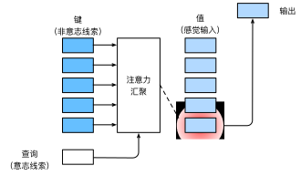

# Transformer

## encoder-decoder

encoder-decoder 架构主要用于将输入数据转换成不同类型或结构的输出数据。在许多应用中，encoder 将一个序列编码成一个固定大小的表示，而 deocoder 将这个表示解码为另一个序列。

### 架构

- encoder：它接受一个长度可变的序列作为输入，并将其转换为具有固定形状的编码状态。encoder 的主要工作是捕获输入序列的上下文信息并将其压缩成固定大小的上下文变量。这个变量应该包含输入序列的所有必要信息，以便 decoder 可以基于此进行准确的预测。
- decoder：它将固定形状的上下文变量映射到长度可变的输出序列。decoder 的工作是根据上下文变量生成输出序列。它逐步产生输出，可能在每一步都基于上下文变量、其先前的隐状态以及之前生成的输出。

### 应用场景

#### 序列处理

encoder-decoder 架构通常用于 seq2seq 的任务，如机器翻译、语音识别等，还可用于如问答系统、聊天机器人等任务。例如机器翻译，序列转换是其核心问题，输入和输出都是长度可变的序列。为了处理这种类型的输入和输出，我们可以采用 encoder-decoder 架构：

例如，将英语翻译为法语。给定一个英文的输入序列：“They”、“are”、“watching”、“.”。首先，encoder-decoder 架构将长度可变的输入序列编码成一个“状态”，然后对该状态进行解码，一个词元接着一个词元地生成翻译后的序列作为输出：“Ils”、“regordent”、“.”。

#### 图片描述

#### 语音识别

### vs. RNN

之前介绍的 RNN 是一种用于处理具有时间或序列性质的数据（如文本或语音）的神经网络结构。因为它可以处理可变长度的序列，所以经常在 encoder-decoder 中用作基本构件。

- encoder：在许多实际应用中，encoder 是一个 RNN（如 LSTM、GRU），它逐步读取输入序列的元素并更新其隐状态，最后一个时刻的 RNN 隐状态通常被用作上下文变量。
- decoder：decoder 也通常是一个 RNN，因为它需要序列生成的能力。它从上下文变量开始，然后逐步产生输出序列。

例如，在机器翻译任务中，源语言句子会被输入到 encoder（一个 RNN）中，encoder 会产生一个上下文变量。然后，这个上下文变量被传递给 decoder（另一个 RNN），它逐步产生目标语言的句子。

### auto-encoder

auto-encoder 是 encoder-decoder 架构的一种实现，它是一种无监督的学习模型，它的目标是学习输入数据的有效表示（encoder），然后通过这个表示再重构出输入数据（decoder）。encoder 将输入数据编码为一个低维表示，而 decoder 试图从这个低维表示中重建原始输入。

encoder 把输入数据压缩到一个“隐层”（通常维度较低），decoder 则把这个隐层数据解压回原始空间。因此，auto-encoder 通常用于数据压缩、去噪、特征提取等。auto-encoder 接收输入，将其转换成高效的内部表示，然后再输出输入数据的类似物。其算法背后并不是训练“映射”模型，而是去学习数据本身的内在结构和特征（隐层也被称为 feature detector）。通常隐层的神经元要比输入、输出层少，这就使神经网络只学习到了最重要的特征，并且实现了特征的降维。

#### 训练

auto-encoder 就是要解决无标签数据时，如何得到误差，进而纠正其中的值的问题。它通过比较重建后的数据与原始输入数据的差异来训练（因为没有标签数据）。通过调整 encoder 和 decoder 的参数，使重构误差最小。

## seq2seq

### 简介

在机器翻译领域最初使用 RNN，但 RNN 做机器翻译有局限性，RNN 只能解决 1-to-N、N-to-1、N-to-N 的问题。但在进行机器翻译时，输入序列的词元数和输出序列的词元数是不固定的，可能输入的一段话中有 5 个词元，翻译完后只有 4 个词元，但 RNN 难以解决 N-To-M 的翻译问题。后来为了解决这个问题，就提出了 seq2seq。这个模型基于 encoder-decoder 架构解决了输入与输出两端单词数目不等的状况。

#### 推理步骤

基于 encoder-decoder 架构，encoder 首先将长度可变的输入序列编码为一个固定大小的变量，也就是输入序列的信息被编码到上下文变量中，然后 decoder 将此上下文信息解码为输出序列。为了连续生成输出序列的 token，独立的 decoder 是基于 encoder 的上下文变量和输出序列已经生成的 token 来预测下一个 token。

##### encoder

encoder 将长度可变的输入序列转换成形状固定的上下文变量 $\mathbf{c}$（是对整个输入序列 $x_1, \ldots, x_T$ 进行编码），并将上下文变量 $c$ 传递给 decoder。

- 隐状态：假设输入序列是 $x_1, \ldots, x_T$，其中 $x_t$ 是输入文本序列中的第 $t$ 个词元。在时间步 $t$，encoder 将词元 $x_t$ 的输入向量 $\mathbf{x}_t$ 和 $\mathbf{h} _{t-1}$（即上一时间步的隐状态）转换为 $\mathbf{h}_t$（即当前步的隐状态），并且使用一个函数 $f()$ 来描述该转换过程 $\mathbf{h}_t = f(\mathbf{x}_t, \mathbf{h}_{t-1})$。
- 上下文变量 $\mathbf{c}$：encoder 通过函数 $q()$ 将所有时间步的隐状态转换为上下文变量 $\mathbf{c} = q(\mathbf{h}_1, \ldots, \mathbf{h}_T)$。例如，在 RNN 实现的 seq2seq 中选择 $\mathbf{c} = q(\mathbf{h}_1, \ldots, \mathbf{h}_T) = \mathbf{h}_T$ ，也就是上下文变量变成了输入序列在最后时间步的隐状态 $\mathbf{c} = \mathbf{h}_T$，具体可以理解为上下文变量就是输入序列的一个总结。

##### decoder

对于输出序列 $y_1, y_2, \ldots, y_{T'}$，对于每个时间步 $t'$（与输入序列或 encoder 的时间步 $t$ 不同），decoder 的输出 $y_{t'}$ 的概率取决于先前的输出子序列 $y_1, \ldots, y_{t'-1}$ 和上下文变量 $\mathbf{c}$，即 $P(y_{t'} \mid y_1, \ldots, y_{t'-1}, \mathbf{c})$。

- 隐状态 $\mathbf{s}_{t^\prime}$：在输出序列上的任意时间步 $t^\prime$，decoder 将来自上一时间步的输出 $y_{t^\prime-1}$ 和上下文变量 $\mathbf{c}$ 作为其输入，然后将它们和上一隐状态 $\mathbf{s}_{t^\prime-1}$（前 $t'$ 时间步的状态总结）转换为隐状态 $\mathbf{s}_{t^\prime}$。一般使用函数 $g()$ 来表示 decoder 隐状态的变换 $\mathbf{s}_{t^\prime} = g(y_{t^\prime-1}, \mathbf{s}_{t^\prime-1}, \mathbf{c})$。

- 输出 $y_{t^\prime}$：在获得 decoder 的隐状态 $\mathbf{s}_{t^\prime}$ 之后，我们可以使用输出层和 softmax() 来计算在时间步 $t^\prime$ 时输出 $y_{t^\prime}$ 的条件概率分布 $P(y_{t^\prime} \mid s_{t^\prime})$。

#### 度量

##### BLEU

我们可以通过与真实的标签序列进行比较来评估预测序列。虽然 BLEU（bilingual evaluation understudy）最先是用于评估机器翻译的结果，但现在它已经被广泛用于测量许多应用的输出序列的质量。原则上说，对于预测序列中的任意 $n$ 元语法（n-grams），BLEU 的评估都是这个 $n-gram$ 是否出现在标签序列中，当预测序列与标签序列完全相同时，BLEU 为 $1$。

BLEU 定义为：$ \exp\left(\min\left(0, 1 - \frac{\mathrm{len}_{\text{label}}}{\mathrm{len}_{\text{pred}}}\right)\right) \prod_{n=1}^k p_n^{1/2^n}$

- $\mathrm{len}_{\text{label}}$：表示标签序列中的词元数
- $\mathrm{len}_{\text{pred}}$：表示预测序列中的词元数
- $k$：用于匹配的最长的 $n-gram$
- $p_n$：表示 $n-gram$ 的精确度，它是两个数量的比值：第一个是预测序列与标签序列中匹配的 $n-gram$ 的数量，第二个是预测序列中 $n-gram$ 的数量的比率。具体地说，给定标签序列 $A$、$B$、$C$、$D$、$E$、$F$ 和预测序列 $A$、$B$、$B$、$C$、$D$，我们有 $p_1 = 4/5$、$p_2 = 3/4$、$p_3 = 1/3$ 和 $p_4 = 0$。

此外，由于 $n-gram$ 越长则匹配难度越大，所以 BLEU 为更长的 $n-gram$ 的精确度分配更大的权重。具体来说，当 $p_n$ 固定时，$p_n^{1/2^n}$ 会随着 $n$ 的增长而增加（原始论文使用 $p_n^{1/n}$）。而且，由于预测的序列越短获得的 $p_n$ 值越高，所以乘法项之前的系数用于惩罚较短的预测序列。例如，当 $k=2$ 时，给定标签序列 $A$、$B$、$C$、$D$、$E$、$F$ 和预测序列 $A$、$B$，尽管 $p_1 = p_2 = 1$，惩罚因子 $\exp(1-6/2) \approx 0.14$ 会降低 BLEU。

### RNN实现

encoder-decoder 是一种通用的神经网络结构，通常 encoder 和 decoder 都是由 RNN 网络实现的。具体来说，RNN encoder 将长度可变的序列转换为固定形状的上下文变量，然后 RNN decoder 根据 encoder 生成的上下文变量和之前输出的 token 生成输出（目标）序列 token。

#### encoder

我们可以使用一个单向 RNN 来设计 encoder，其中隐状态只依赖于输入子序列，这个子序列是由输入序列的开始位置到隐状态所在的时间步 $t$ 的位置组成。

我们也可以使用双向 RNN 构造 encoder，其中隐状态依赖于两个输入子序列，两个子序列是由隐状态所在的时间步的位置之前的序列和之后的序列，因此隐状态对整个序列的信息都进行了编码。

##### 网络结构

- embedding 层：
- 多个 RNN 隐藏层：

##### 上下文变量$c$

在 RNN 实现的 seq2seq 中，encoder 传给 decoder 的上下文变量 $c$ 是 encoder 最后一个时间步的隐状态，这个隐状态包含了 encoder 对输入序列的理解和编码，可以认为就是输入序列的总结。

#### decoder

我们可以使用另一个 RNN 作为 decoder。当 decoder 开始生成输出序列时，它会使用 encoder 传递的上下文变量作为初始隐藏状态。decoder 的初始隐藏状态将帮助它在生成第一个输出词元时考虑整个输入序列的信息（总结）。随着 decoder 的逐步生成词元，它会逐渐更新自己的隐状态，并在每个时间步都会使用 encoder 传递的上下文变量作为额外的信息来辅助生成下一个输出词元。

在每个时间步，decoder 的隐状态会根据当前输入符号和前一个时间步的隐状态进行更新。然后，该隐状态与上下文变量进行结合，以产生当前时间步的输出预测。这个过程允许 decoder 根据整个输入序列的信息来生成每个输出符号，从而提高了 seq2seq 模型的性能。

##### 网络结构

- embedding 层：
- 多个 RNN 隐藏层：
- 全连接层：为了预测输出词元的概率分布，在 RNN decoder 的最后一层使用全连接层来变换隐状态。

##### 初始化

###### 单一初始化

在 RNN decoder 的隐藏层的初始化时，使用 RNN encoder 输出的上下文变量 $c$ 来初始化 decoder 的隐藏层（隐状态），这就要求实现的 encoder 和 decoder 的 RNN 具有相同数量的层（都是单层）和隐藏单元。encoder 传递给 decoder 的上下文变量 $c$ 是 encoder 的最后一个隐状态，会用它来作为 decoder 的初始隐状态，这意味着 encoder 只给 decoder 传递一次信息。在这种设置下，encoder 的最后一个隐状态被认为是输入序列的压缩表示，它需要包含足够的信息（总结）来帮助 decoder 生成输出序列。

###### 逐层初始化

在经典的 seq2seq 模型中，通常只将 encoder 的最后一个隐状态作为上下文变量传递给 decoder。而在更复杂的模型中，会将 encoder 的每一层的最后一个隐状态传递给 decoder 的对应层作为初始隐状态。这样，decoder 的每一层都可以接收到 encoder 相应层的信息。这种策略允许 decoder 从 encoder 的每一层获取更丰富的信息，从而在生成目标序列时更好地利用输入序列的特征。

以一个基于多层 LSTM 的机器翻译模型为例，假设我们要将英文句子翻译成中文句子，我们的模型有一个 encoder 和一个 decoder，每个都包含两层 LSTM。

- 首先，将输入的英文句子逐个单词地输入到 encoder 的两层 LSTM 中。encoder 的每一层都会生成一个最后一个隐状态（记为 $h_{11}$ 和 $h_{12}$）和一个最后一个单元状态（记为 $c_{11}$ 和 $c_{12}$）。
- 接下来，将 encoder 的每一层的最后一个隐状态和单元状态传递给 decoder 的对应层作为初始隐状态和单元状态。具体来说，decoder 的第一层 LSTM 的初始隐状态和单元状态分别设置为 $h_{11}$ 和 $c_{11}$，第二层 LSTM 的初始隐状态和单元状态分别设置为 $h_{12}$ 和 $c_{12}$。
- 然后，将目标句子的起始符号（例如"<sos>"）输入到 decoder 的两层 LSTM 中。decoder 会逐个生成目标序列的单词，直到遇到终止符号（例如"<eos>"）。

在这个例子中，通过将 encoder 的每一层的最后一个隐状态和单元状态传递给 decoder 的对应层，decoder 可以在生成目标序列时更好地利用输入序列的特征。这有助于提高模型的性能，特别是在处理复杂任务和长序列时。

###### 输入初始化

为了进一步包含经过编码的输入序列的信息，上下文变量在所有的时间步与 decoder 的输入进行拼接（concatenate），传入 RNN 进行训练或推理。

#### 推理步骤

#### 训练步骤

## Bahdanau模型

### Attention

灵长类动物的视觉系统接受了大量的感官输入，这些感官输入远远超过了大脑能够完全处理的程度，然而并非所有刺激的影响都是相等的。意识的聚集和专注使灵长类动物能够在复杂的视觉环境中将注意力引向感兴趣的物体（如猎物和天敌），这种只关注一小部分信息的能力对进化更加有意义，使人类得以生存和成功。自 19 世纪以来，科学家们一直致力于研究认知神经科学领域的注意力。

在深度学习模型中，原始的 RNN 模型在处理长序列时遇到困难，而 Attention 机制允许模型在预测输出时，对输入序列中的某一部分放更多的“注意力”。Attention 的主要作用是让神经网络把“注意力”放在一部分输入上，即区分输入的不同部分对输出的影响。Attention 在 seq2seq 中生成每个 token 时，都有意识地从原始句子中提取生成该 token 时最需要的信息，摆脱了输入序列的长度限制。例如，每个 token 在一篇文本中表达的意思通常与它的上下文有关。比如：光看“鹄”字，可能会觉得很陌生（甚至连读音是什么都不记得吧），而看到它的上下文“鸿鹄之志”后，就对它立马熟悉了起来。因此，token 的上下文信息有助于增强其语义表示，上下文中的不同 token 对增强语义表示所起的作用往往不同。比如在上面这个例子中，“鸿”字对理解“鹄”字的作用最大，而“之”字的作用则相对较小。为了有区分地利用上下文字信息增强目标字的语义表示，就可以用到 Attention 机制。

#### 示例

想象一下，有一个叫小明的小学生，他在读一本故事书。这本书有很多章节，每个章节都有很多句子。小明想要理解书中的每个句子，但是他的注意力有限，不能同时关注到每个单词。这时候，Attention 机制就像是一个帮助小明更好地理解故事的魔法工具。Attention 机制的作用就是帮助小明找出每个句子里最重要的单词，让他能够集中注意力去理解这些关键词，这样就能更好地把握住故事的主线、理解故事的内容。这个魔法工具有一个特殊的能力，那就是可以为每个单词分配一个“权重”。权重越大，说明这个单词对于理解句子越重要。当小明读到一个句子时，这个魔法工具会自动计算出每个单词的权重，然后告诉小明哪些单词最重要。这样，小明就能把有限的注意力集中在关键词上，更快地理解故事。判断哪个词更重要的过程是通过计算每个词与其他词之间的关联性来实现的。可以把这个过程想象成一个简单的游戏。 假设有一个句子：“小明喜欢吃苹果。”为了找出这个句子中最重要的词，可以这样做：

1. 把每个词变成一张卡片，这些卡片包含了词的信息。例如，“小明”、“喜欢”、“吃”和“苹果”。
2. 计算每张卡片与其他卡片之间的关系。这个过程就像是给卡片打分，分数越高说明两张卡片之间的关系越密切。 例如，我们会发现“喜欢”和“吃”之间的关系比较密切，因为它们都表示一个动作。而“小明”和“喜欢”之间的关系也很密切，因为“小明”是喜欢吃苹果的那个人。
3. 当为每张卡片与其他卡片打完分后，可以计算每张卡片的总分，总分越高说明这个词在句子里越重要。在本例中，“喜欢”和“吃”可能会得到较高的分数，因为它们与其他词的关系都很密切。而“苹果”可能会得到较低的分数，因为它与其他词的关系相对较弱。
4. 根据每个词的总分，为每个词分配一个权重。权重越大，说明这个词对理解句子越重要。 

这个过程就是 Attention 机制的简化版，可以找出句子中最重要的词，从而更好地理解句子的含义。当然，实际的计算过程会更复杂一些，但核心思想是相同的。

#### RNN的缺陷

- decoder 只有输入序列的总结：decoder 访问整个编码的输入序列，无法选择性地关注输入序列相关、重点部分。
- docoder 抽取上下文变量无法自动学习：无法通过学习注意力权重自动捕捉 encoder 和 decoder 之间的相关性（动态的上下文变量）。

#### 原理

##### 心理学“双件组”框架

Attention 是如何首先应用于视觉世界中的呢？这要从当今心理学中十分普及的双组件（two-component）框架开始讲。这个框架的出现可以追溯到 19 世纪 90 年代的威廉·詹姆斯，他被认为是“美国心理学之父”。在这个框架中，受试者基于“非自主性提示”和“自主性提示”有选择地引导注意力的焦点。

- 非自主性提示：是基于环境中物体的突出性和易见性。想象一下，假如我们面前有五个物品：一份报纸、一篇研究论文、一杯咖啡、一本笔记本和一本书。所有纸制品都是黑白印刷的，但咖啡杯是红色的。换句话说，这个咖啡杯在这种视觉环境中是突出和显眼的，不由自主地引起人们的注意，所以我们会把最敏锐的视力放到咖啡上。
- 自主性提示：喝咖啡后，我们会变得兴奋并想读书。与之前由于突出性导致的选择不同，此时选择书是受到了认知和意识的控制，因此注意力在基于自主性提示去辅助选择时将更为谨慎。受试者的主观意愿推动，选择的力量也就更强大。

##### Query/Key/Value定义

“自主性的”与“非自主性”的注意力提示解释了人类的注意力的方式，整个 Attention 机制的 Query、Key、Value 概念来源于此，其目的是根据人之前的关注方面，来推断当前最会感兴趣的东西。可以用 Query、Key 和 Value 模拟人类如何根据某些“感兴趣”的信息 Query，在大量信息 Key 中寻找相关内容，并提取需要的信息 Value。

- Query（自主性提示）：表示当前感兴趣的关注点，有时也可以理解为当前的状态。
- Key（非自主性提示）：体现输入序列不同词元间的特殊性，用于与 Query 匹配使用，从而实现非自主性提示。
- Value（编码输出）：是实际编码后的输出信息，它包含了源序列中每个部分提炼出来的实际信息。一旦我们找到与 Query 匹配的 Key，我们就会从相应的 Value 中提取信息。

例如，我们在处理一个机器翻译任务，即将一句英文翻译成中文。在这个场景中，Attention 机制可以帮助模型确定输入句子中哪些分词对生成目标分词最为重要。

- Query：之前已经翻译完成的中文词汇，表示之前状态的总结（可以理解为当前最关心的事情）。
- Key：输入的英文句子中的每个单词。
- Value：与每个英文单词对应的中文翻译。一旦 Query 与 Key 匹配，这些 Value 将被用来生成翻译的中文词。

例如，如果模型正在翻译的句子是 "The cat sits on the mat"（猫坐在垫子上），并且当前的任务是翻译 "cat" 这个词。在这种情况下，Query 将是与“cat”相对应的中文词汇生成的上下文，Key 是每个英文单词的表示（"The", "cat", "sits", "on", "the", "mat"），Value 则是这些单词对应的翻译。通过计算 Query 与所有 Key 的相似度，模型决定最需要关注（即权重最大的）的 Value，这有助于模型更准确地生成“cat”的中文翻译。

例如，可以把 Q、K、V 看做是点菜，Q 是我们想吃什么，K 是菜单，而 V 则是呈现的菜。

##### Attention权重

在具体计算 Attention 时，往往采用加权的方式计算 Value。加权的主要思想是，当我们生成目标序列的每个单词时（也就是 Query），都会计算其与输入序列中每个单词的相关性（即 Query 与 Key 的匹配程度），然后根据这些相关性对 Value 进行加权求和，得到一个表示当前输出状态的隐状态，这个隐状态会用于生成新的单词。当我们有一个 Query 时，我们会用它去匹配所有的 Key 进行比较，通过匹配得到一个权重分布，这个分布决定了我们应该在各个 Value 上放多少“注意力”（权重）：

- Query：来自当前的待解码的部分，用于与 Key 匹配以确定如何加权 Value。
- Key：用于与 Query 匹配，为了确定注意力权重。
- Value：在确定了权重后，用于加权求和以得到输出的部分。

以英语翻译中文为例：

- 建立 Key-Value 对： 为输入序列（英文句子）的每个单词设置 Key 和 Value 的一个表示，比如通过 RNN 或 Transformer，其中 Key 为英语单词而 Value 为中文翻译。
- 生成 Query： 当生成中文句子时，模型会逐个生成目标序列的单词。每次生成一个新的单词时，模型都会计算一个新的输出隐状态（也就是到目前为止已经生成的所有单词的隐状态），这个隐状态就是 Query。
- 匹配 Query-Key、生成新的隐状态：
  - 计算注意力权重：对于每个 Query，模型会计算它与输入序列的每个 Key 的匹配程度。然后，模型会使用 softmax() 函数对匹配程度进行归一化，得到注意力权重。
  - 上下文变量=计算新的输出隐状态：模型会根据计算得出的注意力权重，对输入序列的 Value 进行加权求和，得到一个新的输出隐状态（也就是下一个 Query）作为 encoder 传递给 decoder 的上下文变量，这个隐状态就包含了对当前位置最有用的信息。
  - 生成新的单词：模型会根据新的隐状态来生成新的单词。

这样就确保 Attention 帮助“聚焦”在原句子中与当前输出词（Query）最相关的部分。

##### Query-Key相似度计算

首先，回顾一个经典注意力框架，解释如何在视觉场景中展开注意力。受此框架中的注意力提示（attention cues）的启发，我们将设计能够利用这些注意力提示的模型。1964 年的 Nadaraya-Waston 核回归（kernel regression）正是具有 Attention 机制的机器学习的简单演示。然后，注意力函数在深度学习的注意力模型设计中被广泛使用，Bahdanau 注意力是深度学习中的具有突破性价值的注意力模型，它双向对齐并且可以微分。

###### Nadaraya-Watson核回归

Nadaraya 和 Watson 提出了根据输入的位置对输出 $y_i$ 进行加权：

$$f(x) = \sum_{i=1}^n \frac{K(x - x_i)}{\sum_{j=1}^n K(x - x_j)} y_i$$

- $K$ 是核（kernel）函数

###### Attention Pooling

上式中所描述的估计器被称为 Nadaraya-Watson 核回归（Nadaraya-Watson kernel regression）。从 Attention 的角度，可以将公式重写为一个更加通用的注意力汇聚（Attention Pooling）公式：

$$f(x) = \sum_{i=1}^n \alpha(x, x_i) y_i$$

- $x$：Query
- $(x_i, y_i)$：Key-Value 对
- $a()$：注意力评分 Attention Score 函数，用于计算 Query 与 Key 之间的相似度
- $f(x)$：注意力汇聚的最终加权平均输出

Attention Pooling 将 Query $x$ 和 Key $x_i$ 之间的关系建模为注意力权重（Attention Weight）$\alpha(x, x_i)$，这个权重将被分配给每一个对应值 $y_i$。对于任何 Query，模型在所有 Key-Value 对注意力权重都是一个有效的概率分布：它们是非负的，并且总和为 1。

###### Attention Score

注意力评分函数是用于计算 Query 与 Key 之间的相似度，选择不同的注意力评分函数 $a()$ 会导致不同的注意力汇聚操作。

1-to-1

非参-高斯核

使用高斯核（Gaussian kernel）来计算 Query-Key 的相似度（它们之间的距离），其定义为：$K(u) = \frac{1}{\sqrt{2\pi}} \exp(-\frac{u^2}{2})$。

将高斯核代入，可以得到：

$$\begin{aligned} f(x) &=\sum_{i=1}^n \alpha(x, x_i) y_i\\ &= \sum_{i=1}^n \frac{\exp\left(-\frac{1}{2}(x - x_i)^2\right)}{\sum_{j=1}^n \exp\left(-\frac{1}{2}(x - x_j)^2\right)} y_i \\&= \sum_{i=1}^n \mathrm{softmax}\left(-\frac{1}{2}(x - x_i)^2\right) y_i. \end{aligned}$$

如果一个键 $x_i$ 越是接近给定的查询 $x$，那么分配给这个键对应值 $y_i$ 的注意力权重就会越大，也就“获得了更多的注意力”。

上面的公式使用了高斯核来对 Query-Key 之间的关系建模。高斯核指数部分可以视为注意力评分函数（attention scoring function），简称评分函数（scoring function），然后把这个函数的输出结果输入到 softmax() 中进行运算。通过上述步骤，将得到与 Key 对应的 Value 的概率分布（即注意力权重）。最后，注意力汇聚的输出就是基于这些注意力权重的值的加权和，从而实现 Attention 机制。

用数学语述，假设有一个 Query $\mathbf{q} \in \mathbb{R}^q$ 和 $m$ 个“Key-Value”对 $(\mathbf{k}_1, \mathbf{v}_1), \ldots, (\mathbf{k}_m, \mathbf{v}_m)$，其中 $\mathbf{k}_i \in \mathbb{R}^k$，$\mathbf{v}_i \in \mathbb{R}^v$。注意力汇聚函数 $f$ 就被表示成值的加权和：$f(\mathbf{q}, (\mathbf{k}_1, \mathbf{v}_1), \ldots, (\mathbf{k}_m, \mathbf{v}_m)) = \sum_{i=1}^m \alpha(\mathbf{q}, \mathbf{k}_i) \mathbf{v}_i \in \mathbb{R}^v$。

其中查询 $\mathbf{q}$ 和键 $\mathbf{k}_i$ 的注意力权重是通过注意力评分函数 $a$ 将两个向量映射成标量，再经过 softmax() 运算得到的：$\alpha(\mathbf{q}, \mathbf{k}_i) = \mathrm{softmax}(a(\mathbf{q}, \mathbf{k}_i)) = \frac{\exp(a(\mathbf{q}, \mathbf{k}_i))}{\sum_{j=1}^m \exp(a(\mathbf{q}, \mathbf{k}_j))} \in \mathbb{R}$。

参数化-高斯核

值得注意的是，上式是一个非参数模型，因此是非参数的注意力汇聚（nonparametric attention pooling）模型。非参数模型具有一致性（consistency）的优点，如果有足够的数据，此模型会收敛到最优结果。

尽管如此，我们还是可以轻松地将可学习的参数集成到注意力汇聚中。在下面的查询 $x$ 和键 $x_i$ 之间的距离乘以可学习参数 $w$：

$$\begin{aligned}f(x) &= \sum_{i=1}^n \alpha(x, x_i) y_i \\&= \sum_{i=1}^n \frac{\exp\left(-\frac{1}{2}((x - x_i)w)^2\right)}{\sum_{j=1}^n \exp\left(-\frac{1}{2}((x - x_j)w)^2\right)} y_i \\&= \sum_{i=1}^n \mathrm{softmax}\left(-\frac{1}{2}((x - x_i)w)^2\right) y_i.\end{aligned}$$

N-to-N

缩放点积注意力

使用点积可以得到计算效率更高的注意力评分函数，但是点积操作要求 Query 和 Key 具有相同的长度 $d$。假设查询和键的所有元素都是独立的随机变量，并且都满足零均值和单位方差，那么两个向量的点积的均值为 $0$，方差为 $d$。为确保无论向量长度如何，点积的方差在不考虑向量长度的情况下仍然是 $1$，我们再将点积除以 $\sqrt{d}$。缩放点积注意力（scaled dot-product attention）评分函数为：

$$a(\mathbf q, \mathbf k) = \mathbf{q}^\top \mathbf{k}  /\sqrt{d}$$

在实践中，我们通常从小批量的角度来考虑提高效率，例如基于 $n$ 个 Query 和 $m$ 个 Key-Value 对计算注意力，其中 Query 和 Key 的长度为 $d$，值的长度为 $v$。查询 $\mathbf Q\in\mathbb R^{n\times d}$、键 $\mathbf K\in\mathbb R^{m\times d}$ 和值 $\mathbf V\in\mathbb R^{m\times v}$ 的缩放点积注意力是：

$$ \mathrm{softmax}\left(\frac{\mathbf Q \mathbf K^\top }{\sqrt{d}}\right) \mathbf V \in \mathbb{R}^{n\times v}$$

N-to-M

Additional Attention

当 Query 和 Key 是不同长度的矢量时，可以使用加性注意力（Additional Attention）作为注意力函数。给定查询 $\mathbf{q} \in \mathbb{R}^q$ 和键 $\mathbf{k} \in \mathbb{R}^k$，Aditive ttention 的函数为

$$a(\mathbf q, \mathbf k) = \mathbf w_v^\top \text{tanh}(\mathbf W_q\mathbf q + \mathbf W_k \mathbf k) \in \mathbb{R}$$

- 其中可学习的参数是$\mathbf W_q\in\mathbb R^{h\times q}$、$\mathbf W_k\in\mathbb R^{h\times k}$ 和 $\mathbf w_v\in\mathbb R^{h}$。

将 Query 和 Key 连结起来后输入到一个 MLP 中，MLP 包含一个隐藏层，其隐藏单元数是一个超参数 $h$。通过使用 $\tanh()$​ 作为激活函数，并且禁用偏置项。

### Bahdanau模型

基于 RNN 的 seq2seq 实现，每次从 encoder 传给 decoder 的上下文变量 $c$ 是输入序列的“总结”，但并非所有输入词元都对某个将要输出的词元都有用。我们试着从 Attention 机制中找到灵感，Bahdanau 等人提出了一个没有严格单向对齐限制的可微 Bahdanau Attention 模型。在预测词元时，如果不是所有输入词元都相关，模型将仅对齐（或参与）输入序列中与当前预测相关的部分，这是通过将上下文变量视为 Attention 集中的输出来实现的。

Attention 机制是在输入序列（如源语言的词语）和输出序列（如目标语言的词语）之间建立连接的。如在翻译任务中，当模型正在生成目标语言的一个词时，Attention 机制可以帮助模型确定应该关注源语言句子的哪些词。所以，Attention 机制中的 Query 通常来自于输出序列，而 Key 和 Value 来自于输入序列。其中：

- Query：decoder 时间步 $t' - 1$ 的隐状态 $\mathbf{s}_{t' - 1}$
- Key、Value：encoder 时间步 $t$ 的隐状态 $\mathbf{h}_t$（Key 与 Value 相同）

#### encoder

##### 网络结构

与 RNN 实现的 encoder 相同。

- embedding 层：
- 多个 RNN 层（隐藏层）：

##### 上下文变量 $c$ / Attention块

基于 Attention 的 Bahdanau 模型与 RNN 实现的模型相似，只不过上下文变量 $\mathbf{c}$ 在 decoder 时间步 $t'$ 都会被 $\mathbf{c}_{t'}$ 替换。假设输入序列中有 $T$ 个词元，decoder 时间步 $t'$ 的上下文变量是注意力集中的输出：$\mathbf{c}_{t'} = \sum_{t=1}^T \alpha(\mathbf{s}_{t' - 1}, \mathbf{h}_t) \mathbf{h}_t$，表示与 Query 最匹配 encoder 的隐状态。decoder 通过计算注意力权重来对 encoder 的输出进行加权求和，从而生成当前时间步 $t'$ 的上下文变量 $\mathbf{c}_{t'}$。这样，decoder 在每个时间步都可以获得一个与当前状态相关的上下文变量，以帮助其更好地生成输出序列。

在通过 Attention 实现的 seq2seq 模型中，encoder 传给 decoder 的上下文变量通常包含了 encoder 中所有时间步的隐状态 $h$（作为键值对），以便 decoder 更好地对输入序列进行理解（用于给 decoder 的隐状态 $s$ 进行查询、匹配）。

###### vs. RNN实现

- RNN 输入序列总结：RNN 是把 encoder 的整个输入序列编码后的最后一个隐状态转递给 decoder。
- Attention 隐藏状态键值对：Attention 把 encoder 的每个时间步的隐状态组成一个键值对（键和值都是隐藏状态 $h$）用于给 decoder 的隐状态 $s$ 进行查询和匹配。因此，可以把 Attention 看成是一个隐状态的字典。

#### decoder

##### 网络结构

- embedding 层：
- 多个 RNN 层（隐藏层）：
- 全连接层：

##### 初始化

- 上一时间步的 encoder 隐状态（隐藏层输出）将作为初始化 decoder 的 Attention 隐状态

#### 推理步骤

#### 训练步骤

## Transformer

- [Transformer]()
