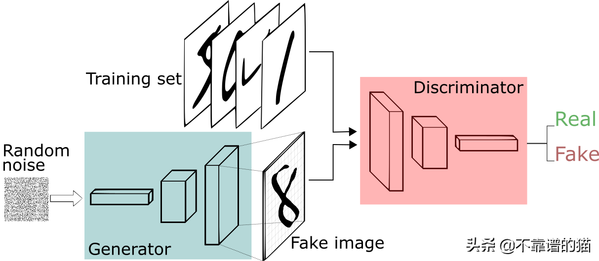
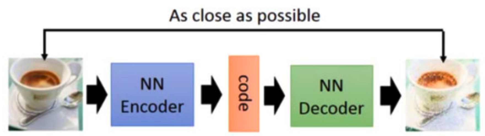

# GAN生成对抗网络

## 简介

什么是生成（generation）？就是模型通过学习一些数据，然后生成类似的数据。让机器看一些动物图片，然后自己来产生动物的图片，这就是生成。

对抗生成网络 GAN 是一种让两个神经网络相互博弈从而完成学习的生成模型，其由一个生成器和一个判别器组成。有 2 个深度神经网络 G 和 D，其中 G 是生成网络，D 是鉴别网络。G 的任务是根据一组真实、有限的数据（如一组图片）生成更多类似但不同的数据，然后把这些生成的数据和真实的数据混在一起给 D。D 的任务是用很少的真实数据训练后，分出哪些是真实数据哪些是生成数据。如果 G 生成的数据能被 D 鉴别，需要继续调整 G，目的是让 D 分不出来。如果 D 分不出真假，说明 D 不够好，需要继续调整 D 的参数分出真伪。这样对抗下去，2 个网络越来越好，G 模仿的越来越真，D 鉴别的越来越准确。当 2 个网络打得难解难分时，G 生成出来的数据和真实数据无法分辨，当缺乏足够的真实数据时，这些生成数据就可以用来训练神经网络了。

GAN 生成对抗网络有两个部分：

- 生成器：学习生成可信的数据。生成的实例成为判别器的负面训练实例。
- 判别器：学会从数据中分辨出生成器的假数据。判别器对产生不可信结果的发生器进行惩罚。

建立 GAN 的第一步是识别所需的最终输出，并根据这些参数收集初始训练数据集。然后将这些数据随机化并输入到生成器中，直到获得生成输出的基本精度为止。然后，将生成的图像与原始概念的实际数据点一起馈入判别器。判别器对信息进行过滤，并返回0到1之间的概率来表示每个图像的真实性（1与真相关，0与假相关）。然后检查这些值是否成功，并不断重复，直到达到预期的结果。

### auto-encoder的问题

训练一个 encoder，把 input 转换成 code，然后训练一个 decoder，把 code 转换成一个 image，然后计算得到的 image 和 input 之间的 MSE（mean square error），训练完这个 model 之后，取出后半部分 NN Decoder，输入一个随机的 code，就能 generate 一个 image。但是 auto-encoder 生成 image 的效果，当然看着很别扭啦，一眼就能看出真假。

## 原理

GAN 有两个网络，一个是 generator，一个是 discriminator，generator 通过机器生成数据（大部分情况下是图像），目的是“骗过”discriminator。Discriminator 判断这张图像是真实的还是机器生成的，目的是找出生成器做的“假数据”从二人零和博弈中受启发，通过两个网络互相对抗来达到最好的生成效果。

- 生成器接收随机数并返回图像。
- 将生成的图像与从实际数据集中获取的图像流一起馈送到鉴别器中。
- 鉴别器接收真实和假图像并返回概率，0 到 1 之间的数字，1 表示真实性的预测，0表示假。

### 第一阶段：固定「判别器D」，训练「生成器G」

我们使用一个还 OK 判别器，让一个「生成器G」不断生成“假数据”，然后给这个「判别器D」去判断。一开始，「生成器G」还很弱，所以很容易被揪出来。但是随着不断的训练，「生成器G」技能不断提升，最终骗过了「判别器D」。到了这个时候，「判别器D」基本属于瞎猜的状态，判断是否为假数据的概率为50%。

### 第二阶段：固定「生成器G」，训练「判别器D」

当通过了第一阶段，继续训练「生成器G」就没有意义了。这个时候我们固定「生成器G」，然后开始训练「判别器D」。「判别器D」通过不断训练，提高了自己的鉴别能力，最终他可以准确的判断出所有的假图片。到了这个时候，「生成器G」已经无法骗过「判别器D」。

### 循环阶段一和阶段二

通过不断的循环，「生成器G」和「判别器D」的能力都越来越强。最终我们得到了一个效果非常好的「生成器G」，我们就可以用它来生成我们想要的图片了。

