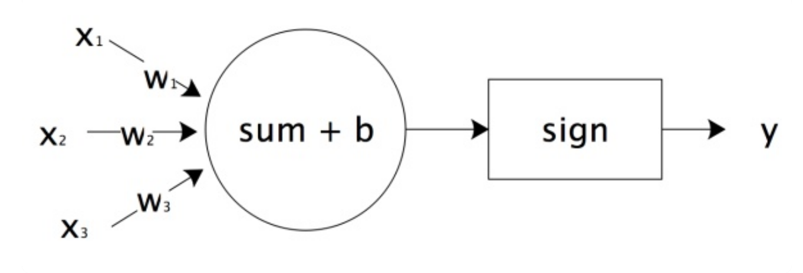

# 深度学习

## 简介

深度学习属于机器学习的一种，与传统的机器学习算法不同，它是通过神经网络来实现的。神经网络就好比是机器的大脑，刚开始就像一个婴儿一样是一张白纸，但通过多次训练之后“大脑”就可以逐渐具备某种能力。这个训练过程只需要告诉“大脑”输入的数据是什么，以及对应的输出结果是什么即可。通过多次训练，“大脑”中的多层神经网络的参数就会自动优化，从而得到一个适应于训练数据的模型。这类模型可以看成在传统的机器学习模型中，都会讲解模型的算法原理，比如 K-Means 的算法原理，KNN 的原理等。而到了神经网络，更关注的是网络结构，以及网络结构中每层神经元的传输机制。不需要告诉机器具体的特征规律是什么，只需把想要训练的数据和对应的结果告诉机器大脑即可。深度学习会自己找到数据的特征规律。而传统机器学习往往需要专家来告诉机器采用什么样的模型算法，这就是深度学习与传统机器学习最大的区别。另外深度学习的神经网络结构通常比较深，一般都是 5 层以上，甚至也有 101 层或更多的层数，这些深度的神经网络可以让机器更好地自动捕获数据的特征。

### 历史

-	1958: Perceptron (linear model)
-	1969: Perceptron has limitation
-	1980s: Multi-layer perceptron: Do not have significant difference from DNN today
-	1986: Backpropagation: Usually more than 3 hidden layers is not helpful
-	1989: 1 hidden layer is “good enough”, why deep?
-	2006: RBM initialization
-	2009: GPU
-	2011: Start to be popular in speech recognition
-	2012: win ILSVRC image competition 
-	2015.2: Image recognition surpassing human-level performance 
-	2016.3: Alpha GO beats Lee Sedol
-	2016.10: Speech recognition system as good as humans

### 表示学习/与传统机器学习的区别

如前所述，机器学习可以使用数据来学习输入和输出之间的转换，例如在语音识别中将音频转换为文本。而这种模式通常需要以适合算法的方式表示数据，以便将这种表示转换为输出。整个数据的表示就是表示学习，而在传统的机器学习中，这个过程需要人工学习，也就是我们日常说的特征工程。深度学习通过其“深度”的层自动地学习了这种转换，每一层提供一个层次的表示。例如，靠近输入的层可以表示数据的低级细节，而接近分类输出的层可以表示用于区分的更抽象的概念。由于表示学习（Representation Learning）目的是寻找表示本身，因此深度学习可以称为“多级表示学习”。

- 传统机器学习的特征提取主要依赖人工：针对特定简单任务的时候人工提取特征会简单有效，但是并不能通用。在过去的日子里，将机器学习应用于这些问题的关键部分是提出人工设计的特征工程方法，将数据转换为某种适合于浅层模型的形式。例如，在计算机视觉中，科学家们习惯于将特征工程的过程与建立机器学习模型的过程分开。
- 深度学习的特征提取并不依靠人工，而是机器自动提取特征的：这也是为什么大家都说深度学习的可解释性很差，因为有时候深度学习虽然能有好的表现，但是并不知道它的原理是什么。然而，与一个算法自动执行的数百万个选择相比，人类通过特征工程所能完成的事情很少。当深度学习开始时，这些特征抽取器被自动调整的滤波器所取代，产生了更高的精确度。深度学习的一个关键优势是它不仅取代了传统学习管道末端的浅层模型，而且还取代了劳动密集型的特征工程过程。

深度学习与经典方法的区别主要在于它更关注的功能强大的模型，这些模型由神经网络错综复杂的交织在一起，包含层层数据转换。深度模型是很深的神经网络，是一种简单的通过增加隐层提升容量的办法，理论上参数越多的模型复杂度越高、容量越大。

#### 目的

- 可分性：表示学习的目标之一是将输入数据转换为具有更好可分性的特征空间。这意味着在学习到的表示中，不同类别或不同概念之间的样本应该有明显的边界或区别。例如，在图像分类任务中，表示学习的目标是使来自不同类别的图像在特征空间中更容易区分。这样的特征表示使得机器学习算法可以更轻松地进行分类、聚类或其他数据分析任务。
- 可解释性：另一个表示学习的目标是生成可解释性的特征表示。这意味着学习到的特征应该具有对应于原始数据中的可理解概念。例如，在自然语言处理中，词嵌入模型学习到的词向量应该能够捕捉到词语之间的语义关系，使得相似的词在向量空间中更接近。这样的表示不仅有助于模型的解释性，也可以在语义分析和文本生成等任务中提供更好的性能。
- 推理能力：另一个重要的目标是使得学习到的特征表示在推理任务中更具能力。这意味着在特征空间中，我们可以执行类似于推理、类比或关联的操作。例如，通过在词嵌入空间中执行向量运算，如“国王 - 男人 + 女人 = 皇后”，我们可以得到与“皇后”非常接近的结果。这种推理能力使得我们能够进行关联和类比推理，从而在自然语言处理、推荐系统和知识图谱等领域中实现更高级的语义推理和理解。

## 神经网络

神经网络是一个具有相互连接的节点的计算系统，其节点的工作方式更像是人脑中的神经元（neuron）。这些神经元在它们之间进行处理并传递信息。神经网络就好比一个黑盒子，只需要告诉这个黑盒子输入数据和输出数据，神经网络就可以自我训练。一旦训练好之后，就可以像黑盒子一样使用，当你传入一个新的数据时，它就会告诉你对应的输出结果。在训练过程中，神经网络主要是通过前向传播和反向传播机制运作的。每个神经网络都是一系列的算法，这些算法试图通过一个模拟人类大脑运作的过程来识别一组数据中的潜在关系。【1】当神经网络层数比较多的时候，称它们为深度学习神经网络。

### 神经元

神经网络由多个神经元组成，每个神经元具有一个加权和的输入，并应用一个激活函数来生成输出。在神经网络中，每个神经元的加权和计算是通过将输入特征与相应的权重相乘并求和来实现的。激活函数引入非线性性质，允许网络学习更复杂的模式。整个网络可以包含多个神经元和不同类型的激活函数，从而能够学习更复杂的模型。

人脑神经元可以通过感知机进行模拟，每个感知机相当于一个神经元，使用阶跃函数 sign 的感知机输出也是只有两个值，跟人脑神经元一样。如图，x1、x2、x3 相当于神经元的树突；实现信号的输入 $sum()+b$ 及 sign 函数相当于神经元细胞，完成输入的计算，y  是神经元的输出。用数学形式表达的话是 $y=sign(w1x1+w2x2+w3x3+b)$，它是感知机 $y=sign(wx+b)$  向量展开形式。

- x_1，x_2，x_3，x_n：模拟生物神经网络中来自其他神经元的输入；
- ω_1，ω_2，ω_3，ω_n：模拟生物神经网络中每个神经元对外接收的突触强度不同，所以外界接收的输入乘以一定权重；
- Σ-Sum：模拟生物神经网络中神经元对外接收的信号进行累加汇总；
- Bias：模拟生物神经网络中神经元的一般敏感性。每个神经元的敏感性不同，所以需要一定的偏差来调整汇总值；
- Activation Function（sign）：激活函数用于计算神经元的输出，它模拟生物神经网络中信号累积到一定程度产生的动作电位，当累积到一定程度就会“激活”动作电位，一般使用 Sigmoid() 函数；
- Output：模拟生物神经网络中神经元对外释放的新的信号；

### 神经网络

但感知机模型只能用于二元分类，且无法学习比较复杂的非线性模型，因此在工业界无法使用。而神经网络则在感知机的模型上做了扩展，将感知机组成一层或多层网络状结构，就构成了机器学习的神经网络（Neural Network）。在多层神经网络中，每一层都由多个感知机组成。将输入的特征向量 X 传递给第一层的每一个感知机，运算以后作为输出传递给下一层的每一个感知机，直到最后一层感知机产生最终的输出结果。这就是机器学习神经网络的实现过程，通过模拟人脑神经网络，利用样本数据训练每个感知机神经元的参数，神经网络学到的东西都在 $w、b$ 中。

- 节点：神经网络是由神经元（感知机）组成的，也称之为节点，它们分布在神经网络的各个层中，这些层包括输入层，输出层和隐藏层。
- 输入层（非功能层，不算一层）：只接收信号，并分发到隐藏层，不对数据进行加工，因此**不被记为层数**。
- 隐藏层（功能层）：隐藏层可以是一层也可以是多层，每个隐藏层都会把前一层节点传输出来的数据进行计算，这相当于把数据抽象到另一个维度的空间中，可以更好地提取和计算数据的特征。
- 输出层（功能层）：与隐层一样进行计算（也算一层），并将计算结果输出。一般来说输出层节点数等于要分类的个数。

总体而言，神经网络在感知机的模型上做了以下 3 方面的扩展：

1. 加入了隐藏层：隐藏层可以有多层，增强模型的表达能力。当然增加了这么多隐藏层模型的复杂度也增加了好多。
2. 输出层：输出层的神经元也可以不止一个输出，可以有多个输出。这样模型可以灵活的应用于分类回归，以及其他的机器学习领域比如降维和聚类等。多个神经元输出的输出层对应的一个实例如下图，输出层现在有 4 个神经元了。
3. 对激活函数做扩展：感知机的激活函数是 $𝑠𝑖𝑔𝑛(𝑧)$，虽然简单但是处理能力有限。因此，神经网络中一般使用多种不同的激活函数，比如在逻辑回归里面使用 Sigmoid 函数，即：$𝑓(𝑧)=\frac{1}{1+𝑒^{−𝑧}}$，以及后来出现的 tanx、softmax 和 ReLU 等。通过使用不同的激活函数，神经网络的表达能力进一步增强。

### 深度神经网络

深度神经网络是基于神经网络发展起来的，它的原理与神经网络的原理一样，只不过强调了模型结构的深度，通常有 5 层以上，这样模型的学习能力会更强大。

深度神经网络的层与层之间是全连接的，也就是说第 i 层的任意一个神经元一定与第 i+1 层的任意一个神经元相连。虽然深度神经网络看起来很复杂，但是从小的局部模型来说，还是和感知机一样，即一个线性关系 $𝑧=∑𝑤_𝑖𝑥_𝑖+𝑏$ 加上一个激活函数 𝜎(𝑧)。

由于网络的层数多，系数 𝑤 和偏倚 𝑏 的数量也就是很多了。具体的参数定义包括：

- 系数 𝑤：以一个三层的网络为例，第二层的第 4 个神经元到第三层的第 2 个神经元的线性系数定义为 $𝑤^3_{24}$，上标 3 代表线性系数 𝑤 所在的层数，而下标对应的是输出的第三层索引 2 和输入的第二层索引 4。也许会问，为什么不是 $𝑤^3_{42}$ 而是 $𝑤^3_{24}$ 呢？这主要是为了便于模型用于矩阵表示运算，如果是 $𝑤^3_{42}$ 而每次进行矩阵运算是 $𝑤^𝑇𝑥+𝑏$ 需要进行转置。将输出的索引放在前面的话，则线性运算不用转置，即直接为 $𝑤𝑥+𝑏$。总结下，第 𝑙−1 层的第 k 个神经元到第 𝑙 层的第 j 个神经元的线性系数定义为 $𝑤^𝑙_{𝑗𝑘}$。注意，输入层是没有 𝑤 参数的。
- 偏倚 𝑏：还是以这个三层的网络为例，第二层的第三个神经元对应的偏倚定义为 $𝑏^2_3$。其中，上标 2 代表所在的层数，下标 3 代表偏倚所在的神经元的索引。同样的道理，第三个的第一个神经元的偏倚应该表示为 $𝑏^3_1$。同样的，输入层是没有偏倚参数*𝑏*的。

## 学习算法

### 数据D/经验E

与通用 ML 相同

### 任务T/模型M

与通用 ML 相同。

#### 参数初始化

每个模型都是根据某个预先指定的分布来初始化模型的参数，有人可能会觉得，初始化方案的选择并不是特别重要。相反，初始化方案的选择在神经网络学习中起着举足轻重的作用，它对保持数值稳定性至关重要。选择哪个函数以及如何初始化参数可以决定优化算法收敛的速度有多快，糟糕选择可能会导致我们在训练时遇到梯度爆炸或梯度消失。

##### 正态分布初始化

##### Xavier 初始化

#### 超参数

##### 层数-神经元数

多少层、每层多少个 neuron

##### 激活函数

激活函数（Activation Funciton）通过计算加权和并加上偏置来确定神经元是否应该被激活，它们将输入信号转换为输出的可微运算，大多数激活函数都是非线性的。因为激活函数必须与损失函数配合，为了解决非线性的分类或回归问题，激活函数必须是非线性的函数，另外使用基于梯度的方式来训练模型，因此激活函数也必须是连续可导的。 

- 两层神经网络：当选择两层神经网络时，原始感知机的 sign 函数表现并不太好，常用的是 sigmoid 函数。
- 多层神经网络（两层以上）：对于两层以上的多层神经网络，ReLU 函数的效果更好一些。ReLU 函数表达式是：``y=max(x,0)``当 x 大于 0，输出 x；当 x 小于 0，输出 0。

###### Softmax/Cross-Entropy

Softmax() 是专门应用在输出层的激活函数，它接受一个数组作为输入，并输出一个相同长度的数组。注意到它的输出都是正数，并且总和为 1，它在二分类问题中有广泛的应用，然而在隐藏层中已经较少使用，它在大部分时候被更简单、更容易训练的 ReLU 所取代。

例如有一个三个类别的分类问题，神经网络的输出层应该有三个神经元，假设第一个神经元对应类别一，第二个对应类别二，第三个对应类别三，这样期望的输出应该是 (1,0,0)、（0,1,0）和（0,0,1）这三种。即样本真实类别对应的神经元输出应该无限接近或等于 1，而非该样本真实输出对应的神经元的输出应该无限接近或者等于 0。

###### Sigmoid/SME

对于一个定义域在 $\mathbb{R}$ 中的输入，sigmoid() 函数将输入变换为区间 (0, 1) 上的输出。因此，sigmoid() 通常称为挤压函数（squashing function），它将范围（-inf, inf）中的任意输入压缩到区间（0, 1）中的某个值。

其表达式为：$\operatorname{sigmoid}(x)=\frac{1}{1+𝑒^{−x}}$，函数图像如下：

其导数为：

$\frac{d}{dx} \operatorname{sigmoid}(x) = \frac{\exp(-x)}{(1 + \exp(-x))^2} = \operatorname{sigmoid}(x)\left(1-\operatorname{sigmoid}(x)\right)$

对于 sigmoid()，当 x 的取值越来越大后，函数曲线变得越来越平缓，意味着此时的导数 sigmoid′(x) 也越来越小。同样的，当 $x$ 的取值越来越小时，也有这个问题。仅仅在 $x$ 取值为 0 附近时，导数 sigmoid′(x) 的取值较大。当输入为 0 时，sigmoid() 的导数达到最大值 0.25，而输入在任一方向上越远离 0 点时，导数越接近 0。

对于反向传播算法，每一层向前递推都要乘以 sigmoid′(𝑧)，得到梯度变化值。sigmoid() 的这个曲线意味着在大多数时候的梯度变化值很小，导致 𝑊、𝑏 更新到极值的速度较慢，也就是算法收敛速度较慢。

###### Sigmoid/Cross-Entropy

用交叉熵损来代替 SME 作为 sigmoid() 的损失函数，二分类时每个样本的交叉熵损失函数的形式：$𝐽(𝑊,𝑏,𝑎,𝑦)=−[𝑦𝑙𝑛(𝑎)+(1−𝑦)𝑙𝑛(1−𝑎)]$。

使用交叉熵得到的的 $𝛿^𝑙$ 梯度表达式没有了 sigmoid′(x)，梯度为预测值和真实值的差距，这样求得的 $𝑊^𝑙,𝑏^𝑙$ 的梯度也不包含 sigmoid′(x)，因此避免了反向传播收敛速度慢的问题。通常情况下，如果使用了 sigmoid 激活函数，交叉熵损失函数肯定比 SME 损失函数好用。

###### ReLU

在反向传播过程中，经常会出现梯度爆炸和梯度消失的现象。就是在反向传播的算法过程中，由于使用了是矩阵求导的链式法则，有一大串连乘，如果连乘的数字在每层都是小于 1，则梯度越往前乘越小，导致梯度消失。而如果连乘的数字在每层都是大于 1，则梯度越往前乘越大，导致梯度爆炸。对于无法完美解决的梯度消失问题，一个可能部分解决方法是使用 ReLU（Rectified Linear  Unit）激活函数，它在 CNN 中得到了广泛的应用。

其表达式为：$\operatorname{ReLU}(x) = \max(x, 0)$。也就是说大于等于 0 则不变，小于 0 则激活后为 0。通俗地说，ReLU() 通过将相应的活性值设为 0，仅保留正元素并丢弃所有负元素。

###### tanh

与 sigmoid() 类似，tanh() 也能将其输入压缩转换到区间 (-1, 1) 上。函数的形状类似于 sigmoid 函数，不同的是 tanh 函数关于坐标系原点中心对称。

其表达式为：$\operatorname{tanh}(x) = \frac{1 - \exp(-2x)}{1 + \exp(-2x)}$

其导数为：$\frac{d}{dx} \operatorname{tanh}(x) = 1 - \operatorname{tanh}^2(x)$。当输入接近 0 时，tanh 函数的导数接近最大值 1。与 sigmoid() 类似，输入在任一方向上越远离 0 点，导数越接近 0。

##### 学习步长

学习步长（Learning rate）决定了在梯度下降迭代的过程中，每一步沿梯度负方向前进的长度。以下山的例子，步长就是在当前这一步所在位置沿着最陡峭最易下山的位置走的那一步的长度。

##### Batch

批次（Batch）处理是一种优化算法的实现方式，应用与小批次梯度下降（Mini-batch Gradient Descent）。在这种方法中，将整个数据集分成多个小批次，每个批次包含一定数量的样本。在每次训练时，只使用一个批次的数据来计算梯度和更新模型参数。

这样做有几个优点：首先，它可以加快计算速度，因为在 GPU 上，对一个批次的数据进行并行处理通常比逐个处理更快；其次，它可以增加模型训练的稳定性，因为每个批次的平均梯度通常比单个样本的梯度更接近整个数据集的真实梯度；最后，它可以在一定程度上防止过拟合，因为每次迭代中都引入了一些噪声（由于每个批次的数据都是随机选择的）。

##### Epoch

一个 Epoch 表示模型在训练过程中使用整个训练数据集进行一次完整的前向传播和反向传播。在一个 Epoch 中，模型会遍历整个训练数据集，并对每个批次的数据进行训练，以优化模型参数。

通常情况下，需要进行多个 Epoch 的训练，以充分优化模型参数。在每个 Epoch 之间，模型的参数会不断更新，目标函数的值会逐渐降低，模型的性能会逐渐提高。通过多次迭代，模型可以更好地学习到训练数据中的特征和模式，从而提高对未知数据的预测能力。

#### 超参数估计

用来确定合适的超参数值

##### 点估计

点估计是一种常用的超参数估计方法，基于样本数据来确定超参数。点估计是使用样本数据来估算超参数的一种方法。它所基于的假设是，从整个参数空间中随机选择的参数值与整体真实模型参数相似，这种方法可用于估算超参数的合理范围。

##### MLE 最大似然估计

MLE 可以通过对观测数据进行分析和建模，从中计算出最大化所选模型参数的似然函数，这有助于理解如何为模型选择最优超参数。

##### 贝叶斯统计

### 性能度量P

与通用 ML 相同。

### 优化器

优化器用于在训练过程中更新和调整模型的参数，以最小化目标函数。优化器的目标是找到目标函数的最小值点，这个最小值点对应的模型参数就是要找的最优解。优化器使我们能够继续更新模型参数，并使损失函数的值最小化，它对于深度学习非常重要。一方面，训练复杂的深度学习模型可能需要数小时、几天甚至数周，优化器的性能直接影响模型的训练效率。另一方面，了解不同优化器的原则及其超参数的作用将使我们能够以有针对性的方式调整超参数，以提高深度学习模型的性能。

机器学习目的是通过训练集 $X$ 获得最优的模型参数 $\theta$。对于神经网络，输入层有 $𝑛_{𝑖𝑛}$ 个神经元，而输出层有 $𝑛_{𝑜𝑢𝑡}$ 个神经元，再加上一些含有若干神经元的隐藏层。此时需要找到合适的所有隐藏层和输出层对应的线性系数矩阵 𝑊 及偏倚向量 𝑏，让所有的训练样本计算出的输出尽可能的等于或很接近样本输出。

#### 梯度下降法

传统机器学习的算法是用一个合适的损失函数（其实是目标函数）来度量训练样本的输出损失，接着对这个损失函数进行优化求最小化的极值，对应的一系列线性系数矩阵 𝑊 及偏倚向量 𝑏 即为最终结果，但这前提是所有优化问题都是“凸”函数，而在深度神经网络中，大部分都是“非凸”函数。在深度学习中，最常见的一般是通过梯度下降法来一步步迭代完成的，当然也可以是其他的迭代方法比如牛顿法与拟牛顿法。

梯度下降法具体做法是通过计算函数在当前点的梯度（即导数），然后沿着梯度的负方向（因为这个方向使得函数值下降最快）更新参数，逐步找到函数的最小值点。

具体步骤包括：

- 初始化参数：首先，需要为模型的参数（通常用向量 $\theta$ 表示）设定一个初始值。这个值可以是随机的，也可以根据某种规则设定。
- 计算梯度：然后，计算损失函数 L 在当前参数 $\theta$ 下的梯度，也就是函数对各个参数的偏导数，这个梯度向量指向了函数在当前点增长最快的方向。
- 更新参数：接下来，根据计算出的梯度来更新参数。更新的规则是，新的参数等于原参数减去学习率 η 乘以梯度。这里的学习率是一个超参数，用来控制每一步更新的幅度。
- 迭代更新：重复上述过程，直到满足一定的停止条件，如梯度小于某个阈值（说明接近最小值点），或达到预设的最大迭代次数。

##### 直观解释

梯度下降的一个直观的解释：比如在一座大山上的某处位置，由于不知道怎么下山，于是决定走一步算一步，也就是在每走到一个位置的时候，求解当前位置的梯度，沿着梯度的负方向，也就是当前最陡峭的位置向下走一步，然后继续求解当前位置梯度，向这一步所在位置沿着最陡峭最易下山的位置走一步。这样一步步的走下去，一直走到觉得已经到了山脚。当然这样走下去，有可能不能走到山脚，而是到了某一个局部的山峰低处。因此梯度下降不一定能够找到全局的最优解，有可能是一个局部最优解。当然，如果损失函数是凸函数，梯度下降法得到的解就一定是全局最优解。

##### 梯度

在微积分里面，对多元函数求偏导数，把求得的各个参数的偏导数以向量的形式写出来就是梯度。比如函数 f(x,y) 分别对 x、y 求偏导数，求得的梯度向量就是 (∂f/∂x, ∂f/∂y)，简称 grad f(x,y) 或 ▽f(x,y)。对于在点 $(x_0,y_0)$ 的具体梯度向量就是 $(∂f/∂x_0, ∂f/∂y_0)^T$，或 $▽f(x_0,y_0)$。如果是 3 个参数的向量梯度就是 $(∂f/∂x, ∂f/∂y, ∂f/∂z)^T$ 以此类推。

梯度向量几何上意义就是函数变化增加最快的方向。具体来说，对于函数 $f(x,y)$ 在点 $(x_0, y_0)$，沿着梯度向量的方向 $(∂f/∂x_0, ∂f/∂y_0)^T$ 的方向是 $f(x,y)$ 增加最快的方向。或者说，沿着梯度向量的方向，更加容易找到函数的最大值。反过来说，沿着梯度向量相反的方向，也就是 $-(∂f/∂x_0, ∂f/∂y_0)^T$ 的方向，是梯度减少最快，也就是更加容易找到函数的最小值。在机器学习算法中，在最小化损失函数时，可以通过梯度下降法来一步步的迭代求解，得到最小化的损失函数及其模型参数值。

##### 算法表达

梯度下降法的算法可以有代数法和矩阵法两种表示，如果对矩阵分析不熟悉，则代数法更加容易理解。不过矩阵法更加的简洁，且由于使用了矩阵，实现逻辑更加的一目了然。

###### 代数方式描述

- 先决条件：确认优化模型的假设函数 h 和损失函数 l。比如对于线性回归，
  - 假设函数表示为 $ℎ_𝜃(𝑥_1,𝑥_2,...𝑥_𝑛)=𝜃_0+𝜃_1𝑥_1+...+𝜃_𝑛𝑥_𝑛$，其中 $𝜃_𝑖 (i = 0,1,2... n)$ 为模型参数，$𝑥_𝑖 (i = 0,1,2... n)$ 为每个样本的 n 个特征值。g 该表示可以简化，增加一个特征 $𝑥_0=1$ ，这样 $ℎ_𝜃(𝑥_0,𝑥_1,...𝑥_𝑛)=\sum_{i=0}^n𝜃_𝑖𝑥_𝑖$。
  - 对应于上面的假设函数，损失函数为：$𝐽(𝜃_0,𝜃_1...,𝜃_𝑛)=\frac{1}{2𝑚}\sum_{𝑗=1}^{𝑚}(ℎ_𝜃(𝑥^{(𝑗)}_0,𝑥^{(𝑗)}_1,...𝑥^{(𝑗)}_𝑛)−𝑦^𝑗)^2$。 

- 参数初始化：主要是初始化 $𝜃_0,𝜃_1...,𝜃_𝑛$，算法终止距离 𝜀 以及学习率 $\eta$。在没有任何先验知识的时候，可以将所有的 𝜃 初始化为 0，将 $\eta$ 初始化为 1，在调优的时候再优化。
- 算法过程：
  - 确定当前位置的损失函数的梯度，对于 $𝜃_𝑖$，其梯度表达式如下：$\frac{∂}{∂𝜃_𝑖}𝐽(𝜃_0,𝜃_1,...,𝜃_𝑛)$。
  - 用学习率乘以损失函数的梯度，得到当前位置下降的距离，即 $\eta\frac{∂}{∂𝜃_𝑖}𝐽(𝜃_0,𝜃_1,...,𝜃_𝑛)$，对应于前面登山例子中的某一步。
  - 确定是否所有的梯度下降的距离 $𝜃_𝑖$ 都小于 𝜀，如果小于*𝜀* 则算法终止，当前所有的 $𝜃_𝑖$ (i=0,1,...n) 即为最终结果。否则进入下一步
  - 更新所有的 𝜃，对于 $𝜃_𝑖$，其更新表达式如下 $𝜃_𝑖=𝜃_i−\eta\frac{∂}{∂𝜃_𝑖}𝐽(𝜃_0,𝜃_1,...,𝜃_𝑛)$，更新完毕后继续迭代第一步。

下面用线性回归的例子来具体描述：

假设样本为： $(𝑥^{(0)}_1,𝑥^{(0)}_2,...𝑥^{(0)}_𝑛,𝑦_0),(𝑥^{(1)}_1,𝑥^{(1)}_2,...𝑥^{(1)}_𝑛,𝑦_1),...(𝑥^{(𝑚)}_1,𝑥^{(𝑚)}_2,...𝑥^{(𝑚)}_𝑛,𝑦_𝑚)$ 。

损失函数 MSE 为：$𝐽(𝜃_0,𝜃_1...,𝜃_𝑛)=\frac{1}{2𝑚}\sum_{𝑗=1}^{𝑚}(ℎ_𝜃(𝑥^{(𝑗)}_0,𝑥^{(𝑗)}_1,...𝑥^{(𝑗)}_𝑛)−𝑦^𝑗)^2$。

则在算法过程步骤 1 中对于 $𝜃_𝑖$ 的偏导数计算如下：$\frac{∂}{∂𝜃_𝑖}𝐽(𝜃_0,𝜃_1...,𝜃_𝑛)=\frac{1}{𝑚}\sum_{𝑗=0}^𝑚(ℎ_𝜃(𝑥^{(𝑗)}_0,𝑥^{(𝑗)}_1,...𝑥^{(𝑗)}_𝑛)−𝑦^𝑗)𝑥^{(𝑗)}_𝑖$

由于样本中没有 $𝑥_0$，上式中令所有的 $𝑥^𝑗_0$ 为 1，步骤 4 中 $𝜃_𝑖$ 的更新表达式如下：$𝜃_𝑖=𝜃_𝑖−\eta\frac{1}{𝑚}\sum_{𝑗=0}^𝑚(ℎ_𝜃(𝑥^{(𝑗)}_0,𝑥^{(𝑗)}_1,...𝑥^{(𝑗)}_𝑛)−𝑦^𝑗)𝑥^{(𝑗)}_𝑖$

从这个例子可以看出，当前点的梯度方向是由所有样本决定的，加 1/𝑚 是为了好理解。由于步长也为常数，所以这里 $eta/m$ 可用一个常数表示。后续会详细讲到的梯度下降法的变种，他们主要的区别是对样本的采用方法不同，这里采用的是用所有样本。

###### 矩阵方式描述

这一部分主要讲解梯度下降法的矩阵方式表述，相对于代数法，要求有一定的矩阵分析的基础知识，尤其是矩阵求导的知识。

- 先决条件：对于线性回归，
  - 假设函数 $ℎ_𝜃(𝑥_1,𝑥_2,...𝑥_𝑛)=𝜃_0+𝜃_1𝑥_1+...+𝜃_𝑛𝑥_𝑛$ 的矩阵表达方式为：$ℎ_𝜃(𝐗)=𝐗𝜃$。其中， 假设函数 $ℎ_𝜃(𝐗)$ 为 $m\times1$ 的向量，𝜃 为 $(n+1) \times 1$ 的向量，里面有 n+1 个代数法的模型参数。𝐗 为 $m\times(n+1)$ 维的矩阵。m 代表样本的个数，n+1 代表样本的特征数。
  - 损失函数的表达式为：$𝐽(𝜃)=\frac{1}{2}(𝐗𝜃−𝐘)^𝑇(𝐗𝜃−𝐘)$，其中 𝐘 是样本的输出向量，维度为 $m\times1$。

- 算法相关参数初始化: 𝜃 向量可以初始化为默认值，或者调优后的值。算法终止距离 𝜀 ，学习率 $\theta$ 和之前比没有变化。
- 算法过程：
  - 确定当前位置的损失函数的梯度，对于 𝜃 向量，其梯度表达式如下：$\frac{∂}{∂𝜃}𝐽(𝜃)$
  - 用步长乘以损失函数的梯度，得到当前位置下降的距离，即 $\theta\frac{∂}{∂𝜃}𝐽(𝜃)$ 对应于前面登山例子中的某一步。
  - 确定 𝜃：判断向量里面的每个值梯度下降的距离都小于 𝜀，如果小于 𝜀 则算法终止，当前 𝜃 向量即为最终结果。否则进入下一步。
  - 更新 𝜃 向量：$𝜃=𝜃−\eta\frac{∂}{∂𝜃}𝐽(𝜃)$。更新完毕后继续转入步骤 1。　　　

还是线性回归的例子，损失函数对于 𝜃 向量的偏导数计算如下：$\frac{∂}{∂𝜃}𝐽(𝜃)=𝐗^𝑇(𝐗𝜃−𝐘)$。步骤 4 中 𝜃 向量的更新表达式如下：$𝜃=𝜃−\eta𝐗^𝑇(𝐗𝜃−𝐘)$。

相对于数法，可以看到矩阵法要简洁很多。

##### 具体步骤

输入：总层数 L 以及各隐藏层与输出层的神经元个数、激活函数 $𝜎$、损失函数 $𝛿$、学习率长 $\eta$、最大迭代次数 MAX 与停止迭代阈值 𝜖，输入的 m 个训练样本 ${(𝑥_1,𝑦_1),(𝑥_2,𝑦_2),...,(𝑥_𝑚,𝑦_𝑚)}$。

输出：各隐藏层与输出层的线性关系系数矩阵 𝑊 和偏倚向量 𝑏。

前向传播：$𝑎^𝑙=𝜎(𝑧^𝑙)=𝜎(𝑊^𝑙𝑎^{𝑙−1}+𝑏^𝑙)$，计算到输出层第 $l$ 层对应的 $𝑎^l$ 即为前向传播算法计算出来的输出。

1. 初始化各隐藏层与输出层的线性关系系数矩阵 𝑊 和偏倚向量 𝑏 的值为一个随机值。
2. for 迭代=1 to MAX：
   1. for i=1 to m（样本个数）：
      1. 将神经网络的输入 $𝑎^1$ 设置为 $𝑥_𝑖$
      2. 前向传播：for 𝑙=2 to L，计算 $𝑎^{𝑖,𝑙}=𝜎(𝑧^{𝑖,𝑙})=𝜎(𝑊^𝑙𝑎^{𝑖,𝑙−1}+𝑏^𝑙)$
      3. 损失函数：计算输出层的损失函数 $𝛿^{𝑖,𝐿}$
       4. 反向传播：for 𝑙=L-1 to 2，计算 $𝛿^{𝑖,𝑙}=(𝑊^{𝑙+1})^𝑇𝛿^{𝑖,𝑙+1}⊙𝜎′(𝑧^{𝑖,𝑙})$
     2. for 𝑙 = 2 to L，更新第 𝑙 层的参数 $𝑊^𝑙, 𝑏^𝑙$：
        1. $𝑊^𝑙=𝑊^𝑙−𝛼∑_{𝑖=1}^𝑚𝛿^{𝑖,𝑙}(𝑎^{𝑖,𝑙−1})^𝑇$
        2. $𝑏^𝑙=𝑏^𝑙−𝛼∑_{𝑖=1}^𝑚𝛿^{𝑖,𝑙}$
     3. 如果所有 𝑊，𝑏 的变化值都小于停止迭代阈值 𝜖，则跳出迭代循环到步骤 3。
  3. 输出各隐藏层与输出层的线性关系系数矩阵 𝑊 和偏倚向量 𝑏。

##### 子类

机器学习目的是通过训练集 $X$ 获得最优的模型参数 $\theta$，在整个损失函数的表达式中有 2 类变量，参数 $\theta$ 和 特征值 $x_i$。梯度下降法的目的是估算 $\theta$，因此他需要基于各个点的 $x_i$ 值。而梯度下降法的各个子类，则是通过不同方式获取 $x_i$ 的值，梯度下降法（或批量梯度下降法）使用全量训练集 $X$ 计算每一个参数 $\theta_i$，小批量梯度下降法在整个训练集中每次抽取固定长度的小批量（Mini-Batch）用于更新参数，而随机梯度下降法则每次随机挑选一个训练样本 $x_i$ 用于更新参数。

###### 批量梯度下降法

批量梯度下降法 BGD（Batch Gradient Descent）是梯度下降法最常用的形式，具体做法是在更新参数时使用使用整个训练集来进行更新。其具体做法是计算出在每个样本 $x_i$ 上损失函数的梯度，再将不同样本的梯度进行求和，求和的结果作为本次更新中损失函数的梯度。在批处理模式中，每次更新都要遍历训练集中所有的样本，因而运算量较大。当数据集有 m 个样本时，这里求梯度的时候就用了所有 m 个样本的梯度数据。

例如，对于线性回归问题，需要根据一个特征 x 预测目标值 y。

模型是 $\hat{y} = wx + b$，其中 w 是权重，b 是偏置项。

损失函数 MSE 为：$L(w,b)=(1/N)∑(\hat{y}_i - y_i)^2$，N 是训练集中的样本数量，$\hat{y}$ 是模型预测的结果，$y_i$ 是真实标签。

假设有训练集：x = [1, 2, 3, 4]，y = [2, 4, 6, 8]。

需要使用批量梯度下降法来优化模型参数 w 和 b。步骤如下：

1. 初始化参数：假设将 w 和 b 的初始值都设为 0。

2. 计算整个训练集上每个样本的损失函数的梯度：对于每个样本，计算损失函数关于参数的梯度。梯度计算公式如下：∇L(w) = (2 / N) * (y_pred_i - y_true_i) * x_i；∇L(b) = (2 / N) * (y_pred_i - y_true_i)。对于每个样本，可以计算梯度：

   - i = 1: ∇L(w) = (2 / 4) * (0 - 2) * 1 = -1, ∇L(b) = (2 / 4) * (0 - 2) = -1 
   - i = 2: ∇L(w) = (2 / 4) * (0 - 4) * 2 = -4, ∇L(b) = (2 / 4) * (0 - 4) = -2 
   - i = 3: ∇L(w) = (2 / 4) * (0 - 6) * 3 = -9, ∇L(b) = (2 / 4) * (0 - 6) = -3 
   - i = 4: ∇L(w) = (2 / 4) * (0 - 8) * 4 = -16, ∇L(b) = (2 / 4) * (0 - 8) = -4

   然后，将所有样本的梯度求和，得到整个训练集上的损失函数的梯度：∇L(w) = -1 - 4 - 9 - 16 = -30；∇L(b) = -1 - 2 - 3 - 4 = -10。

3. 更新所有参数：根据计算得到的梯度，沿着梯度的负方向更新参数。假设设置学习率 $\eta$ 为 0.01：w = w - $\eta$ * ∇L(w) = 0 - 0.01 * (-30) = 0.3；b = b - $\eta$ * ∇L(b) = 0 - 0.01 * (-10) = 0.1。

4. 以上步骤为一次 Epoch。重复多个 Epoch，直到模型收敛或达到最大迭代次数。

通过这个例子，可以看到如何使用批量梯度下降法在整个训练集上一次性计算损失函数的梯度，并更新模型参数。梯度下降法的收敛速度可能会较慢，但每一步更新的方向都是基于整个数据集的最优方向。因此，其更新路径是平稳的。然而，当训练集非常大时，每次迭代都需要处理所有数据，这会非常耗时。在实际应用中，通常使用小批量梯度下降法 MBGD（Mini-batch Gradient Descent）来平衡计算效率和收敛性能。

###### 小批量梯度下降法

小批量梯度下降法 MBGD（Mini-Batch Gradient Descent）是批量梯度下降法和随机梯度下降法的折衷，在每次迭代中，从训练集中随机选择一个小批量的样本来计算梯度并更新权重。如在 CNN 中，同时导入 64 张图片并行计算各个图片的损失函数即梯度，然后计算这 64 张图片的平均梯度用于统一更新模型。对应的更新公式是：$𝜃_𝑖=𝜃_𝑖−\eta\sum_{𝑗=𝑡}^{𝑡+𝑥−1}(ℎ_𝜃(𝑥^{(𝑗)}_0,𝑥^{(𝑗)}_1,...𝑥^{(𝑗)}_𝑛)−𝑦^𝑗)𝑥^{(𝑗)}_𝑖$。

还是以线性回归问题为例，现在使用 MBGD 来优化模型参数 w 和 b。

有训练集：x = [1, 2, 3, 4, 5, 6, 7, 8]；y_true = [2, 4, 6, 8, 10, 12, 14, 16]。

我们将训练集划分为大小为 4 的小批量，即：

- Mini-batch 1: x = [1, 2, 3, 4], y_true = [2, 4, 6, 8]；
- Mini-batch 2: x = [5, 6, 7, 8], y_true = [10, 12, 14, 16]。

小批量梯度下降法的步骤如下：

1. 初始化参数：将 w 和 b 的初始值都设为 0。
2. 对每个小批量执行以下操作：
   1. 计算小批量上的损失函数的梯度：对于每个样本，计算损失函数关于模型参数的梯度。梯度计算公式如：∇L(w) = (2 / N) * (y_pred_i - y_true_i) * x_i ∇L(b) = (2 / N) * (y_pred_i - y_true_i)，其中 N 是小批量中的样本数量。
   2. 更新所有参数：根据计算得到的梯度，沿着梯度的负方向更新参数。假设我们设置学习率为 0.01：w = w - learning_rate * ∇L(w)；b = b - learning_rate * ∇L(b)。
3. 重复以上步骤，遍历所有小批量从而完成一次 Epoch。重复多个 Epoch，直到模型收敛或达到最大迭代次数。

通过这个例子，可以看到如何使用小批量梯度下降法在每个小批量上计算损失函数的梯度，并更新模型参数。与批量梯度下降法相比，小批量梯度下降法在每次迭代时只使用一部分训练数据，这可以提高计算效率并加速收敛过程。同时，由于每次迭代使用的数据不同，小批量梯度下降法引入了随机性，有助于模型跳出局部最优解。在实际应用中，小批量梯度下降法通常是首选方法。

###### 随机梯度下降法

随机梯度下降法 SGD（Stochastic Gradient Descent）其实和批量梯度下降法原理类似，区别在与求梯度时没有用所有的训练样本数据，而是仅仅选取一个样本来求梯度。它在每次更新中只使用一个样本，下一次更新再使用另外一个样本，在不断迭代的更新过程中实现对所有样本的遍历。这样可以减少计算的复杂度，但是更新的方向可能会因为单个样本的噪声而产生较大的波动。有趣的是，事实表明当训练集的规模较大时，随机梯度下降法的性能更佳。对应的更新公式是：$𝜃_𝑖=𝜃_𝑖−𝛼(ℎ_𝜃(𝑥^{(𝑗)}_0,𝑥^{(𝑗)}_1,...𝑥^{(𝑗)}_𝑛)−𝑦_𝑗)𝑥^{(𝑗)}_𝑖$。

以线性回归问题为例，模型是 y_pred = w * x + b，使用均方误差 MSE（Mean Squared Error）作为损失函数。用随机梯度下降法 SGD（Stochastic Gradient Descent）来优化模型参数 w 和 b。

假设我们有以下训练集：x = [1, 2, 3, 4, 5, 6, 7, 8]；y_true = [2, 4, 6, 8, 10, 12, 14, 16]。

随机梯度下降法的步骤如下：

1. 初始化参数：将 w 和 b 的初始值都设为 0。
2. 对每个样本执行以下操作：
   1. 计算损失函数的梯度：对于当前样本，计算损失函数关于模型参数的梯度。梯度计算公式如下：∇L(w) = 2 * (y_pred_i - y_true_i) * x_i；∇L(b) = 2 * (y_pred_i - y_true_i)。
   2. 更新所有参数：根据计算得到的梯度，沿着梯度的负方向更新参数。设置学习率为 0.01：w = w - learning_rate * ∇L(w)；b = b - learning_rate * ∇L(b)。
3. 重复以上步骤，遍历所有样本从而完成一次 Epoch。重复多个 Epoch，直到模型收敛或达到最大迭代次数。

通过这个例子，可以看到如何使用随机梯度下降法在每个样本上计算损失函数的梯度，并更新模型参数。与批量梯度下降法和小批量梯度下降法相比，随机梯度下降法每次迭代仅使用一个样本进行梯度计算和参数更新，这可以进一步提高计算效率，并增加收敛过程的随机性。然而，随机梯度下降法的收敛过程可能较为不稳定，因为每次迭代的梯度估计可能具有较大的方差。对于准确度来说，随机梯度下降法用于仅仅用一个样本决定梯度方向，导致解很有可能不是最优。对于收敛速度来说，由于随机梯度下降法一次迭代一个样本，导致迭代方向变化很大，不能很快的收敛到局部最优解。在实际应用中，我们通常使用小批量梯度下降法来平衡计算效率和收敛性能。

###### Momentum

Momentum 算法是 SGD 的一个改进版本，它在更新参数时不仅考虑当前的梯度，还会考虑之前的梯度方向。这种“惯性”效应可以帮助优化器更快地收敛，并减小更新方向的波动。

以线性回归问题为例，模型是 y_pred = w * x + b，使用均方误差 MSE 作为损失函数。使用带有 Momentum 的随机梯度下降法来优化模型参数 w 和 b。

假设有训练集：x = [1, 2, 3, 4, 5, 6, 7, 8]；y_true = [2, 4, 6, 8, 10, 12, 14, 16]。

Momentum 算法的步骤如下：

1. 初始化参数：将 w 和 b 的初始值都设为 0。同时，初始化动量项 $v_w$ 和 $v_b$ 为 0。
2. 设置超参数：学习率和动量因子（momentum_factor）。例如，learning_rate = 0.01，momentum_factor = 0.9。
3. 对每个样本执行以下操作：
   1. 计算损失函数的梯度：对于当前样本，计算损失函数关于模型参数的梯度。梯度计算公式如下：∇L(w) = 2 * (y_pred_i - y_true_i) * x_i；∇L(b) = 2 * (y_pred_i - y_true_i)。
   2. 更新动量项：v_w = momentum_factor * v_w + learning_rate * ∇L(w)；v_b = momentum_factor * v_b + learning_rate * ∇L(b)。
   3. 更新所有参数：w = w - v_w；b = b - v_b。
4. 重复以上步骤（遍历所有样本），直到模型收敛或达到最大迭代次数。

通过这个例子，我们可以看到如何使用带有 Momentum 的随机梯度下降法在每个样本上计算损失函数的梯度，并更新模型参数。Momentum  算法通过引入动量项，可以加速收敛过程并减小梯度更新中的震荡。这可以使用较大的学习率来加速训练，同时保持较好的收敛性能。在实际应用中，Momentum 算法通常与小批量梯度下降法结合使用。

#### Adagrad/Adadelta/RMSprop

这些优化器通过动态调整学习率来加速训练。对于出现频率高的特征，它们会减小学习率；对于出现频率低的特征，它们会增大学习率。

##### Adagrad

#### Adam

Adam 优化器结合了 Momentum 和 RMSprop 的优点，既考虑了历史梯度的信息，也进行了自适应的学习率调整。因此，它通常能在多种任务中表现良好。

### 训练模式

深度学习的训练其实就是更新系数，用输出误差的损失函数去自动迭代更新神经元系数，直到输出信号的值和目标值的误差达到最小。

神经网络的训练包括前向传播和反向传播。整个神经网络训练的过程就是不断地通过前向/反向传播迭代完成的，当达到指定的迭代次数或达到收敛标准的时候即可以停止训练。然后就可以拿训练好的网络模型对新的数据进行预测。

#### 示例

举个例子，一个简单的神经网络模型，这个模型只有一个输入层、一个隐藏层和一个输出层。假设这个模型的任务是预测一个房子的价格，输入是房子的面积（以平方米为单位），隐藏层有三个节点，输出是预测的价格（以万为单位）。这个模型的权重和偏置参数已经通过以前的训练初始化好了。

##### 前向传播

1. 输入：有一个房子，面积是 50 平方米。
2. 隐藏层：将输入乘以权重，然后加上偏置，然后将结果通过一个激活函数（如 ReLU 函数）。每个隐藏层节点都会有自己的权重和偏置，所以会得到 3 个值。
3. 输出层：将隐藏层的 3 个输出值再次乘以权重、加上偏置，然后通过一个激活函数（如 ReLU）。这将给出预测结果，比如预测的价格是300万。

以上就是前向传播的过程，将输入转化为输出的预测。

##### 反向传播

反向传播是用来更新网络权重和偏置的过程，以便提高模型的预测精度。这个过程依赖于损失函数，这个函数衡量了预测和真实值之间的差距。

1. 计算损失：首先，需要知道真实的房价。假设真实的房价是 280 万，而预测是 300 万，那么可以计算出损失，例如使用均方误差损失。
2. 计算梯度：然后，需要计算**损失函数关于每个权重和偏置的梯度**。这些梯度可以被理解为如果改变这个权重或偏置，损失会怎么变。在神经网络中，使用链式法则来计算这些梯度，这就是反向传播的主要部分。
3. 更新权重和偏置：最后，使用这些梯度来更新权重和偏置，通常会减去梯度乘以一个学习率。这样，如果一个权重的增加会导致损失增加，那么就会减小这个权重，反之亦然。

以上就是反向传播的过程，通过计算梯度并更新权重和偏置来减小损失，提高模型的预测精度。

#### 前向传播

前向传播（Forward Propagation）指的是：按顺序（从输入层到输出层）计算和存储神经网络中每层的结果，数据从输入层传递到输出层的过程叫做前向传播。这个过程的计算结果通常是通过上一层的神经元的输出经过矩阵运算和激活函数得到的本层神经元的输出，这样就完成了每层之间的神经元数据的传输。

假设选择的激活函数是 𝜎(x)，隐藏层和输出层的输出值为 𝑎。对于下图的三层神经网络，利用与感知机一样的思路，可以基于上一层的输出计算下一层的输出，也就是所谓的前向传播算法。

假设输入样本是 $\mathbf{x}\in \mathbb{R}^d$，并且隐藏层不包括偏置项。

中间变量是：$\mathbf{z}= \mathbf{W}^{(1)} \mathbf{x}$，其中 $\mathbf{W}^{(1)} \in \mathbb{R}^{h \times d}$ 是隐藏层的权重参数。将中间变量 $\mathbf{z}\in \mathbb{R}^h$ 通过激活函数 $\phi$ 后，得到长度为 $h$ 的隐藏激活向量：$\mathbf{h}= \phi (\mathbf{z})$，隐藏变量 $\mathbf{h}$ 也是一个中间变量。

假设输出层的参数只有权重 $\mathbf{W}^{(2)} \in \mathbb{R}^{q \times h}$，可以得到输出层变量，它是一个长度为 $q$ 的向量：$\mathbf{o}= \mathbf{W}^{(2)} \mathbf{h}$。

假设第 𝑙−1 层共有 m 个神经元，而第 𝑙 层共有 n 个神经元。则第 𝑙 层的线性系数 𝑤 组成了一个 𝑛×𝑚 的矩阵 $𝑊^𝑙$，第 𝑙 层的偏倚 𝑏 组成了一个 𝑛×1 的向量 $𝑏^𝑙$，第 𝑙−1 层的的输出 𝑎 组成了一个 𝑚×1 的向量 $𝑎^{𝑙−1}$,第 𝑙 层的的未激活前线性输出 𝑧 组成了一个 𝑛×1 的向量 $𝑧^𝑙$，第 𝑙 层的的输出 𝑎 组成了一个 𝑛×1 的向量 $𝑎^𝑙$。则用矩阵法表示，第 l 层的输出为：$𝑎^𝑙=𝜎(𝑧^𝑙)=𝜎(𝑊^𝑙𝑎^{𝑙−1}+𝑏𝑙)$。

##### 计算图

绘制计算图有助于可视化计算中操作符和变量的依赖关系。下图是与上述简单网络相对应的计算图，其中正方形表示变量，圆圈表示操作符。左下角表示输入，右上角表示输出，注意显示数据流的箭头方向主要是向右和向上的。

#### 反向传播

对损失函数用梯度下降法进行迭代优化求极小值的过程即为反向传播算法（Backpropagation）。当前向传播作用到输出层得到分类结果之后，需要与实际值进行比对，从而得到误差。反向传播的核心原理是通过代价函数对网络中的参数进行修正，这样更容易让网络参数得到收敛。

反向传播算法利用样本数据，可以训练神经网络、计算每个神经元的 w 和 b 参数值。当所有的神经元参数都计算出来，神经网络也就训练出来了。反向传播的算从最后一层，也就是输出层开始，利用样本结果使用梯度下降算法计算每个神经元的参数。然后以这些参数计算出来的结果作为倒数第二层的输出计算该层的参数。然后逐层倒推，反向传播，计算完所有感知机的参数。

假设有函数 $\mathsf{Y}=f(\mathsf{X})$ 和 $\mathsf{Z}=g(\mathsf{Y})$，其中输入和输出 $\mathsf{X}、\mathsf{Y}、\mathsf{Z}$ 是任意形状的张量。利用链式法则，可以计算 $\mathsf{Z}$ 关于 $\mathsf{X}$ 的导数：

$\frac{\partial \mathsf{Z}}{\partial \mathsf{X}} = \text{prod}\left(\frac{\partial \mathsf{Z}}{\partial \mathsf{Y}}, \frac{\partial \mathsf{Y}}{\partial \mathsf{X}}\right)$。

这里使用 $\text{prod}$ 运算符在执行必要的操作（如换位和交换输入位置）后将其参数相乘。对于向量，这很简单，它只是矩阵-矩阵乘法。

在计算图中的单隐藏层简单网络的参数是 $\mathbf{W}^{(1)}$ 和 $\mathbf{W}^{(2)}$。反向传播的目的是计算梯度 $\partial J/\partial \mathbf{W}^{(1)}$ 和 $\partial J/\partial \mathbf{W}^{(2)}$。为此，应用链式法则，依次计算每个中间变量和参数的梯度。计算的顺序与前向传播中执行的顺序相反，因为需要从计算图的结果开始，并朝着参数的方向努力。

第一步是计算目标函数 $J=L+s$ 相对于损失项 $L$ 和正则项 $s$ 的梯度：$\frac{\partial J}{\partial L} = 1 \; \text{and} \; \frac{\partial J}{\partial s} = 1$。

接下来，根据链式法则计算目标函数关于输出层变量 $\mathbf{o}$ 的梯度：
$\frac{\partial J}{\partial \mathbf{o}}
= \text{prod}\left(\frac{\partial J}{\partial L}, \frac{\partial L}{\partial \mathbf{o}}\right)
= \frac{\partial L}{\partial \mathbf{o}}
\in \mathbb{R}^q$

接下来，计算正则化项相对于两个参数的梯度：$\frac{\partial s}{\partial \mathbf{W}^{(1)}} = \lambda \mathbf{W}^{(1)}
\; \text{and} \;
\frac{\partial s}{\partial \mathbf{W}^{(2)}} = \lambda \mathbf{W}^{(2)}$

现在，可以计算最接近输出层的模型参数的梯度 $\partial J/\partial \mathbf{W}^{(2)} \in \mathbb{R}^{q \times h}$。
使用链式法则得出：$\frac{\partial J}{\partial \mathbf{W}^{(2)}}= \text{prod}\left(\frac{\partial J}{\partial \mathbf{o}}, \frac{\partial \mathbf{o}}{\partial \mathbf{W}^{(2)}}\right) + \text{prod}\left(\frac{\partial J}{\partial s}, \frac{\partial s}{\partial \mathbf{W}^{(2)}}\right)= \frac{\partial J}{\partial \mathbf{o}} \mathbf{h}^\top + \lambda \mathbf{W}^{(2)}$

为了获得关于$\mathbf{W}^{(1)}$的梯度，需要继续沿着输出层到隐藏层反向传播。关于隐藏层输出的梯度$\partial J/\partial \mathbf{h} \in \mathbb{R}^h$由下式给出：$
\frac{\partial J}{\partial \mathbf{h}}
= \text{prod}\left(\frac{\partial J}{\partial \mathbf{o}}, \frac{\partial \mathbf{o}}{\partial \mathbf{h}}\right)
= {\mathbf{W}^{(2)}}^\top \frac{\partial J}{\partial \mathbf{o}}$

由于激活函数 $\phi$ 是按元素计算的，计算中间变量 $\mathbf{z}$ 的梯度 $\partial J/\partial \mathbf{z} \in \mathbb{R}^h$，需要使用按元素乘法运算符，用$\odot$表示：
$\frac{\partial J}{\partial \mathbf{z}}
= \text{prod}\left(\frac{\partial J}{\partial \mathbf{h}}, \frac{\partial \mathbf{h}}{\partial \mathbf{z}}\right)
= \frac{\partial J}{\partial \mathbf{h}} \odot \phi'\left(\mathbf{z}\right)$

最后，可以得到最接近输入层的模型参数的梯度 $\partial J/\partial \mathbf{W}^{(1)} \in \mathbb{R}^{h \times d}$。
根据链式法则，得到：
$\frac{\partial J}{\partial \mathbf{W}^{(1)}}
= \text{prod}\left(\frac{\partial J}{\partial \mathbf{z}}, \frac{\partial \mathbf{z}}{\partial \mathbf{W}^{(1)}}\right) + \text{prod}\left(\frac{\partial J}{\partial s}, \frac{\partial s}{\partial \mathbf{W}^{(1)}}\right)
= \frac{\partial J}{\partial \mathbf{z}} \mathbf{x}^\top + \lambda \mathbf{W}^{(1)}$

### 优化方案

#### 参数调优

##### 参数问题

###### 梯度爆炸（gradient exploding）

参数更新过大，破坏了模型的稳定收敛。

###### 梯度消失（gradient vanishing）

参数更新过小，在每次更新时几乎不会移动，导致模型无法学习。

sigmoid() 函数的输入很大或是很小时，它的梯度都会消失。此外，当反向传播通过许多层时，除非我们在刚刚好的地方，这些地方 sigmoid() 函数的输入接近于零，否则整个乘积的梯度可能会消失。

当网络有很多层时，除非很小心，否则在某一层可能会切断梯度。事实上，这个问题曾经困扰着深度网络的训练。因此，更稳定的 ReLU() 函数已经成为从业者的默认选择。

##### 解决方案

在使用梯度下降时，需要进行调优，具体包括：

- 样本归一化：由于样本不同特征的取值范围不一样，可能导致迭代很慢，为了减少特征取值的影响，可以对特征数据归一化。这样特征的新期望为 0，新方差为 1，迭代速度可以大大加快。
- 参数初始化：初始值不同，获得的最小值也有可能不同，因此梯度下降求得的只是局部最小值。当然如果损失函数是凸函数则一定是最优解。由于有局部最优解的风险，需要多次用不同初始值运行算法，关键损失函数的最小值，选择损失函数最小化的初值。

#### 训练集表现不佳

##### Adaptive Learning Rate

在之前的算法描述中，学习率为常数。但是实际上取值取决于数据样本，可以多取一些值，从大到小，分别运行算法，看看迭代效果。如果损失函数在变小，说明取值有效，否则要增大步长。步长太大，会导致迭代过快，甚至有可能错过最优解。步长太小，迭代速度太慢，很长时间算法都不能结束。所以算法的步长需要多次运行后才能得到一个较为优的值。

- Vanilla
- Adagrad
- RMSProp

##### New Activation Function

- ReLU
- Maxout

#### 验证集表现不佳

##### Regularization

在 lost funciton 上再加上一个 regularization term：

###### Dropout

每次训练前先去掉一些用不到的 neuron

###### Early Stopping

## 分类

神经网络中每个感知机的参数可以通过训练获得，也就是 w 和 b 可以计算得到，但是一个神经网络应该设置多少层，每层应该有多少个 neuron，这些参数必须要算法工程师设置，因此这些参数也被称为超级参数。超级参数如何设置目前还没有太好的方法，只能依赖算法工程师的经验和不断尝试去优化。一个神经网络就是一个模型（function set），需要去设计层数，每个层有多少个神经元等，是设计这个model。

### vs. 线性神经网络

线性神经网络是指神经网络中所有的连接都是线性的，也就是没有非线性的激活函数。它适用于线性可分的问题，如二分类问题或回归问题。

### vs. 全连接神经网络

全连接 FCNN（Fully Connected Neural Network）的意思是每一层的神经元与上一层的所有神经元都是连接的。不过在实际使用中，全连接的参数会过多，导致计算量过大。因此在实际使用中全连接神经网络的层数一般比较少。

### vs. 前馈神经网络

前馈神经网络 FNN（Feedforward Neural Network）采用一种单向多层结构，各神经元分层排列。每一层的神经元可以接收前一层神经元的信号，并产生输出到下一层。由于从输入到输出的过程中不存在与模型自身的反馈连接，因此被称为“前馈”。其最大特点是**整个网络中无反馈，信号从输入层到输出层单向传播、没有反馈连接。前馈神经网络的计算是一个从输入到输出的单向流动过程，可用一个有向无环图表示**。

- 第 0 层叫输入层，最后一层叫输出层，其他中间层叫做隐层。隐层可以是一层，也可以是多层。

- 每一层是全连接的：层中的每个神经元都与下一层中的所有其他神经元相连

- 多层神经元网络：单层感知器只能学习线性可分离的模式，而多层感知器则可以学习数据之间的非线性的关系

  

## 神经网络

- [神经网络](20_simple-nn/README.md)

## CV

## CNN

- [CNN](30_cnn/README.md)

## NLP

- [NLP]()

## RNN

- [RNN](40_rnn/README.md)

## Transformer

- [Transformer](50_transformer/README.md)

## Ref

1. [深度学习算法完整简介](https://www.toutiao.com/i6812916374394896910/?tt_from=weixin&utm_campaign=client_share&wxshare_count=1&timestamp=1602943120&app=news_article&utm_source=weixin&utm_medium=toutiao_ios&use_new_style=1&req_id=202010172158390100120640510F6549D8&group_id=6812916374394896910)
2. [反向传播——通俗易懂](https://blog.csdn.net/weixin_38347387/article/details/82936585)

